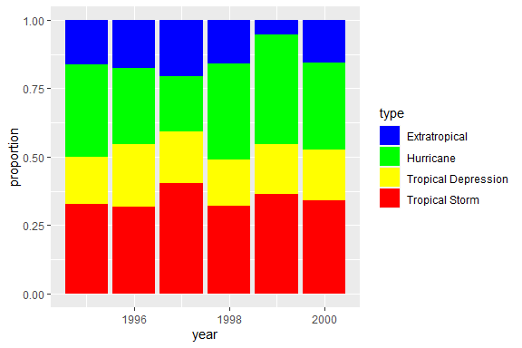

Problem Set 2 - solution
================
Solution

Push your knitted homework assignment (.Rmd, .md docs, and any other
required files or folders) to GitHub by the given deadline.

### Problem 1: Spot the error

Explain why the following command does not color the data points blue,
then write down the command that will turn the points blue.

``` r
> library(ggplot2)
Warning: package 'ggplot2' was built under R version 4.2.3
> ggplot(data = mpg) + 
+   geom_point(mapping = aes(x = displ, y = hwy, color = "blue"))
```

<!-- -->

**Answer:** The `aes()` command is used to map data to different types
of output. The command `color = "blue"` tells `aes` to color each x,y
pair that belongs to the group “blue.” In this case, there is only one
group, and R chooses to use red to identify that group. The code below
shows that by adding the color option outside the `aes()` command, we
can set the line blue.

``` r
> library(ggplot2)
> ggplot(data = mpg) + 
+   geom_point(mapping = aes(x = displ, y = hwy), color = "blue")
```

<!-- -->

### Problem 2: Galton I

Using the famous `Galton` data set from the `mosaicData package`:

``` r
> library(mosaicData)
Warning: package 'mosaicData' was built under R version 4.2.3
> head(Galton)
  family father mother sex height nkids
1      1   78.5   67.0   M   73.2     4
2      1   78.5   67.0   F   69.2     4
3      1   78.5   67.0   F   69.0     4
4      1   78.5   67.0   F   69.0     4
5      2   75.5   66.5   M   73.5     4
6      2   75.5   66.5   M   72.5     4
```

1.  Create a scatterpolot of each person’s `height` against their
    father’s height
2.  Separate your plot into facets by `sex`
3.  Add regression lines to all your facets

*Note: Use father’s height as the x-axis*

``` r
> library(mosaic)
Warning: package 'mosaic' was built under R version 4.2.3
> 
> #Q1: scatterplot of height vs father's height
> ggplot(data=Galton) + 
+   geom_point(aes(y=height, x=father))
```

<!-- -->

``` r
> 
> #Q2: scatterplot of height vs father's height (by sex)
> ggplot(data=Galton) + 
+   geom_point(aes(y=height, x=father)) +
+   facet_wrap(~sex)
```

<!-- -->

``` r
> 
> 
> #Q2: scatterplot of height vs father's height (by sex)
> ggplot(data=Galton) + 
+   geom_point(aes(y=height, x=father)) +
+   facet_wrap(~sex) +
+   geom_smooth(aes(y=height, x=father),method=lm)
```

<!-- -->

### Problem 3: Galton II

Revisit the previous problem. Instead of faceting by `sex`, use `sex` to
color the points in your scatterplot and include regression lines. Use a
color scheme for the points that is not the default coloring.

``` r
> 
> #Q1: scatterplot of height vs father's height
> ggplot(data=Galton, aes(y=height,x=father,color=sex)) +
+   geom_point() +
+   scale_color_brewer(palette="Dark2") +
+   geom_smooth(method="lm") 
```

<!-- -->

### Problem 4: How many variables?

Consider the data `MLB_teams` that is in the `mdsr` package (see
exercise 3.5). (Install if needed, then load the package to get the data
set.)

1.  Use this data to create a graph with at least 4 variables present.
    Describe the story the graph is trying to display.

``` r
> library(mdsr)
Warning: package 'mdsr' was built under R version 4.2.3
> head(MLB_teams)
# A tibble: 6 × 11
  yearID teamID lgID      W     L  WPct attendance normA…¹ payroll metro…² name 
   <int> <chr>  <fct> <int> <int> <dbl>      <int>   <dbl>   <int>   <dbl> <chr>
1   2008 ARI    NL       82    80 0.506    2509924   0.584  6.62e7 4489109 Ariz…
2   2008 ATL    NL       72    90 0.444    2532834   0.589  1.02e8 5614323 Atla…
3   2008 BAL    AL       68    93 0.422    1950075   0.454  6.72e7 2785874 Balt…
4   2008 BOS    AL       95    67 0.586    3048250   0.709  1.33e8 4732161 Bost…
5   2008 CHA    AL       89    74 0.546    2500648   0.582  1.21e8 9554598 Chic…
6   2008 CHN    NL       97    64 0.602    3300200   0.768  1.18e8 9554598 Chic…
# … with abbreviated variable names ¹​normAttend, ²​metroPop
> 
> ggplot(data=MLB_teams, aes(x=WPct,y=normAttend,color=payroll)) +
+   geom_point() + 
+   facet_wrap(~lgID) +
+   geom_smooth(method=lm, se=FALSE)
Warning: The following aesthetics were dropped during statistical transformation: colour
ℹ This can happen when ggplot fails to infer the correct grouping structure in
  the data.
ℹ Did you forget to specify a `group` aesthetic or to convert a numerical
  variable into a factor?
Warning: The following aesthetics were dropped during statistical transformation: colour
ℹ This can happen when ggplot fails to infer the correct grouping structure in
  the data.
ℹ Did you forget to specify a `group` aesthetic or to convert a numerical
  variable into a factor?
```

<!-- -->

The figure above analyzes the relationship between winning percentage
and attendance rates. It further facets the reltionaship by league and
uses color to highlight differences in payroll. We see a strong
relationship between winning percentage and attendance. This makes sense
because people prefer to watch a game when the likelihood of winning is
higher. The coloring shows taht teams with higher payroll tend to have
both higher winning percentages and higher attendance.

### Problem 5: Storm paths by year

Textbook exercises 3.10 \[second edition 3.8\]. The data for the problem
is the data frame `storms` in the `nasaweather` package.

- Use `lat` (y-axis!) and `long` (x-axis!) to plot the path of the
  storms and add `coord_quickmap()` to get a decent aspect ratio between
  the two coordinates (so you can accurately judge distance traveled).

- To use color to distinguish storms but not include the legend of storm
  names/colors you can add `scale_color_discrete(guide="none")`.

``` r
> library(nasaweather)
> 
> ggplot(data=storms, aes(x=long,y=lat,color=name)) + 
+   geom_path() +
+   facet_wrap(~year) +
+   scale_color_discrete(guide="none") +
+   coord_quickmap()
```

<!-- -->

### Problem 6: Storm types by year

Revist the `storms` data used in problem 5. Use `ggplot` to create a
stacked bar graph that shows the proportion of storm `type` that occur
each `year`. Use `scale_fill_brewer` or `scale_fill_manual` to change
the default coloring of the bars.

``` r
> #library(nasaweather)
> head(storms)
# A tibble: 6 × 11
  name     year month   day  hour   lat  long pressure  wind type        seasday
  <chr>   <int> <int> <int> <int> <dbl> <dbl>    <int> <int> <chr>         <int>
1 Allison  1995     6     3     0  17.4 -84.3     1005    30 Tropical D…       3
2 Allison  1995     6     3     6  18.3 -84.9     1004    30 Tropical D…       3
3 Allison  1995     6     3    12  19.3 -85.7     1003    35 Tropical S…       3
4 Allison  1995     6     3    18  20.6 -85.8     1001    40 Tropical S…       3
5 Allison  1995     6     4     0  22   -86        997    50 Tropical S…       4
6 Allison  1995     6     4     6  23.3 -86.3      995    60 Tropical S…       4
> 
> ggplot(data=storms, aes(x=year,fill=type)) + 
+   geom_bar(position="fill") +
+   scale_fill_manual(values=c("blue","green","yellow","red")) +
+   ylab("proportion")
```

<!-- -->
