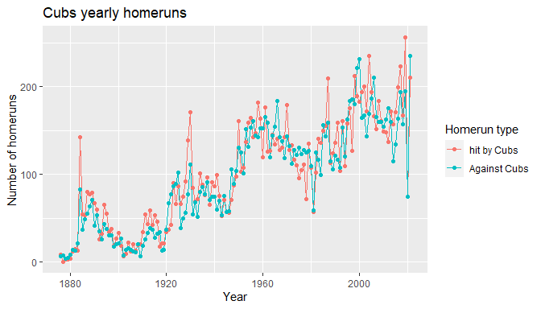

PS4 - solution
================

Package versions

``` r
> mypacks
[1] "ggplot2"      "dplyr"        "nycflights13" "readr"        "tidyr"       
[6] "lubridate"    "Lahman"       "scales"      
> lapply(mypacks, packageVersion)
[[1]]
[1] '3.4.3'

[[2]]
[1] '1.0.9'

[[3]]
[1] '1.0.2'

[[4]]
[1] '2.1.3'

[[5]]
[1] '1.2.0'

[[6]]
[1] '1.9.0'

[[7]]
[1] '10.0.1'

[[8]]
[1] '1.2.1'
```

### Problem 1: joins

The data set below called `Students` contains information on five
students with their ID number, first name and computer preference.

| Id  | Name   | Computer |
|-----|--------|----------|
| 1   | Arya   | m        |
| 2   | Gregor | m        |
| 3   | Cersei | w        |
| 4   | Jon    | m        |
| 5   | Jon    | w        |

The data set below called `Classes` contains roster information (student
first name and ID).

| Class | Student | Stud_Id |
|-------|---------|---------|
| Econ  | Jon     | 4       |
| Econ  | Arya    | 1       |
| Econ  | Cersei  | 3       |
| Stats | Gregor  | 2       |
| Stats | Jon     | 4       |
| Stats | Jon     | 5       |
| Stats | Arya    | 1       |
| CS    | Tyrion  | 6       |

What data set will be produced by the following commands? `Describe` the
data set in words and `show` what it looks like using an R Markdown
table to display the new data set.

**1.**

``` r
> left_join(Classes, Students, by=c("Stud_Id"="Id"))
```

#### *answer 1:*

The student IDs are perfect keys so for each `Stud_Id` there is only one
`Id` in the `Students` dataset. The data set produced has the same
number of rows as `Classes` with the extra columns giving computer info
(and the name from `Students`). Since Typrion is not in the `Students`
dataset, there will be NAs for his `Name` and `Computer`.

| Class | Student | Stud_Id | Name   | Computer |
|-------|---------|---------|--------|----------|
| Econ  | Jon     | 4       | Jon    | m        |
| Econ  | Arya    | 1       | Arya   | m        |
| Econ  | Cersei  | 3       | Cersei | w        |
| Stats | Gregor  | 2       | Gregor | m        |
| Stats | Jon     | 4       | Jon    | m        |
| Stats | Jon     | 5       | Jon    | w        |
| Stats | Arya    | 1       | Arya   | m        |
| CS    | Tyrion  | 6       | NA     | NA       |

**2.**

``` r
> Econ <- Classes %>% filter(Class == "Econ")
> Stats <- Classes %>% filter(Class == "Stats")
> inner_join(Stats, Econ, by="Stud_Id")
```

#### *answer 2:*

A, `inner_join` of the `Stats` class roster with `Econ` will show
`Stats` students who are also taking `Econ`.

| Class.x | Student.x | Stud_Id | Class.y | Student.y |
|---------|-----------|---------|---------|-----------|
| Stats   | Jon       | 4       | Econ    | Jon       |
| Stats   | Arya      | 1       | Econ    | Arya      |

**3.**

``` r
> anti_join(Stats, Econ, by="Stud_Id")
```

#### *answer 3:*

An `anti_join` of the `Stats` class roster with `Econ` will show `Stats`
students who are not also taking `Econ`.

| Class | Student | Stud_Id |
|-------|---------|---------|
| Stats | Gregor  | 2       |
| Stats | Jon     | 5       |

### Problem 2: restructure

Consider the `Lakes_wide` data set below that records lake clarity (in
meters) for 2012 through 2014.

| LakeId | 2012 | 2013 | 2014 |
|--------|------|------|------|
| 1      | 6.5  | 5.8  | 5.8  |
| 2      | 2.1  | 3.4  | 2.8  |

What data set will be produced by the following commands? `Describe` the
data set in words and `show` what it looks like using an R Markdown
table to display the new data set.

**1.**

``` r
> gather(Lakes_wide, key = Year, value = Clarity, 2:4)
```

#### *answer 1:*

This command gathers columns 2-4 (clarity measurements) and places the
`values` in a variable called `Clarity` and creates a new `key` variable
called `Year` that identifies the year of each value. The `LakeId`
identifies which lake each measurement was taken from.

| LakeId | Year | Clarity |
|--------|------|---------|
| 1      | 2012 | 6.5     |
| 2      | 2012 | 2.1     |
| 1      | 2013 | 5.8     |
| 2      | 2013 | 3.4     |
| 1      | 2014 | 5.8     |
| 2      | 2014 | 2.8     |

**2.**

``` r
> gather(Lakes_wide, key = Year, value = Clarity, 2:4) %>%
+   group_by(LakeId) %>%
+   arrange(Year) %>%
+   mutate(Change_in_Clarity = Clarity - lag(Clarity))
```

#### *answer 2:*

This takes the long data set from **1.**, arranges Clarity measures by
year (first to last year), then for each lake it computes the difference
between yearly measurements (current year minus previous year) using the
`lag` function. Note that the 2012 change measurements are missing
(`NA`) because we do not know the 2011 measurements.

| LakeId | Year | Clarity | Change_in_Clarity |
|--------|------|---------|-------------------|
| 1      | 2012 | 6.5     | NA                |
| 2      | 2012 | 2.1     | NA                |
| 1      | 2013 | 5.8     | -0.7              |
| 2      | 2013 | 3.4     | 1.3               |
| 1      | 2014 | 5.8     | 0.0               |
| 2      | 2014 | 2.8     | -0.6              |

### Problem 3: planes

Use the `nycflights13` package and the `flights` and `planes` data
frames to answer the questions below. Use the `dplyr` package to answer
the questions below. (See `nycflights13` help files for more data set
details)

**1.** What variable is the key that connects these two data sets?

#### *Answer 1:*

``` r
> glimpse(flights)
Rows: 336,776
Columns: 19
$ year           <int> 2013, 2013, 2013, 2013, 2013, 2013, 2013, 2013, 2013, 2…
$ month          <int> 1, 1, 1, 1, 1, 1, 1, 1, 1, 1, 1, 1, 1, 1, 1, 1, 1, 1, 1…
$ day            <int> 1, 1, 1, 1, 1, 1, 1, 1, 1, 1, 1, 1, 1, 1, 1, 1, 1, 1, 1…
$ dep_time       <int> 517, 533, 542, 544, 554, 554, 555, 557, 557, 558, 558, …
$ sched_dep_time <int> 515, 529, 540, 545, 600, 558, 600, 600, 600, 600, 600, …
$ dep_delay      <dbl> 2, 4, 2, -1, -6, -4, -5, -3, -3, -2, -2, -2, -2, -2, -1…
$ arr_time       <int> 830, 850, 923, 1004, 812, 740, 913, 709, 838, 753, 849,…
$ sched_arr_time <int> 819, 830, 850, 1022, 837, 728, 854, 723, 846, 745, 851,…
$ arr_delay      <dbl> 11, 20, 33, -18, -25, 12, 19, -14, -8, 8, -2, -3, 7, -1…
$ carrier        <chr> "UA", "UA", "AA", "B6", "DL", "UA", "B6", "EV", "B6", "…
$ flight         <int> 1545, 1714, 1141, 725, 461, 1696, 507, 5708, 79, 301, 4…
$ tailnum        <chr> "N14228", "N24211", "N619AA", "N804JB", "N668DN", "N394…
$ origin         <chr> "EWR", "LGA", "JFK", "JFK", "LGA", "EWR", "EWR", "LGA",…
$ dest           <chr> "IAH", "IAH", "MIA", "BQN", "ATL", "ORD", "FLL", "IAD",…
$ air_time       <dbl> 227, 227, 160, 183, 116, 150, 158, 53, 140, 138, 149, 1…
$ distance       <dbl> 1400, 1416, 1089, 1576, 762, 719, 1065, 229, 944, 733, …
$ hour           <dbl> 5, 5, 5, 5, 6, 5, 6, 6, 6, 6, 6, 6, 6, 6, 6, 5, 6, 6, 6…
$ minute         <dbl> 15, 29, 40, 45, 0, 58, 0, 0, 0, 0, 0, 0, 0, 0, 0, 59, 0…
$ time_hour      <dttm> 2013-01-01 05:00:00, 2013-01-01 05:00:00, 2013-01-01 0…
> glimpse(planes)
Rows: 3,322
Columns: 9
$ tailnum      <chr> "N10156", "N102UW", "N103US", "N104UW", "N10575", "N105UW…
$ year         <int> 2004, 1998, 1999, 1999, 2002, 1999, 1999, 1999, 1999, 199…
$ type         <chr> "Fixed wing multi engine", "Fixed wing multi engine", "Fi…
$ manufacturer <chr> "EMBRAER", "AIRBUS INDUSTRIE", "AIRBUS INDUSTRIE", "AIRBU…
$ model        <chr> "EMB-145XR", "A320-214", "A320-214", "A320-214", "EMB-145…
$ engines      <int> 2, 2, 2, 2, 2, 2, 2, 2, 2, 2, 2, 2, 2, 2, 2, 2, 2, 2, 2, …
$ seats        <int> 55, 182, 182, 182, 55, 182, 182, 182, 182, 182, 55, 55, 5…
$ speed        <int> NA, NA, NA, NA, NA, NA, NA, NA, NA, NA, NA, NA, NA, NA, N…
$ engine       <chr> "Turbo-fan", "Turbo-fan", "Turbo-fan", "Turbo-fan", "Turb…
> 
> dim(unique(planes %>% select(tailnum)))-dim(planes %>% select(tailnum))
[1] 0 0
```

The `tailnum` variable gives the unique tail number identifying
different planes. This variable, which is in both data sets, is the key
that connects outgoing flights to the plane flying the route.

We can check to make sure `tailnum` really is a unique identifier here

**2.** How many planes that flew out of NYC airports in 2013 are in the
`planes` data set? How many are **not** in this data set?

#### *Answer 2:*

``` r
> unique_planes <- unique(flights %>% select(tailnum)) #select all the unique tail numbers in flights
> matches <- semi_join(unique_planes,planes) # number of matches
> non_matches <- anti_join(unique_planes,planes) # number of non-matches
```

There are 3322 planes that flew out of NYC in 2013 that are in the
`planes` data set. There are 722 planes that flew out of NYC that are
not in the `planes` data set.

**3.** What is the oldest plane (or planes) that flew out of NYC in
2013? Give the tail number(s), the year it was manufactured, and its
number of flights from NYC in 2013.

#### *Answer 3:*

The variable `year.y` in the joined data set gives the year (of
manufacture) from the `planes` data. Note that you could also use a
`semi_join` of `planes` using `flights` to answer this question that is
only about manufactured year.

Here we get the first entry of manufactured year for each `tailnum` and
count the number of flights:

``` r
> oldest_plane <- inner_join(flights,planes,by="tailnum") %>% 
+   mutate(min_year=min(year.y,na.rm=TRUE)) %>% #create the minimum year
+   filter(year.y==min_year) %>% #filter on minimum year
+   group_by(tailnum,year.y) %>%
+   summarize(n_flight=n())
```

The oldest plane is tail number N381AA which had 22 flights out of NYC
in 2013.

**4.** For the planes flying out of NYC airports in 2013, create a graph
that shows the distribution of manufactured year. Describe the
distribution.

#### *Answer 4:*

A density, histogram or bar graph of manufacture years shows that most
planes were made after 1980, with many planes made around 2000 and a
smaller mode around 1990.

``` r
> inner_join(unique_planes,planes,by="tailnum") %>%
+    ggplot(aes(x=year)) + 
+      geom_bar()
Warning: Removed 70 rows containing non-finite values (`stat_count()`).
```

<!-- -->

**Note:** you need to only look at distinct `tailnum` to get the
distribution of manufactured year. If you look at all flights, then you
are creating a distribution for the number, or frequency, of flights out
of NYC by manfactured year.

### Problem 4

More with the `nycflights13` data. Consider `top_dest`, the top 10
destinations out of NYC area in 2013:

``` r
> top_dest <- flights %>% 
+   group_by(dest) %>% 
+   summarize(N=n()) %>% 
+   arrange(desc(N)) %>% 
+   slice(1:10)
```

**1.** Use a `filtering join` command to create a `flights` data subset
that only contains destinations in the `top_dest` top 10 destinations.
What is the dimension of this data set? Why does it make sense to use a
filtering join here?

#### *Answer 1:*

``` r
> flights10 <- semi_join(flights, top_dest)
> flights10
# A tibble: 141,145 × 19
    year month   day dep_time sched_de…¹ dep_d…² arr_t…³ sched…⁴ arr_d…⁵ carrier
   <int> <int> <int>    <int>      <int>   <dbl>   <int>   <int>   <dbl> <chr>  
 1  2013     1     1      542        540       2     923     850      33 AA     
 2  2013     1     1      554        600      -6     812     837     -25 DL     
 3  2013     1     1      554        558      -4     740     728      12 UA     
 4  2013     1     1      555        600      -5     913     854      19 B6     
 5  2013     1     1      557        600      -3     838     846      -8 B6     
 6  2013     1     1      558        600      -2     753     745       8 AA     
 7  2013     1     1      558        600      -2     924     917       7 UA     
 8  2013     1     1      558        600      -2     923     937     -14 UA     
 9  2013     1     1      559        559       0     702     706      -4 B6     
10  2013     1     1      600        600       0     851     858      -7 B6     
# … with 141,135 more rows, 9 more variables: flight <int>, tailnum <chr>,
#   origin <chr>, dest <chr>, air_time <dbl>, distance <dbl>, hour <dbl>,
#   minute <dbl>, time_hour <dttm>, and abbreviated variable names
#   ¹​sched_dep_time, ²​dep_delay, ³​arr_time, ⁴​sched_arr_time, ⁵​arr_delay
```

The number of rows is 141145 and columns is 19. Because we are using
`top_dest` to filter the data, using `semi_join` is slightly more
efficient because it won’t include uncessary columns from `top_dest`. In
this case there is only 1 extra variable so it doesn’t matter too much
but there can be cases where there are many uncessary variables that get
included when we use `inner_join`.

**2.** Use your joined data from part `1` to compute the median number
of minutes **between flights** (not actual flight duration) to each
destination. Which destination(s) has the shortest median time between
flights?

- **Note:** While the variable `time_hour` records departure time, it is
  too coarse (rounded to the nearest hour) for our purposes. Use the
  `make_datetime` function to convert the scheduled departure date/time
  (year,month,day,hour,minute) to a date variable
- **Hint:** Combine the `interval` and `lag` function to compute the
  number of minutes between scheduled departures for each destination.

#### *Answer 2:*

Note that we can’t use the `time_hour` variable because it doesn’t have
a minute measure in it. But, as an alternative way to get scheduled time
stamp, we could also use the `update(time_hour, minute=minute)` command
to update this variable with the scheduled `minute` variable in the
data.

``` r
> flights10 %>% 
+   mutate(sch_datetime = make_datetime(year=year, month=month, day =day, hour = hour, min = minute)) %>%     # one way to get scheduled time/date variable
+   group_by(dest) %>%     # group by destination
+   arrange(sch_datetime) %>%    # make sure ordered earliest to latest
+   mutate(diff = interval(lag(sch_datetime), sch_datetime)/dminutes(1)) %>%   #get time between flights
+   summarize(medianMins = median(diff, na.rm=TRUE)) %>%
+   arrange(medianMins)
# A tibble: 10 × 2
   dest  medianMins
   <chr>      <dbl>
 1 ATL           15
 2 ORD           15
 3 BOS           17
 4 CLT           18
 5 LAX           19
 6 MCO           20
 7 SFO           20
 8 FLL           24
 9 MIA           25
10 DCA           34
```

Atlanta and Chicago both have the shortest median time between flights
of 15 minutes.

### Problem 5

MDSR textbook exercise 5.1 (2nd Ed. 6.10).

#### *Answer:*

``` r
> cubs_narrow <- Teams %>% filter(teamID=="CHN") %>% 
+   select(yearID,HR,HRA) %>%
+   gather(key="type",value="HR",HR,HRA) 
>   
> ggplot(cubs_narrow, aes(x=yearID,y=HR,group=type,color=type)) + 
+   geom_line() + 
+   geom_point() + 
+   scale_color_discrete(name="Homerun type",labels=c("hit by Cubs","Against Cubs")) + 
+   labs(title="Cubs yearly homeruns",x="Year",y="Number of homeruns")
```

<!-- -->

### Problem 6

MDSR textbook exercise 5.10 (2nd Ed. 5.6).

- **Note:** The `fec` package doesn’t appear to exist anymore. I went
  and downloaded the right datasets for you, but you have to go the [FEC
  website](https://classic.fec.gov/finance/disclosure/ftpdet.shtml#a2013_2014)
  to figure out what the columns mean. The following shows where I have
  saved each `FEC` file

  - `Contributions by Individuals`:
    - `https://raw.githubusercontent.com/mgelman/data/master/contributions.csv`
  - `Candidate Master File`:
    - `https://raw.githubusercontent.com/mgelman/data/master/candidates.csv`

- **Hint:** For `Figure 2.2`, the field `TRANSACTION_TP` helps determine
  whether the funds are supporting or against a candidate.

- **Pro tip** Include the chunk option `cache=TRUE` in any R chunks that
  read in large data sets (such as `contributions`). This will cache
  results of these large R chunks which can reduce the time to `knit`
  your `.Rmd` after the initial cache.

#### *Answer:*

``` r
> 
> contributions <- read_csv("https://raw.githubusercontent.com/mgelman/data/master/contributions.csv")
Warning: One or more parsing issues, call `problems()` on your data frame for details,
e.g.:
  dat <- vroom(...)
  problems(dat)
> candidates <- read_csv("https://raw.githubusercontent.com/mgelman/data/master/candidates.csv")
> 
> cont_cand <- inner_join(contributions,candidates,by="CAND_ID") #join contributions with candidates
> 
> over_4m_general <- cont_cand %>% 
+   filter(TRANSACTION_PGI=="G") %>% #filter for general election
+   group_by(CAND_ID,CAND_NAME) %>% 
+   summarize(total_cont=sum(TRANSACTION_AMT)/1000000)  %>%
+   filter(total_cont>4) 
> 
> ggplot(data=over_4m_general,aes(x=CAND_NAME,y=total_cont)) + 
+     geom_bar(stat="identity") + 
+     coord_flip() + 
+     labs(y="Money Spent (millions of USD)",x="") + 
+     scale_y_continuous(labels = dollar)
```

<!-- -->

``` r
> 
> over_4m_general_bytype <-  cont_cand %>% 
+   filter(TRANSACTION_PGI=="G") %>% #filter for general election
+   mutate(support=TRANSACTION_TP!="24A") %>% #create opposition flag
+   group_by(CAND_ID,CAND_NAME) %>%
+   mutate(total_cont=sum(TRANSACTION_AMT)/1000000) %>% 
+   filter(total_cont>4) %>%
+   group_by(CAND_ID,CAND_NAME,support) %>%
+   summarize(total_cont_type=sum(TRANSACTION_AMT)/1000000) 
>   
> 
> ggplot(data=over_4m_general_bytype,aes(x=CAND_NAME,y=total_cont_type,fill=support)) + 
+     geom_bar(stat="identity") + 
+     coord_flip() + 
+     labs(y="Money Spent (millions of USD)",x="") + 
+     scale_fill_discrete(name="type",labels=c("against","supporting")) + 
+     scale_y_continuous(labels = dollar)
```

<!-- -->
