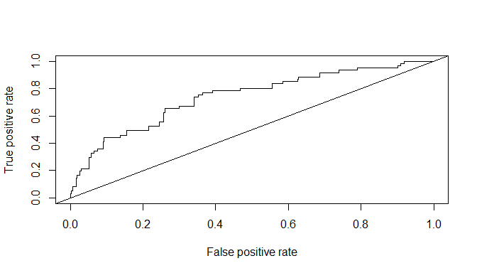

PS5 - solution
================

Package versions

``` r
> mypacks
 [1] "ggplot2"     "dplyr"       "tidyr"       "stringr"     "readr"      
 [6] "rvest"       "ROCR"        "NHANES"      "boot"        "nasaweather"
[11] "rpart"       "partykit"   
> lapply(mypacks, packageVersion)
[[1]]
[1] '3.4.3'

[[2]]
[1] '1.0.9'

[[3]]
[1] '1.2.0'

[[4]]
[1] '1.4.1'

[[5]]
[1] '2.1.3'

[[6]]
[1] '1.0.3'

[[7]]
[1] '1.0.11'

[[8]]
[1] '2.1.0'

[[9]]
[1] '1.3.28'

[[10]]
[1] '0.1'

[[11]]
[1] '4.1.16'

[[12]]
[1] '1.2.16'
```

### Problem 1

Consider the `NHANES` data (from the same-named package). See the help
file for this data for more info.

Now suppose you are working for Target as a data scientist and you are
tasked with predicting which customers are pregnant based mainly on
demographic and physical patterns observed in the publicly available
NHANES data. (A real data scientist for Target would also have buying
profiles!) For this problem you want to predict `PregnantNow` using the
characteristics: `Age`, `Education`, `HHIncomeMid`, `MaritalStatus`,
`Bmi`, and `Height`.

Preliminary steps: Recode `PregnantNow` to have two levels (yes, no) and
make the `unknown` level NAs. Recode `MaritalStatus` to just be
`married` or `notmarried`. Finally, create a subset of the data for
females that only contains complete cases (i.e. no NAs) for the
variables described above that you will use in this problem. **Use
`NHANESf` in to answer the questions below!**

``` r
> glimpse(NHANES)
Rows: 10,000
Columns: 76
$ ID               <int> 51624, 51624, 51624, 51625, 51630, 51638, 51646, 5164…
$ SurveyYr         <fct> 2009_10, 2009_10, 2009_10, 2009_10, 2009_10, 2009_10,…
$ Gender           <fct> male, male, male, male, female, male, male, female, f…
$ Age              <int> 34, 34, 34, 4, 49, 9, 8, 45, 45, 45, 66, 58, 54, 10, …
$ AgeDecade        <fct>  30-39,  30-39,  30-39,  0-9,  40-49,  0-9,  0-9,  40…
$ AgeMonths        <int> 409, 409, 409, 49, 596, 115, 101, 541, 541, 541, 795,…
$ Race1            <fct> White, White, White, Other, White, White, White, Whit…
$ Race3            <fct> NA, NA, NA, NA, NA, NA, NA, NA, NA, NA, NA, NA, NA, N…
$ Education        <fct> High School, High School, High School, NA, Some Colle…
$ MaritalStatus    <fct> Married, Married, Married, NA, LivePartner, NA, NA, M…
$ HHIncome         <fct> 25000-34999, 25000-34999, 25000-34999, 20000-24999, 3…
$ HHIncomeMid      <int> 30000, 30000, 30000, 22500, 40000, 87500, 60000, 8750…
$ Poverty          <dbl> 1.36, 1.36, 1.36, 1.07, 1.91, 1.84, 2.33, 5.00, 5.00,…
$ HomeRooms        <int> 6, 6, 6, 9, 5, 6, 7, 6, 6, 6, 5, 10, 6, 10, 10, 4, 3,…
$ HomeOwn          <fct> Own, Own, Own, Own, Rent, Rent, Own, Own, Own, Own, O…
$ Work             <fct> NotWorking, NotWorking, NotWorking, NA, NotWorking, N…
$ Weight           <dbl> 87.4, 87.4, 87.4, 17.0, 86.7, 29.8, 35.2, 75.7, 75.7,…
$ Length           <dbl> NA, NA, NA, NA, NA, NA, NA, NA, NA, NA, NA, NA, NA, N…
$ HeadCirc         <dbl> NA, NA, NA, NA, NA, NA, NA, NA, NA, NA, NA, NA, NA, N…
$ Height           <dbl> 164.7, 164.7, 164.7, 105.4, 168.4, 133.1, 130.6, 166.…
$ BMI              <dbl> 32.22, 32.22, 32.22, 15.30, 30.57, 16.82, 20.64, 27.2…
$ BMICatUnder20yrs <fct> NA, NA, NA, NA, NA, NA, NA, NA, NA, NA, NA, NA, NA, N…
$ BMI_WHO          <fct> 30.0_plus, 30.0_plus, 30.0_plus, 12.0_18.5, 30.0_plus…
$ Pulse            <int> 70, 70, 70, NA, 86, 82, 72, 62, 62, 62, 60, 62, 76, 8…
$ BPSysAve         <int> 113, 113, 113, NA, 112, 86, 107, 118, 118, 118, 111, …
$ BPDiaAve         <int> 85, 85, 85, NA, 75, 47, 37, 64, 64, 64, 63, 74, 85, 6…
$ BPSys1           <int> 114, 114, 114, NA, 118, 84, 114, 106, 106, 106, 124, …
$ BPDia1           <int> 88, 88, 88, NA, 82, 50, 46, 62, 62, 62, 64, 76, 86, 6…
$ BPSys2           <int> 114, 114, 114, NA, 108, 84, 108, 118, 118, 118, 108, …
$ BPDia2           <int> 88, 88, 88, NA, 74, 50, 36, 68, 68, 68, 62, 72, 88, 6…
$ BPSys3           <int> 112, 112, 112, NA, 116, 88, 106, 118, 118, 118, 114, …
$ BPDia3           <int> 82, 82, 82, NA, 76, 44, 38, 60, 60, 60, 64, 76, 82, 7…
$ Testosterone     <dbl> NA, NA, NA, NA, NA, NA, NA, NA, NA, NA, NA, NA, NA, N…
$ DirectChol       <dbl> 1.29, 1.29, 1.29, NA, 1.16, 1.34, 1.55, 2.12, 2.12, 2…
$ TotChol          <dbl> 3.49, 3.49, 3.49, NA, 6.70, 4.86, 4.09, 5.82, 5.82, 5…
$ UrineVol1        <int> 352, 352, 352, NA, 77, 123, 238, 106, 106, 106, 113, …
$ UrineFlow1       <dbl> NA, NA, NA, NA, 0.094, 1.538, 1.322, 1.116, 1.116, 1.…
$ UrineVol2        <int> NA, NA, NA, NA, NA, NA, NA, NA, NA, NA, NA, NA, NA, N…
$ UrineFlow2       <dbl> NA, NA, NA, NA, NA, NA, NA, NA, NA, NA, NA, NA, NA, N…
$ Diabetes         <fct> No, No, No, No, No, No, No, No, No, No, No, No, No, N…
$ DiabetesAge      <int> NA, NA, NA, NA, NA, NA, NA, NA, NA, NA, NA, NA, NA, N…
$ HealthGen        <fct> Good, Good, Good, NA, Good, NA, NA, Vgood, Vgood, Vgo…
$ DaysPhysHlthBad  <int> 0, 0, 0, NA, 0, NA, NA, 0, 0, 0, 10, 0, 4, NA, NA, 0,…
$ DaysMentHlthBad  <int> 15, 15, 15, NA, 10, NA, NA, 3, 3, 3, 0, 0, 0, NA, NA,…
$ LittleInterest   <fct> Most, Most, Most, NA, Several, NA, NA, None, None, No…
$ Depressed        <fct> Several, Several, Several, NA, Several, NA, NA, None,…
$ nPregnancies     <int> NA, NA, NA, NA, 2, NA, NA, 1, 1, 1, NA, NA, NA, NA, N…
$ nBabies          <int> NA, NA, NA, NA, 2, NA, NA, NA, NA, NA, NA, NA, NA, NA…
$ Age1stBaby       <int> NA, NA, NA, NA, 27, NA, NA, NA, NA, NA, NA, NA, NA, N…
$ SleepHrsNight    <int> 4, 4, 4, NA, 8, NA, NA, 8, 8, 8, 7, 5, 4, NA, 5, 7, N…
$ SleepTrouble     <fct> Yes, Yes, Yes, NA, Yes, NA, NA, No, No, No, No, No, Y…
$ PhysActive       <fct> No, No, No, NA, No, NA, NA, Yes, Yes, Yes, Yes, Yes, …
$ PhysActiveDays   <int> NA, NA, NA, NA, NA, NA, NA, 5, 5, 5, 7, 5, 1, NA, 2, …
$ TVHrsDay         <fct> NA, NA, NA, NA, NA, NA, NA, NA, NA, NA, NA, NA, NA, N…
$ CompHrsDay       <fct> NA, NA, NA, NA, NA, NA, NA, NA, NA, NA, NA, NA, NA, N…
$ TVHrsDayChild    <int> NA, NA, NA, 4, NA, 5, 1, NA, NA, NA, NA, NA, NA, 4, N…
$ CompHrsDayChild  <int> NA, NA, NA, 1, NA, 0, 6, NA, NA, NA, NA, NA, NA, 3, N…
$ Alcohol12PlusYr  <fct> Yes, Yes, Yes, NA, Yes, NA, NA, Yes, Yes, Yes, Yes, Y…
$ AlcoholDay       <int> NA, NA, NA, NA, 2, NA, NA, 3, 3, 3, 1, 2, 6, NA, NA, …
$ AlcoholYear      <int> 0, 0, 0, NA, 20, NA, NA, 52, 52, 52, 100, 104, 364, N…
$ SmokeNow         <fct> No, No, No, NA, Yes, NA, NA, NA, NA, NA, No, NA, NA, …
$ Smoke100         <fct> Yes, Yes, Yes, NA, Yes, NA, NA, No, No, No, Yes, No, …
$ Smoke100n        <fct> Smoker, Smoker, Smoker, NA, Smoker, NA, NA, Non-Smoke…
$ SmokeAge         <int> 18, 18, 18, NA, 38, NA, NA, NA, NA, NA, 13, NA, NA, N…
$ Marijuana        <fct> Yes, Yes, Yes, NA, Yes, NA, NA, Yes, Yes, Yes, NA, Ye…
$ AgeFirstMarij    <int> 17, 17, 17, NA, 18, NA, NA, 13, 13, 13, NA, 19, 15, N…
$ RegularMarij     <fct> No, No, No, NA, No, NA, NA, No, No, No, NA, Yes, Yes,…
$ AgeRegMarij      <int> NA, NA, NA, NA, NA, NA, NA, NA, NA, NA, NA, 20, 15, N…
$ HardDrugs        <fct> Yes, Yes, Yes, NA, Yes, NA, NA, No, No, No, No, Yes, …
$ SexEver          <fct> Yes, Yes, Yes, NA, Yes, NA, NA, Yes, Yes, Yes, Yes, Y…
$ SexAge           <int> 16, 16, 16, NA, 12, NA, NA, 13, 13, 13, 17, 22, 12, N…
$ SexNumPartnLife  <int> 8, 8, 8, NA, 10, NA, NA, 20, 20, 20, 15, 7, 100, NA, …
$ SexNumPartYear   <int> 1, 1, 1, NA, 1, NA, NA, 0, 0, 0, NA, 1, 1, NA, NA, 1,…
$ SameSex          <fct> No, No, No, NA, Yes, NA, NA, Yes, Yes, Yes, No, No, N…
$ SexOrientation   <fct> Heterosexual, Heterosexual, Heterosexual, NA, Heteros…
$ PregnantNow      <fct> NA, NA, NA, NA, NA, NA, NA, NA, NA, NA, NA, NA, NA, N…
> NHANES <- NHANES %>% 
+   mutate(
+     pregnant = recode_factor(PregnantNow, No = "No", Yes = "Yes",Unknown = NA_character_), 
+     married = recode_factor(MaritalStatus, Married = "married", .default="notmarried")) 
> NHANESf <- NHANES %>% 
+   filter(Gender == "female") %>% 
+   select(pregnant,Age,  Education , BMI, HHIncomeMid, married ,Height, SurveyYr) %>% 
+   na.omit()
```

**1.** Using `NHANESf` data, fit a logistic model to model pregnancies
using the set of specified explanatory variables. Draw the ROC curve and
double density curves for your model. Describe what these graphs tell us
about our model.

``` r
> glm.model<-glm(pregnant~Age+Education+BMI+HHIncomeMid+married+Height+SurveyYr,data=NHANESf,family="binomial")
> glm.model

Call:  glm(formula = pregnant ~ Age + Education + BMI + HHIncomeMid + 
    married + Height + SurveyYr, family = "binomial", data = NHANESf)

Coefficients:
            (Intercept)                      Age  Education9 - 11th Grade  
             -2.084e+00               -7.792e-02                6.187e-01  
   EducationHigh School    EducationSome College    EducationCollege Grad  
              3.434e-02                7.028e-01                2.581e-01  
                    BMI              HHIncomeMid        marriednotmarried  
              4.560e-02                6.490e-06               -1.886e+00  
                 Height          SurveyYr2011_12  
              7.398e-04               -4.670e-01  

Degrees of Freedom: 1504 Total (i.e. Null);  1494 Residual
Null Deviance:      510.6 
Residual Deviance: 459.2    AIC: 481.2
```

3.  Draw the ROC curve and double density curves for your model.
    Describe what these graphs tell us about our model.

#### *Answer:*

First get the glm, then extract the probabilies:

``` r
> pglm <- glm(pregnant ~ Age +  Education + BMI + HHIncomeMid + married + Height, family = "binomial",data=NHANESf)
> NHANESf <- NHANESf %>% 
+   mutate(pred_probs = predict(pglm, type="response"))
```

The ROC curve shows the true positive and false positive rates for the
model at a variety of threshold values. This shows that there are some
threshold levels (not 0.5) that will lead to higher sensitivity (true
positive) than just random guessing (the straight line). Without looking
at ROC curves for other models, though, it is hard to really judge how
good this model is just based on the ROC curve.

``` r
> pred_obj <- prediction(NHANESf$pred_probs,NHANESf$pregnant, label.ordering = c("No","Yes"))
> perf_obj <- performance(pred_obj, "tpr","fpr")
> plot(perf_obj); abline(0,1)
```

<!-- -->

The double density curves show that most non-pregnant women have
estimated pregnancy probabilities below 10%. The probabilities for the
pregnant women are not so well defined but do range higher than the
probabilities for non-pregnant woman.

``` r
> ggplot(NHANESf, aes(x=pred_probs, color=pregnant))  + 
+   geom_density(size=1.5) + 
+   ggtitle("Pregnancy probability estimates by actual status")
Warning: Using `size` aesthetic for lines was deprecated in ggplot2 3.4.0.
ℹ Please use `linewidth` instead.
This warning is displayed once every 8 hours.
Call `lifecycle::last_lifecycle_warnings()` to see where this warning was
generated.
```

<!-- -->

**2.** Use a threshold of 0.5 to predict pregnancies. Compute the
confusion matrix, accuracy, sensitivity and specificity. Then repeat
these calculations using a threshold of 0.05.

#### *Answer:*

``` r
> NHANESf <- NHANESf %>% 
+   mutate(preds50 = ifelse(pred_probs >=.50,"Yes","No"), 
+          preds5 = ifelse(pred_probs >=.05,"Yes","No"))
```

The compute the confusion matrix for these predictions:

``` r
> with(NHANESf,table(pregnant, preds50))
        preds50
pregnant   No
     No  1444
     Yes   61
> with(NHANESf,table(pregnant, preds5))
        preds5
pregnant   No  Yes
     No  1045  399
     Yes   21   40
> stats <- NHANESf %>% gather(key=threshold, value=preds, preds50:preds5) %>%
+   group_by(threshold) %>%
+   summarize(accuracy = mean(preds == pregnant), 
+             precision = sum(preds == "Yes" & pregnant == "Yes")/sum(preds == "Yes"),
+             recall = sum(preds == "Yes" & pregnant == "Yes")/sum(pregnant == "Yes") 
+             )
> stats
# A tibble: 2 × 4
  threshold accuracy precision recall
  <chr>        <dbl>     <dbl>  <dbl>
1 preds5       0.721    0.0911  0.656
2 preds50      0.959  NaN       0    
```

With a threshold of 0.50, we are not predicting any pregnancies in this
data! Note that the largest pregnancy probability is about 26%:

``` r
> summary(NHANESf$pred_probs)
    Min.  1st Qu.   Median     Mean  3rd Qu.     Max. 
0.002001 0.012869 0.027755 0.040532 0.057275 0.265048 
```

For a 50% threshold: the accuracy rate is then the rate of no
pregnancies in the data, 95.9%, the precision rate is NA because we
don’t predict any pregnancies and the recall rate is 0% (none of the
pregnancies were predicted).

For a 5% threshold: the accuracy rate is 72.1%, the precision rate is
9.1% and the recall rate is 65.6%.

**3.** Which threshold would you use (0.5 or 0.05) if your job depended
on you correctly identifying women who were pregnant at a high rate?
What if your job depended on correctly identifying as many individuals
as possible? Explain your rational when answering these questions.

#### *Answer:*

If you wanted to identify women who are actually pregnant at a high rate
you will want a high level of `recall`, so using a lower threshold
(0.05) is better since you will have a higher rate of IDing these women.

If you wanted to correctly identify as many indivduals as possible, you
want a high level of `accuracy`. Therefore you should choose the
threshold of 0.5 which predicts that nobody is pregnant. While this
seems like a bad model, it will lead to high accuracy since the actual
probability of being pregnant is so low in the data.

### Problem 2

Consider the model you fit in problem 1.

**1.** Refit your model in part a of problem 1 using the 2009-10
`SurveyYr` as the training data set and the 2011-12 year as the test
set. Using a 0.05 theshold, compute the accuracy, precision and recall
of the predictions from both the training and test sets.

#### *Answer:*

Fit the model on the training data set:

``` r
> NHANESf %>% group_by(SurveyYr) %>% count()
# A tibble: 2 × 2
# Groups:   SurveyYr [2]
  SurveyYr     n
  <fct>    <int>
1 2009_10    791
2 2011_12    714
> train <- NHANESf %>% filter(SurveyYr == "2009_10")
> test <- NHANESf %>% filter(SurveyYr == "2011_12")
> pglm <- glm(pregnant ~ Age +  Education + BMI + HHIncomeMid + married + Height, family = "binomial",data=train)
```

Then compute test set probs, predictions and stats:

``` r
> pred_probs_test <- predict(pglm, newdata =test, type="response")
> test <- test %>% 
+   mutate( 
+     preds = ifelse(pred_probs_test >=.05,"Yes","No"), 
+     probs = pred_probs_test, 
+     type = "test")
```

Then training set values:

``` r
> pred_probs_train <- predict(pglm,type="response")
> train <- train %>% 
+   mutate( 
+     preds = ifelse(pred_probs_train >=.05,"Yes","No"), 
+     probs = pred_probs_train, 
+     type = "train")
```

Join together in one data set (columns are the same) with a row bind

``` r
> all <- bind_rows(test,train)
> stats <- all %>% group_by(type) %>%
+     summarize(accuracy = mean(pregnant == preds),
+               precision = sum(pregnant == "Yes" & 
+                      preds == "Yes")/sum(preds == "Yes"),
+             recall = sum(pregnant == "Yes" & 
+                      preds == "Yes")/sum(pregnant == "Yes")
+             )
> stats
# A tibble: 2 × 4
  type  accuracy precision recall
  <chr>    <dbl>     <dbl>  <dbl>
1 test     0.669    0.0723  0.783
2 train    0.659    0.0972  0.737
```

- For the test set: accuracy is 66.9%, precision is 7.2%, and recall is
  78.3%.
- For the training set: accuracy is 65.9%, precision is 9.7%, and recall
  is 73.7%.

**2.** Draw ROC curves for both the training and test sets. Compare the
curves and comment on how well your 2009-10 model can predict 2011-12
pregnancies.

#### *Answer:*

The curves are similar, possibly suggesting that the second year of data
has similar pregnancy patterns as the first year of data. The curve
starts to flatten out around a false positive rate of 75% so after this
point we see bigger increases in false positive rates for smaller gains
in sensitivity.

``` r
> roc_fn <- function(data)
+ { 
+   preds_obj <- prediction(data$probs, data$pregnant, c("No","Yes"))
+   perf_obj <- performance(preds_obj, "tpr","fpr")
+   perf_df <- data_frame(fpr=unlist(perf_obj@x.values), tpr= unlist(perf_obj@y.values), 
+                         threshold=unlist(perf_obj@alpha.values))
+   return(perf_df)
+ }
> perf_df <- all %>%
+    group_by(type) %>%
+   do(roc_fn(.))
Warning: `data_frame()` was deprecated in tibble 1.1.0.
ℹ Please use `tibble()` instead.
This warning is displayed once every 8 hours.
Call `lifecycle::last_lifecycle_warnings()` to see where this warning was
generated.
> perf_df
# A tibble: 988 × 4
# Groups:   type [2]
   type      fpr   tpr threshold
   <chr>   <dbl> <dbl>     <dbl>
 1 test  0           0   Inf    
 2 test  0.00434     0     0.314
 3 test  0.00579     0     0.252
 4 test  0.00868     0     0.236
 5 test  0.0101      0     0.204
 6 test  0.0130      0     0.199
 7 test  0.0145      0     0.193
 8 test  0.0203      0     0.184
 9 test  0.0217      0     0.182
10 test  0.0232      0     0.181
# … with 978 more rows
```

``` r
> ggplot(perf_df, aes(x=fpr, y=tpr, color=type)) + 
+   geom_line(size=1.5) + 
+   labs(x="false positive rate", y="true positive rate", title="ROC curves") + 
+   geom_abline(slope=1,intercept=0, linetype=3) 
```

<!-- -->

### Problem 3

Consider the model you fit in problem 1.

**1.** Use the `cv.glm` command to get the cross-validation error
estimate using 5-fold CV with a threshold of 0.5. Use this error to
estimate the accuracy of the model and compare this to your answer
problem 2 part 2.

#### *Answer:*

The cv error for the logistic model is about 4% using a threshold of
0.50, meaning the accuracy is about 96% which is very close to what was
obtained on the full data set without cross validation.

``` r
> pglm <- glm(pregnant ~ Age +  Education + BMI + HHIncomeMid + married + Height, family = "binomial",data=NHANESf)
> set.seed(5)
> cost <- function(y, pi) mean(abs(y-pi) >= .5)
> cv.glm(NHANESf, pglm, K=5, cost)$delta[1]
[1] 0.04053156
```

**2.** Use the `cv.glm` command to get the cross-validation error
estimate using 5-fold CV with a threshold of 0.05. Use this error to
estimate the accuracy of the model and compare this to your answer
problem 2 part 2.

#### *Answer:*

The cv error for the logistic model is about 30% using a threshold of
0.50, meaning the accuracy is about 70% which is again very close to
what was obtained on the full data set without cross validation.

``` r
> cost <- function(y, pi) mean(abs(y-pi) >= .05)
> cv.glm(NHANESf, pglm, K=5, cost)$delta[1]
[1] 0.2983389
```

### Problem 5

Take a look at textbook exercise 8.5. For parts 1-2 below, we will use
the response `y_td` as our response to make a classifier for **tropical
depressions**:

``` r
> table(storms$type)

      Extratropical           Hurricane Tropical Depression      Tropical Storm 
                412                 896                 513                 926 
> storms <- storms %>% 
+   mutate(y_td = recode_factor(type, .default="other", `Tropical Depression`="Tropical Depression"))
> table(storms$type, storms$y_td)
                     
                      Tropical Depression other
  Extratropical                         0   412
  Hurricane                             0   896
  Tropical Depression                 513     0
  Tropical Storm                        0   926
> storms$y_td <- factor(storms$y_td, levels=c("other","Tropical Depression") )
> levels(storms$y_td)
[1] "other"               "Tropical Depression"
```

**1.** Create a decision tree to classify a storm as a tropical
depression (or not) using `wind` and `pressure` as your predictors. Draw
a tree diagram of the model and describe what wind speed and pressure
characteristics can be used to identify a tropical depression. (Note:
use the default control parameters for `rpart`.)

#### *Answer:*

``` r
> form <- as.formula(y_td ~ pressure + wind)
> td_dtree <- rpart(form, data=storms)
> td_dtree
n= 2747 

node), split, n, loss, yval, (yprob)
      * denotes terminal node

 1) root 2747 513 other (0.81325082 0.18674918)  
   2) wind>=32.5 2109   0 other (1.00000000 0.00000000) *
   3) wind< 32.5 638 125 Tropical Depression (0.19592476 0.80407524)  
     6) wind< 22.5 125  62 Tropical Depression (0.49600000 0.50400000)  
      12) pressure>=1012.5 24   2 other (0.91666667 0.08333333) *
      13) pressure< 1012.5 101  40 Tropical Depression (0.39603960 0.60396040) *
     7) wind>=22.5 513  63 Tropical Depression (0.12280702 0.87719298) *
```

If wind speed is greater than or equal to 32.5mph then the storm is not
predicted to be a TD (with 100% precision). For storms with wind speeds
less than 32.5, it will be predicted to be a TD (with 14.4% precision
error) unless it has winds less than 22.5mph and pressure less than
1012.5 (with 40% error).

``` r
> plot(as.party(td_dtree),type="simple",gp = gpar(fontsize = 10))
```

<!-- -->

**2.** Visualize your model in part 1 in the predictor space. Your
figure should look similar to either figure 8.10 or the loan default
duration/credit plots. (Note: use `geom_jitter` rather than `geom_point`
to account for overplotting)

#### *Answer:*

``` r
> ggplot(storms, aes(x=pressure, y=wind, color=y_td)) + 
+   geom_jitter() + 
+   geom_hline(yintercept = c(32.5)) + 
+   geom_segment(x=1012.5,xend=1012.5, y=0,yend=22.5, color="black") + 
+   geom_segment(x=1012.5,xend=Inf, y=22.5,yend=22.5, color="black") + 
+   annotate("rect",ymin=22.5,ymax=32.5,xmin=-Inf,xmax=Inf, fill="lightblue",alpha=.4) + 
+   annotate("rect",ymin=0,ymax=22.5,xmin=-Inf,xmax=1012.5, fill="lightblue",alpha=.4)
```

<!-- -->

**3.** Create one decision tree to classify *all four* types of storms!
Use `type` as your response and `wind` and `pressure` as your
predictors. Draw a tree diagram of the model. Is it easy to distinguish
between storms using these two measures? Which measure, wind speed or
pressure, seems most important when classifying storm types? (Note: use
the default control parameters for `rpart`.)

#### *Answer:*

The tree is relatively simple, with wind speed the being the primary
factor.

``` r
> storms_dtree <- rpart(type ~ pressure + wind, data=storms)
> storms_dtree
n= 2747 

node), split, n, loss, yval, (yprob)
      * denotes terminal node

 1) root 2747 1821 Tropical Storm (0.14998180 0.32617401 0.18674918 0.33709501)  
   2) wind>=62.5 937   41 Hurricane (0.01067236 0.95624333 0.00000000 0.03308431) *
   3) wind< 62.5 1810  915 Tropical Storm (0.22209945 0.00000000 0.28342541 0.49447514)  
     6) wind< 32.5 638  125 Tropical Depression (0.19592476 0.00000000 0.80407524 0.00000000) *
     7) wind>=32.5 1172  277 Tropical Storm (0.23634812 0.00000000 0.00000000 0.76365188)  
      14) pressure< 985.5 127   37 Extratropical (0.70866142 0.00000000 0.00000000 0.29133858) *
      15) pressure>=985.5 1045  187 Tropical Storm (0.17894737 0.00000000 0.00000000 0.82105263) *
> plot(as.party(storms_dtree),type="simple")
```

<!-- -->

**4.** Compute the accuracy of your model from part 3. Describe
intuitively what accuracy measures and how you can classify these four
types of storms using their wind speed and pressure characteristics.

#### *Answer:*

This model can correctly predict about 86% of storms in the data. Wind
speeds greater than 62.5mph are classified as Hurricanes, storms less
than 32.5mph are tropical depressions, storms between 32.5 and 62.5mph
are extratropical if pressure is below 985.5, otherwise they are
tropical storms.

``` r
> storms <- storms %>% mutate(preds = predict(storms_dtree, type="class"))
> table(storms$type, storms$preds)
                     
                      Extratropical Hurricane Tropical Depression
  Extratropical                  90        10                 125
  Hurricane                       0       896                   0
  Tropical Depression             0         0                 513
  Tropical Storm                 37        31                   0
                     
                      Tropical Storm
  Extratropical                  187
  Hurricane                        0
  Tropical Depression              0
  Tropical Storm                 858
> storms %>% summarize(accuracy = mean(preds == type))
# A tibble: 1 × 1
  accuracy
     <dbl>
1    0.858
```
