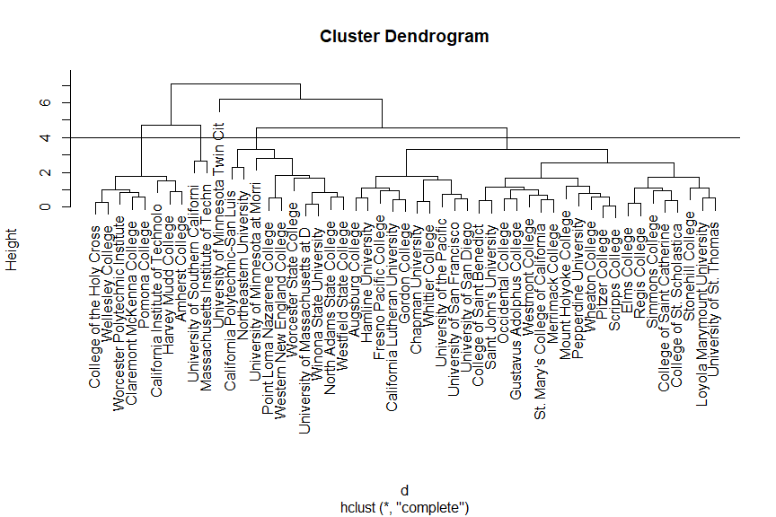
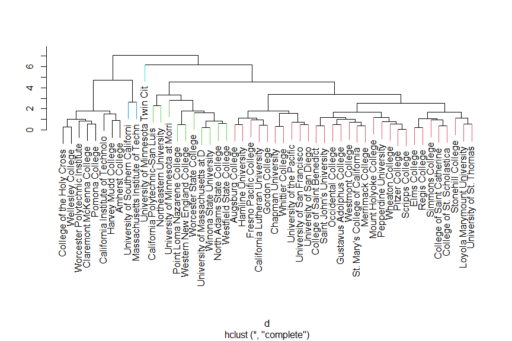
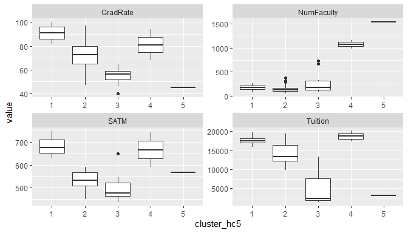
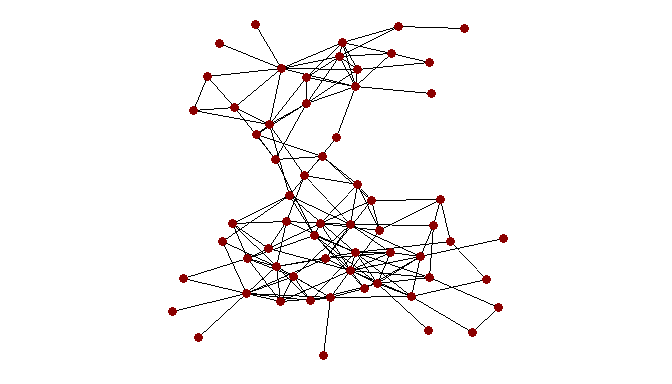

PS6 - solution
================

Package versions

``` r
> mypacks
[1] "ggplot2"   "dplyr"     "tidyr"     "readr"     "class"     "sparcl"   
[7] "GGally"    "statnet"   "ggnetwork"
> lapply(mypacks, packageVersion)
[[1]]
[1] '3.4.3'

[[2]]
[1] '1.0.9'

[[3]]
[1] '1.2.0'

[[4]]
[1] '2.1.3'

[[5]]
[1] '7.3.20'

[[6]]
[1] '1.0.4'

[[7]]
[1] '2.1.2'

[[8]]
[1] '2019.6'

[[9]]
[1] '0.5.10'
```

### Problem 1

Review the colleges clustering example from day 22. Use this data to
answer the following questions. Filter the data to only include schools
in `MN`, `MA` and `CA`.

**1.** Do a hierarchical clustering using the standardized versions of
variables `SATM`, `Tuition`, `NumFaculty` and `GradRate`. Show the basic
dedrogram (non-colored) for this clustering. How many clusters will be
formed if we cut the tree at a height of 4? **Note:** increase the
figure height in your markdown document so you can see the tree better.

#### *Answer:*

If the tree is cut at a height of 4, then 5 clusters will be created.

``` r
> colleges <- read_csv("https://raw.githubusercontent.com/mgelman/data/master/Colleges.csv")
> names(colleges)
 [1] "State"       "College"     "SATM"        "SATV"        "AppsReceive"
 [6] "AppsAccept"  "HStop10"     "HStop25"     "FullTime"    "Tuition"    
[11] "RoomBoard"   "Books"       "Ratio"       "Donate"      "Expend"     
[16] "GradRate"    "Type"        "AvgSalary"   "NumFaculty" 
> colleges2 <- colleges %>% filter(State %in% c("MN","MA","CA"))
> coll_vars <- c("SATM","Tuition","NumFaculty","GradRate")
> coll_vars
[1] "SATM"       "Tuition"    "NumFaculty" "GradRate"  
> d <- dist(scale(colleges2[,coll_vars]))
> coll_hc <- hclust(d)
> plot(coll_hc, labels = colleges2$College)
> abline(h=4)
```

<!-- -->

**2.** Which school is most dissimilar from other schools with respect
to these variables? What school is least dissimilar (i.e most similar!)
to Scripps College with respect to these variables? Explain your
answers.

#### *Answer:*

The UMN Twin Cities is most different from other schools when looking at
these variables, especially with respect to number of faculty which at
1538 is about 4.5 SD’s above the overall average. Pitzer college is most
similar to Scripps. They both have SATM scores of 590, faculty numbers
of 54 and grad rates of 73%. Their tuition amounts differ by less than
0.1 of a SD.

``` r
> colleges2 %>%
+   filter(College %in% c("University of Minnesota Twin Cit", "Scripps College","Pitzer College")) %>% 
+   select(College, SATM, Tuition, NumFaculty, GradRate)
# A tibble: 3 × 5
  College                           SATM Tuition NumFaculty GradRate
  <chr>                            <dbl>   <dbl>      <dbl>    <dbl>
1 Pitzer College                     590   17688         54       73
2 Scripps College                    590   17238         54       73
3 University of Minnesota Twin Cit   568    3171       1538       45
> colleges2 %>%
+   select(College, SATM, Tuition, NumFaculty, GradRate) %>%
+   mutate_at(2:5,scale) %>%
+   filter(College %in% c("University of Minnesota Twin Cit", "Scripps College","Pitzer College")) 
# A tibble: 3 × 5
  College                          SATM[,1] Tuition[,1] NumFaculty[,1] GradRat…¹
  <chr>                               <dbl>       <dbl>          <dbl>     <dbl>
1 Pitzer College                      0.437       0.918         -0.640    0.0833
2 Scripps College                     0.437       0.834         -0.640    0.0833
3 University of Minnesota Twin Cit    0.159      -1.81           4.49    -1.72  
# … with abbreviated variable name ¹​GradRate[,1]
```

**3.** Cut the tree to produce 5 clusters. Then produce a colored
dendrogram that uses color to distinguish between clusters. How many
schools are in each cluster?

#### *Answer:*

The smallest cluster contains the most different school, UMN Twin
Cities, and the second smallest only contains 2 schools (MIT and USC).
Two mid-sized clusters have 8 and 10 schools (a mostly liberal arts
group and mostly smaller state schools). The largest cluster has 30
schools.

``` r
> hc_clusters <- cutree(coll_hc, k=5)
> colleges2 <- colleges2 %>%
+   mutate(cluster_hc5 = as.character(hc_clusters))
> ColorDendrogram(coll_hc, y=colleges2$cluster_hc5, labels=colleges2$College, branchlength = 1.6)
```

<!-- -->

``` r
> table(colleges2$cluster_hc5)

 1  2  3  4  5 
 8 30 10  2  1 
```

**4.** Describe the schools in each cluster with respect to the
variables we used to form the clusters. For example, what are some
sample statistics of our variables in each cluster? How would you
explain those clusters to prospective college students?

#### *Answer:*

- The single school cluster, UMN-TC, is on its own because it is an
  outlier in terms of number of faculty.
- The two school cluster (#4) have the next highest number of faculty
  and high tuition.
- The “selective LA” 8 school cluster (#1) have high SATM, tuition, and
  grad rates and low number of faculty.
- The 10 school group (#3) are a little more diverse than the 8 school
  group, but they seem to have measurements in the lower half of
  schools.
- The largest group (#2) tend to have lower faculty numbers and higher
  tuition (like the LA cluster), but lower SATM and a wide range in grad
  rates.

``` r
> colleges2 %>% 
+   select(cluster_hc5, SATM, Tuition, NumFaculty, GradRate) %>%
+   gather(key=variable, value=value, SATM:GradRate) %>%
+   ggplot(aes(y=value, x=cluster_hc5)) + geom_boxplot() + facet_wrap(~variable, scales="free") 
```

<!-- -->

``` r
> colleges2 %>% select(SATM, Tuition, NumFaculty, GradRate)  %>% summarize_all(median)
# A tibble: 1 × 4
   SATM Tuition NumFaculty GradRate
  <dbl>   <dbl>      <dbl>    <dbl>
1   548   13332        139       72
> colleges2 %>% select(cluster_hc5, SATM, Tuition, NumFaculty, GradRate) %>%group_by(cluster_hc5) %>% summarize_all(median)
# A tibble: 5 × 5
  cluster_hc5  SATM Tuition NumFaculty GradRate
  <chr>       <dbl>   <dbl>      <dbl>    <dbl>
1 1            678.  17475        174.     91  
2 2            532.  13292        125      72.5
3 3            477    2432.       168.     56.5
4 4            667   18665       1077      81  
5 5            568    3171       1538      45  
```

#### Problem 2

The file below is an edgelist for an undirected network of dolphins. An
edge between a pair of dolphins indicates that the pair has “frequent
associations”. (Data was collected by D. Lusseau, K. Schneider, O. J.
Boisseau, P. Haase, E. Slooten, and S. M. Dawson for *Behavioral Ecology
and Sociobiology* 54, 396-405 (2003))

``` r
> dolphins <- read.csv("https://raw.githubusercontent.com/mgelman/data/master/soc-dolphins.csv")
```

**1.** Create a network object using this edgelist. Include the argument
`directed=FALSE` to get an undirected network. How many nodes are in
this network? How many edges?

#### Answer:

There are 62 nodes (dolphins) and 159 edges. Here are two ways to create
this network using either `network` or `igraph` packages.

``` r
> dol.net <- network(dolphins, matrix.type="edgelist", directed=FALSE)
> dol.net
 Network attributes:
  vertices = 62 
  directed = FALSE 
  hyper = FALSE 
  loops = FALSE 
  multiple = FALSE 
  bipartite = FALSE 
  total edges= 159 
    missing edges= 0 
    non-missing edges= 159 

 Vertex attribute names: 
    vertex.names 

No edge attributes
```

``` r
> dol.neti <- igraph::graph_from_data_frame(dolphins, directed=FALSE) 
> dol.neti
IGRAPH 1cf62c3 UN-- 62 159 -- 
+ attr: name (v/c)
+ edges from 1cf62c3 (vertex names):
 [1] 11--1  15--1  16--1  41--1  43--1  48--1  18--2  20--2  27--2  28--2 
[11] 29--2  37--2  42--2  55--2  11--3  43--3  45--3  62--3  9 --4  15--4 
[21] 60--4  52--5  10--6  14--6  57--6  58--6  10--7  14--7  18--7  55--7 
[31] 57--7  58--7  20--8  28--8  31--8  41--8  55--8  9 --21 29--9  9 --38
[41] 9 --46 9 --60 10--14 18--10 10--33 42--10 10--58 11--30 11--43 11--48
[51] 52--12 34--13 18--14 14--33 42--14 55--14 14--58 15--17 15--25 15--34
[61] 15--35 15--38 15--39 15--41 15--44 15--51 15--53 16--19 16--25 16--41
[71] 16--46 16--56 16--60 21--17 34--17 38--17 17--39 17--51 18--23 18--26
+ ... omitted several edges
> igraph::ecount(dol.neti)
[1] 159
> igraph::vcount(dol.neti)
[1] 62
```

**2.** Use `ggplot` and `ggnetwork` to plot this network.

#### Answer:

Using either type of graph object:

``` r
> set.seed(10)
> ggplot(data=ggnetwork(dol.net), aes(x = x, y = y, xend = xend, yend = yend)) + 
+   geom_edges() + 
+   geom_nodes(size=3, color="darkred") +
+   theme_blank() + coord_fixed() 
```

<!-- -->

**3.** Compute the `degree` of each node and plot your network with node
size determined by degree. Are there any unusually high cases of degree?

#### Answer:

There don’t seem to be any abnormally large cases with high degree,
there are quite a few in the 9-12 range. (A boxplot of degree also shows
that the degree distribution isn’t overly right skewed.)

``` r
> set.seed(10)
> degree <- sna::degree(dol.net, gmode = "graph")
> set.vertex.attribute(dol.net, "degree", degree)
> ggplot(data=ggnetwork(dol.net), aes(x = x, y = y, xend = xend, yend = yend)) + 
+   geom_edges() + 
+   geom_nodes(aes(size=degree), color="darkred") +
+   theme_blank() + coord_fixed() 
```

<!-- -->

``` r
> igraph::V(dol.neti)$degree <- igraph::degree(dol.neti)
> # same graphing command as above
```

**4.** Repeat part 3 for `betweenness`.

#### Answer:

There are two cases that have very large betweenness values compared to
other cases.

``` r
> set.seed(10)
> between <- sna::betweenness(dol.net, gmode = "graph")
> set.vertex.attribute(dol.net, "between", between)
> ggplot(data=ggnetwork(dol.net), aes(x = x, y = y, xend = xend, yend = yend)) + 
+   geom_edges() + 
+   geom_nodes(aes(size=between), color="darkred") +
+   theme_blank() + coord_fixed() 
```

<!-- -->

``` r
> boxplot(between, main="betweenness stats")
```

<!-- -->

``` r
> igraph::V(dol.neti)$between <- igraph::betweenness(dol.neti)
> # same graphing command as above
```
