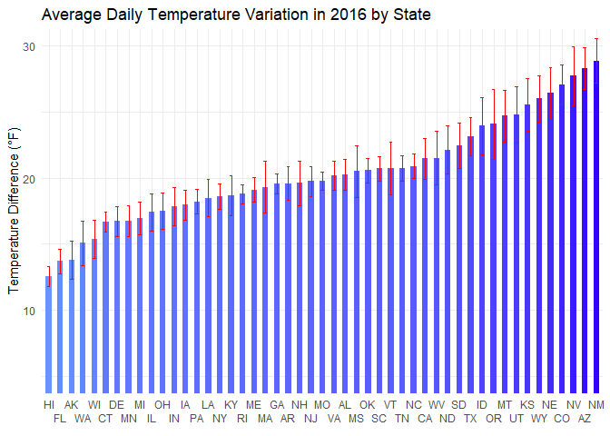

Team Project 1
================

## Data

The data `MonthlyWeather.csv` contain monthly weather readings for 113
US airports from July, 2014 through September, 2017. Variable
descriptions are given below. The location of this data is
<https://raw.githubusercontent.com/mgelman/data/master/MonthlyWeather.csv>.

### Analysis 1: Exploring Temperature Variation and Weather by Month

The visualization below illustrates the average temperature differences
by month. We have created this bar graph by grouping the weather data
set by month and calculating the mean of average daily temperature
differences for each month. Using this data we created a bar graph with
95% confidence interval and reordered them in the chronological order of
the month.

<!-- -->

As shown in the above bar graph, June appears to have the most variable
daily temperatures with an average daily temperature difference of
22.5°F, while December has the least variable, or the most consistent,
daily temperatures with an average daily temperature difference of
16.2°F. Indicated on the top of the bar, the 95% confidence interval
(CI) for the mean daily temperature difference in December does not
overlap with the intervals in other months, especially that in January,
so there is indeed a statistically significant difference between the
mean in December and others, supporting the conclusion that December has
the most consistent daily temperatures. However, the 95% confidence
interval for the mean daily temperature difference in June overlaps with
the intervals in March, April, May, July, August, September, and
October, which means that the true differences between the mean in June
and the means in the other months may not be statistically significant
at the 0.05 level. Conducting one-way ANOVA test and Tukey HSD gives
adjusted p-values much above 0.05 for multiple pairwise-comparisons
between the mean in June and the means in the other seven months,
confirming the differences between them are not statistically
significant. Therefore, it is unclear whether June has the highest mean
daily temperature difference compared to the other seven months, and
further data analysis is needed to determine which month has the most
variable daily temperatures.

The visualization below illustrates the average number of sunny days by
month. We have created this bar graph by grouping the weather data set
by month and calculating the mean of number of sunny days for each
month. Using this data we created a bar graph with 95% confidence
interval and reordered them in the chronological order of the month.

<!-- -->

As shown in the above bar graph, July appears to have the most sunny
days with an average number of sunny days of 15.4, while December seems
to have the fewest sunny days with an average number of sunny days of
8.4. However, the 95% confidence interval (CI), indicated on the top of
the bar, for the number of sunny days in December overlaps with the
interval in January, meaning the true difference between the two months
may not be statistically significant at the 0.05 level. Moreover, the
95% CI in July overlaps with the intervals in June, August, and October,
so the true difference between the number of sunny days in July and
those in the other months may not be statistically significant.
Conducting one-way ANOVA test and Tukey HSD gives adjusted p-values much
above 0.05 for multiple pairwise-comparisons between the number of sunny
days in December and that in January, as well as between the number in
July and those in the other three months, confirming the differences
between them are not statisticaly significant at the 0.05 level.
Therefore, it is unclear whether December has the least sunny days
compared to January and whether July has the most sunny days compared to
June, August, and October. Further data analysis is needed to determine
which month has the most and the fewest sunny days.

### Analysis 2: Exploring Temperature Variation and Weather by State for Year 2016

The visualization below illustrates the average temperature differences
by State in 2016. We have created this graph by first filtering the
weather data set so that it only includes the data from 2016. Then, we
grouped the data by state and calculated the mean of average temperature
differences for each state. Using this data we created a bar graph with
95% confidence interval and reordered them in the increasing order of
the average temperature differences.

<!-- -->

As shown in the bar graph above, New Mexico appears to have the most
variable daily temperatures with an average daily temperature difference
of 28.9°F, while Hawaii has the least variable, or the most consistent,
daily temperatures with an average daily temperature difference of
12.6°F. Indicated on the top of the bar, the 95% CI for the mean daily
temperature difference in New Mexico overlaps with the intervals in
Arizona, Colorado, Kansas, Nebraska, Nevada, and Wyoming, so the true
differences between the mean in New Mexico and the means in the other
six states may not be statistically significant at the 0.05 level.
Moreover, However, the 95% CI for the mean daily temperature difference
in Hawaii overlaps with the intervals in Arkansas and Florida, meaning
the true differences between the mean in Hawaii and the means in
Arkansas and Florida may not be statistically significant. Conducting
one-way ANOVA test and Tukey HSD gives adjusted p-values much above 0.05
for multiple pairwise-comparisons between the mean in New Mexico and the
means in the other six states, as well as between the mean in Hawaii and
those in Arkansas and Florida, confirming the differences between them
are not statisticaly significant at the 0.05 level. Therefore, it is
unclear whether New Mexico has the highest mean daily temperature
difference compared to the other six states and whether Hawaii has the
lowest mean daily temperature difference compared to Arkansas and
Florida. Further data analysis is needed to determine which state has
the most variable and the least variable daily temperatures.

The illustration below is a map of all the states in the US including
Alaska and Hawaii. The colors are filled depending on the average
temperature difference by State in 2016 (Fº).

<!-- -->

In order to compare and contrast the variation in temperate among
different states, it would be better to look at how the temperature
differences deviate from 0. Therefore, we have calculated difference
between state average temperature difference and national average
temperature difference. We then filled each state using this
recalculated data setting 0 as the midpoint.

<!-- -->

The visualization below illustrates the average number of sunny days by
state. We have created this bar graph by first filtering the weather
data set so that it only includes the data from 2016. Then, we grouped
the data by state and calculated the mean of sunny days for each state.
Using this data we created a bar graph with 95% confidence interval and
reordered them in the increasing order of the average number of sunny
days.

<!-- -->

As shown in the above bar graph, New Mexico appears to have the most
sunny days with an average number of sunny days of 23.1, while Hawaii
seems to have the fewest sunny days with an average number of sunny days
of 3.9. However, the 95% CI, indicated on the top of the bar, for the
number of sunny days in New Mexico overlaps with the intervals in
Arizona, Kansas, Mississippi, and Wyoming, meaning the true differences
between the number of sunny days in New Mexico and those in the other
four states may not be statistically significant at the 0.05 level.
Moreover, the 95% CI in Hawaii overlaps with the intervals in Arkansas,
Kentucky, Minnesota, New Hampshire, New York, Rhode Island, Vermont,
Washington, and West Virginia, so the true difference between the number
of sunny days in Hawaii and those in the other nine states may not be
statistically significant. Conducting one-way ANOVA test and Tukey HSD
gives adjusted p-values much above 0.05 for multiple
pairwise-comparisons between the number of sunny days in New Mexico and
those in Arizona, Kansas, Mississippi, and Wyoming, as well as between
the number in Hawaii and those in the other nine states, confirming the
differences between them are not statistically significant at the 0.05
level. Therefore, it is unclear whether Hawaii has the least sunny days
compared to the other nine states and whether New Mexico has the most
sunny days compared to the four other states. Further data analysis is
needed to determine which state has the most and the fewest sunny days.

The illustration below is a map of all the states in the US including
Alaska and Hawaii. The colors are filled depending on the average number
of sunny days by State in 2016.

<!-- -->

### Analysis 3: Choosing a city to live in

In order to choose which city to live in, we first determined what the
most important criteria are. Here are the four criteria:

1.  Low Average Temperature Difference

2.  High Average Number of Sunny Days

3.  Low Average Precipitation

4.  Moderate Average Wind Speed

Based on these four criteria, we have constructed a scoring guideline as
depicted below. Here, more points allocated to a criterion that we
consider more important:

| Conditions                                | Points |
|:------------------------------------------|-------:|
| Average Temperature Difference ≤ 15       |    +10 |
| 15 \< Average Temperature Difference ≤ 20 |     +8 |
| 20 \< Average Temperature Difference ≤ 25 |     +6 |
| 25 \< Average Temperature Difference      |     -3 |
| 20 \< Average Number of Sunny Days        |    +12 |
| 15 \< Average Number of Sunny Days ≤ 20   |    +10 |
| 10 \< Average Number of Sunny Days ≤ 15   |     +8 |
| Average Number of Sunny Days ≤ 10         |     -3 |
| Average Precipitation \< 0.01             |    +10 |
| 0.01 ≤ Average Precipitation \< 0.08      |     +5 |
| 15 \< Average Wind Speed \< 19            |    +10 |

Using this scoring guideline we then allocated points to each city and
calculated the total points that each city has earned. Then, we
visualized the total scores of the top 10 cities using a bar graph as
illustrated below. Note that we have reordered the data points in a
descending order of total scores.

<!-- -->

As shown in the bar graph above, Las Vegas has the highest climate score
for the entire year. Therefore, if we were to choose one particular city
to live in year round, we would choose Las Vegas.

<!-- --><!-- --><!-- --><!-- -->

We then have decided to regroup the City Score data by season to
recalculate the climate score for each city. As shown in the bar graphs
above, depending on the season, city with the high climate score varies.
Denver has the highest climate score in spring, Key West has the highest
climate score in summer, and Las Vegas has the highest climate score for
both autumn and winter. Therefore, we would migrate to the three cities
mentioned above when season changes.
