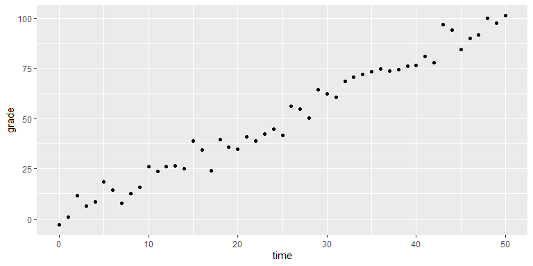

Statistical Learning
================
ECON 122
Day 12

The goal of today’s activity is to examine the tradeoff between goodness
of fit and over-fitting. We will compare the `training MSE` and the
`testing MSE` as we increase model flexibility.

## Analyzing a linear model

Let’s stick with our exam grade vs hours studying data. Imagine the true
relationship is linear but there are random errors that cause
fluctuations. To be exact, the relationship between `grade` and `time`
is
.
The data is presented below

``` r
> set.seed(123) #This sets the random number generator seed so that all our data lines up
> time=(0:50)
> sim_data <- data.frame(time,grade=2*time+rnorm(length(time),0,5))
> ggplot(data=sim_data,aes(x=time,y=grade)) + geom_point() 
```

<!-- -->

### Question 1

Using the data above, overlay both a line as well as a curve that
represents a 10th degree polynomial. What do you notice differently
about the fit of the line vs the 10th degree polynomial curve?

- **Hint**: The syntax for a `nth` degree polynomial is
  `geom_smooth(method="lm",formula=y ~ poly(x,n,raw=TRUE)`

### Question 2

1.  Calculate the `training MSE` of different models where you vary the
    degree of polynomial from 1 to 20. For example, 1 means a line and
    10 means a polynomial of degree 10.

- **Note**:To help you, I’ve written a function that takes the degree of
  polynomial (`n`) and the data set used to evaluate the predictions
  (`data`) as inputs and outputs the `MSE`.

``` r
> calc_MSE <- function(n,data) {
+   lm_output <- lm(grade~poly(time,n,raw=TRUE),data=sim_data) 
+   residuals=data$grade-lm_output$fitted.values
+   mean(residuals^2)
+ }
```

- **Hint**: Use `sapply` on your function as `n` varies from 1 to 20.

2.  Plot the relationship between `n` and the training `MSE`. What do
    you notice about the relationship?

### Question 3

1.  Calculate the `testing MSE` using data generated from the same model
    but not used in the training set. I’ve created the testing data
    below as `testing_data`.

``` r
> testing_data <- data.frame(time,grade=2*time+rnorm(length(time),0,5))
```

2.  Plot both the `testing MSE` and the `training MSE` on the same plot
    against `n`. What relationship do you notice between the variables?
