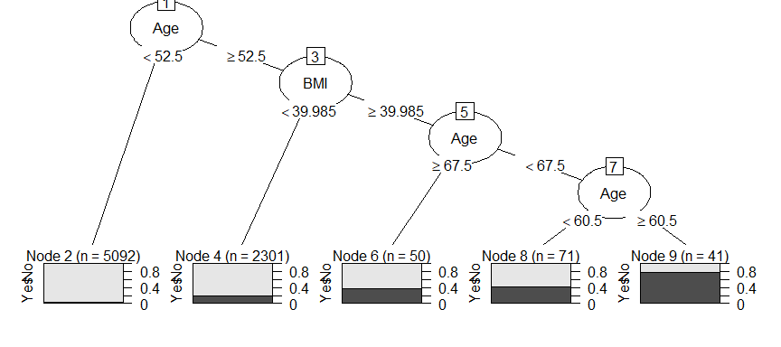

Decision Trees
================
ECON 122
Day 16

### Diabetes Example:

Let’s take a look at the diabetes example from textbook section 8.5.
Here we data frm the NHANES study, and only want to consider complete
cases using the variables:
`Gender, Diabetes, Age, BMI, PhysActive, HHIncome`.

``` r
> table(NHANES$Gender, NHANES$Diabetes)
        
           No  Yes
  female 4592  357
  male   4506  403
> NHANES %>% group_by(Gender, Diabetes) %>% count()
# A tibble: 6 × 3
# Groups:   Gender, Diabetes [6]
  Gender Diabetes     n
  <fct>  <fct>    <int>
1 female No        4592
2 female Yes        357
3 female <NA>        71
4 male   No        4506
5 male   Yes        403
6 male   <NA>        71
> diabetes <- NHANES %>% select(Gender, Diabetes, Age, BMI, PhysActive, HHIncome) %>% na.omit()
> diabetes
# A tibble: 7,555 × 6
   Gender Diabetes   Age   BMI PhysActive HHIncome   
   <fct>  <fct>    <int> <dbl> <fct>      <fct>      
 1 male   No          34  32.2 No         25000-34999
 2 male   No          34  32.2 No         25000-34999
 3 male   No          34  32.2 No         25000-34999
 4 female No          49  30.6 No         35000-44999
 5 female No          45  27.2 Yes        75000-99999
 6 female No          45  27.2 Yes        75000-99999
 7 female No          45  27.2 Yes        75000-99999
 8 male   No          66  23.7 Yes        25000-34999
 9 male   No          58  23.7 Yes        more 99999 
10 male   No          54  26.0 Yes        65000-74999
# … with 7,545 more rows
> diabetes %>% group_by(Gender, Diabetes) %>% count() %>% group_by(Gender) %>% mutate(propByGender = n/sum(n))
# A tibble: 4 × 4
# Groups:   Gender [2]
  Gender Diabetes     n propByGender
  <fct>  <fct>    <int>        <dbl>
1 female No        3475       0.917 
2 female Yes        316       0.0834
3 male   No        3396       0.902 
4 male   Yes        368       0.0978
> prop.table(table(diabetes$Gender, diabetes$Diabetes),1)
        
                 No        Yes
  female 0.91664468 0.08335532
  male   0.90223167 0.09776833
```

There are 7,555 complete cases (rows) with these variables. Of the
females in this group, about 8.3% have diabetes while about 9.8% of
males do.

#### Question 1

Fit a decision tree just using the variables `Gender` and `Age`. What
tree does it produce? What are your error and accuracy rates?

#### Question 2

The default control parameter for the `rpart` splitting algorithm is 1%
(`cp=0.01`). This means that a split will occur from a parent node if
the overall purity of the children is at least 1% better than the
parent. Do you have to *increase* or *decrease* this value to make your
tree bigger (i.e. more splits)? Play around with this value to try to
get your tree from question 1 to split. Here is the argument to add to
the `rpart` command: `control=rpart.control(cp=.01)`. Change the 0.01
value to something higher or lower from this default setting.

- Note: Using the argument `gp = gpar(fontsize = 8)` to change the font
  size can make your trees easier to visualize. For example
  `plot(as.party(diab_rpart),gp = gpar(fontsize = 8))`

#### Question 3

The book authors fit the model below to all variables except income:

``` r
> diab_rpart <- rpart(Diabetes ~ Gender + Age + BMI + PhysActive, data=diabetes, control=rpart.control(cp=.005, minbucket = 30))
> diab_rpart
n= 7555 

node), split, n, loss, yval, (yprob)
      * denotes terminal node

 1) root 7555 684 No (0.90946393 0.09053607)  
   2) Age< 52.5 5092 188 No (0.96307934 0.03692066) *
   3) Age>=52.5 2463 496 No (0.79861957 0.20138043)  
     6) BMI< 39.985 2301 416 No (0.81920904 0.18079096) *
     7) BMI>=39.985 162  80 No (0.50617284 0.49382716)  
      14) Age>=67.5 50  18 No (0.64000000 0.36000000) *
      15) Age< 67.5 112  50 Yes (0.44642857 0.55357143)  
        30) Age< 60.5 71  30 No (0.57746479 0.42253521) *
        31) Age>=60.5 41   9 Yes (0.21951220 0.78048780) *
> plot(as.party(diab_rpart))
```

<!-- -->
What happens if you omit the `minbucket` part of the control argument?
What does including this option do to your tree?

#### Question 4

Fit the model from question 3 without the `minbucket` option to a
training dataset composed of just 2009-10 survey responses. Then use
this model to predict diabetes cases for the 2011-2012 survey. What are
your `test` and `training` `error` and `accuracy` rates? `Precision` and
`recall`?
