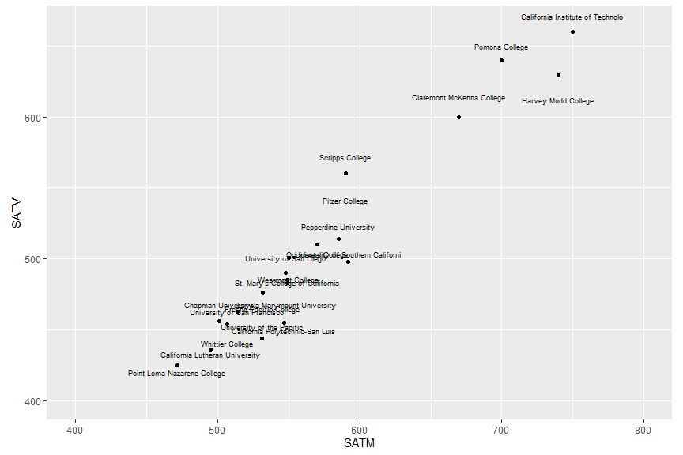

Clustering Activity
================
ECON 122
Day 18

## Clustering using Incoming student characteristics

We will look at a “classic” college data set of a random sample of
colleges and universities. For this activity we will focus on CA
colleges and universities.

``` r
> colleges <- read_csv("https://raw.githubusercontent.com/mgelman/data/master/Colleges.csv")
> names(colleges)
 [1] "State"       "College"     "SATM"        "SATV"        "AppsReceive"
 [6] "AppsAccept"  "HStop10"     "HStop25"     "FullTime"    "Tuition"    
[11] "RoomBoard"   "Books"       "Ratio"       "Donate"      "Expend"     
[16] "GradRate"    "Type"        "AvgSalary"   "NumFaculty" 
> colleges2 <- colleges %>% filter(State=="CA")
```

Instead of focusing just on `SATM` and `SATV` we will also consider
`AppsReceive`.

``` r
> coll_vars <- names(colleges2)[c(3,4,5)]
> coll_vars
[1] "SATM"        "SATV"        "AppsReceive"
> summary(colleges2[,coll_vars])
      SATM            SATV        AppsReceive   
 Min.   :472.0   Min.   :425.0   Min.   :  346  
 1st Qu.:531.0   1st Qu.:456.0   1st Qu.:  959  
 Median :549.0   Median :490.0   Median : 1916  
 Mean   :575.3   Mean   :511.4   Mean   : 2704  
 3rd Qu.:590.0   3rd Qu.:560.0   3rd Qu.: 3037  
 Max.   :750.0   Max.   :660.0   Max.   :12229  
```

First, let’s plot the schools against two of the variables `SATM` and
`SATV`

``` r
> set.seed(7)
> ggplot(colleges2, aes(SATM,SATV)) + 
+   geom_point() + 
+   geom_text(aes(label=College),position=position_jitter(width=0,height=20),size=2.5) + 
+   coord_fixed(xlim = c(400, 800),ylim=c(400,665)) 
```

<!-- -->

#### Question 1:

Just by looking at the figure above, can you predict roughly what 3
different clusters would look like when using k-means clustering?

#### Question 2:

Use k-means clustering with a `k=3` to cluster the data based on `SATM`,
`SATV`, and `AppsReceive`. Add the cluster assignment to your dataset
and plot the same figure as above but with colors representing the
clusters. Do the clusters match your predictions from Question 1? Why or
why not?

#### Question 3:

One reason the clustering might have been different from your
expectations is because we haven’t appropiately scaled the data. Do all
the variables have similar scale? Re-do Question 2 using an appropiate
scaling. Are the clusters closer to what you were expecting?

#### Question 4:

Even after standardizing the data, the clusters may seem visually off
when plotted on the `SATM` vs `SATV` scale. Why is that? What are the
characeristics of the schools that seem to not fit well?

- Hint: Recreating your plot but using `AppsReceive` on the y-axis may
  help explain the clusters.

#### Question 5:

Up to now we’ve been using clusters of 3 to split up the data. Using the
standardized data, create a plot that shows how the values of `withinss`
vary as `k` varies from 1 to 20.

Using this plot, what do you think the optimal level of `k` is? Why?
