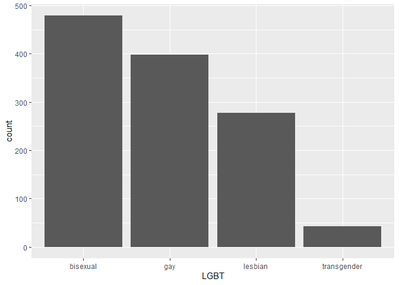
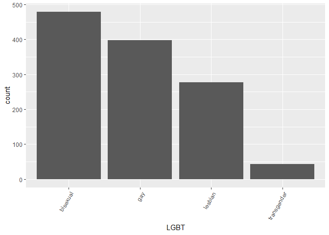

More `ggplot2`
================
ECON 122
Day 5

## Analyzing COVID-19 data

Data for this section was downloaded from [The New York
Times](https://github.com/nytimes/covid-19-data/tree/master/rolling-averages)
COVID-19 case data.

The following chunk imports seven day rolling averages of COVID-19 case
counts per 100k residents. The important variables for this analysis are
`region` which represents each US State and `cases_avg_per_100k` which
hold the case data.

``` r
> library("dplyr")
Warning: package 'dplyr' was built under R version 4.2.1
> COVID_DATA <- read.csv("https://raw.githubusercontent.com/mgelman/data/master/us-states.csv")
> COVID_DATA <- as_tibble(COVID_DATA)
> COVID_DATA <- COVID_DATA %>%  rename(region=state)
> COVID_DATA$region <- tolower(COVID_DATA$region)  # lower case (match MainStates regions)
```

The following chunk creates a snapshot of the data roughly at the peak
of each of the four waves we’ve had so far

``` r
> APR_20 <- COVID_DATA %>% filter(date == "2020-04-01")
> AUG_20 <- COVID_DATA %>% filter(date == "2020-08-01")
> JAN_21 <- COVID_DATA %>% filter(date == "2021-01-01")
> SEP_21 <- COVID_DATA %>% filter(date == "2021-09-01")
```

### Question 1: Create a series of four maps of the US states that shows the case load at each snapshot in time. Label each map appropiately so we can tell the difference between them.

*Hint:* The lecture notes on mapping can help guide you

### Question 2: For each wave, which region of the US is most impacted?

### Question 3: Play around with the palette colors. Are there some color schemes that work better than others for visualizing the case counts?

## Graphs for categorical variables

Survey data is a good source for variables with categorical responses.
We will switch to data collected from the 2013 Pew Survey of LGBT
Americans. Non-responses are denoted as blank spaces in the dataset and
we need to inform R of this when reading in this `.csv` (otherwise blank
responses will be treated as an actual response level when R reads in
this type of (mainly) factor data):

``` r
> library(ggplot2)
Warning: package 'ggplot2' was built under R version 4.2.1
> pew<- read.csv("https://raw.githubusercontent.com/mgelman/data/master/PewLGBT2013.csv", na.strings = c(NA," ","Refused"))
```

A bar graph of `LGBT` variable summarizes the distribution of
respondents LGBT identity:

``` r
> a <- ggplot(pew, aes(x=LGBT) )
> a + geom_bar() 
```

<!-- -->

### Question 4: What happens if you change coordinate systems and add `coord_polar()` to the last plot? (This is called a Coxcomb graph.)

You can rotate labels by rotating text on the x-axis.

``` r
> a + geom_bar() + theme(axis.text.x=element_text(angle=60,hjust=1))
```

<!-- -->

### Question 5: What happens when you change the `hjust` number to something bigger? something negative?

Let’s explore how LGBT identify relates to another categorical variable
response, `Q2`, that measures whether an individual thinks the nation is
on the “right direction” or “wrong track”. Here we use `Q2` answers to
`fill` the bars and create a stacked bar graph:

``` r
> a + geom_bar(aes(fill=Q2)) + scale_fill_discrete(name="Nation headed in")
```

<!-- -->

Note that the scale type is `fill`, so we used `scale_fill_discrete` to
change the legend name.

Let’s make another change by adding `position=fill` to the `bar` geom:

``` r
> a + geom_bar(aes(fill=Q2), position="fill") + scale_fill_discrete(name="Nation headed in")
```

<!-- -->

### Question 6: What is the scale of the y-axis? Once you figure this out, change the label from `count` to something more appropriate. Is there an association between LGBT identity and the response to the right track/wrong track question?

### Question 7: What do the gray sections represent? The gray sections are present in the count version of this graph, but why are they hard to see?

### Question 8: Facet the previous graph by `PARTY`, the political affiliation of the respondent. Does the relationship between LGBT and right track/wrong track seem to depend upon `PARTY`?
