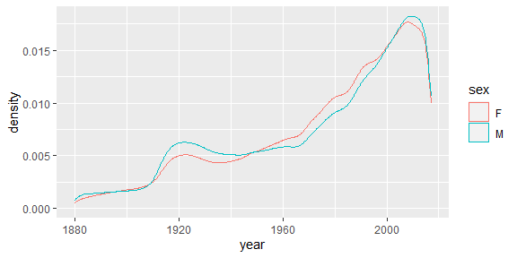
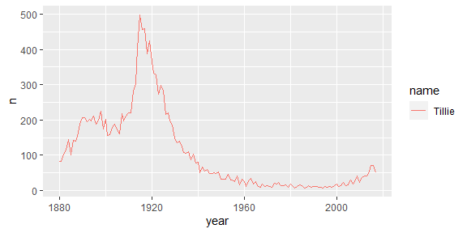

Data wrangling: one data table
================
ECON 122
Day 6

## Historical baby names (section 3.3)

The package `babynames` contains the data set `babynames`. This data set
gives name rates for births recorded by the Social Security
Administration from 1880 - 2017 (138 years).

``` r
> glimpse(babynames)
Rows: 1,924,665
Columns: 5
$ year <dbl> 1880, 1880, 1880, 1880, 1880, 1880, 1880, 1880, 1880, 1880, 1880,…
$ sex  <chr> "F", "F", "F", "F", "F", "F", "F", "F", "F", "F", "F", "F", "F", …
$ name <chr> "Mary", "Anna", "Emma", "Elizabeth", "Minnie", "Margaret", "Ida",…
$ n    <int> 7065, 2604, 2003, 1939, 1746, 1578, 1472, 1414, 1320, 1288, 1258,…
$ prop <dbl> 0.07238359, 0.02667896, 0.02052149, 0.01986579, 0.01788843, 0.016…
```

- Over 1.8 million rows giving the names of all baby names born in any
  year
- Each row specifies a:
  - `year`
  - `sex`
  - `name`
  - `n` number with a name in a given year
  - `prop` yearly proportion with a given name (by sex). E.g. 7065
    females named Mary were recorded in SSA applicants born in 1880,
    this makes up about 7.2% of all females applicants with 1880 birth
    dates.

### 1. what does this plot show?

``` r
> ggplot(babynames, aes(x=year)) + geom_density(aes(color=sex)) 
```

<!-- -->

### 2. What does this plot show?

``` r
> babynames %>% 
+   filter(name == "Tillie", sex == "F") %>% 
+   ggplot(aes(x=year)) + 
+     geom_line(aes(y=n, color=name))
```

<!-- -->

### 3. The following command shows there are 142 years with at least one baby named Tillie. Is this statement necessarily true? (Hint: Think about what 1 row represents)

``` r
> filter(babynames, name == "Tillie")
# A tibble: 142 × 5
    year sex   name       n     prop
   <dbl> <chr> <chr>  <int>    <dbl>
 1  1880 F     Tillie    83 0.000850
 2  1881 F     Tillie    82 0.000830
 3  1882 F     Tillie   104 0.000899
 4  1883 F     Tillie   114 0.000950
 5  1884 F     Tillie   145 0.00105 
 6  1885 F     Tillie   101 0.000712
 7  1886 F     Tillie   143 0.000930
 8  1887 F     Tillie   140 0.000901
 9  1888 F     Tillie   154 0.000813
10  1889 F     Tillie   188 0.000994
# … with 132 more rows
```

### 4. What does this command do?

``` r
> filter(babynames, name %in% c("Tillie","Tilly","Mathilda","Matilda"))
# A tibble: 457 × 5
    year sex   name         n     prop
   <dbl> <chr> <chr>    <int>    <dbl>
 1  1880 F     Matilda    210 0.00215 
 2  1880 F     Tillie      83 0.000850
 3  1880 F     Mathilda    72 0.000738
 4  1881 F     Matilda    187 0.00189 
 5  1881 F     Tillie      82 0.000830
 6  1881 F     Mathilda    69 0.000698
 7  1882 F     Matilda    242 0.00209 
 8  1882 F     Tillie     104 0.000899
 9  1882 F     Mathilda    68 0.000588
10  1883 F     Matilda    167 0.00139 
# … with 447 more rows
```

### 5. Write the following set of commands using one piped command.

``` r
> tillies <- filter(babynames, name=="Tillie")
> summarize(group_by(tillies, sex), tillie_mean = mean(n), tillie_sd = sd(n), n_years = n())
# A tibble: 2 × 4
  sex   tillie_mean tillie_sd n_years
  <chr>       <dbl>     <dbl>   <int>
1 F           106.    114.        137
2 M             5.4     0.548       5
```

### 6. Interpret the summaries given in 5.

### 7. Which year did not have any babies named Tillie for female births?

### 8. Counting babies

Use the `yearSizes` data to answer the following questions. (You will
need to transform this dataset to answer some questions.)

``` r
> yearSizes <- babynames %>% 
+   group_by(year,sex) %>%
+   summarize(n_names = n(), size = sum(n))
> yearSizes
# A tibble: 276 × 4
# Groups:   year [138]
    year sex   n_names   size
   <dbl> <chr>   <int>  <int>
 1  1880 F         942  90993
 2  1880 M        1058 110491
 3  1881 F         938  91953
 4  1881 M         997 100743
 5  1882 F        1028 107847
 6  1882 M        1099 113686
 7  1883 F        1054 112319
 8  1883 M        1030 104627
 9  1884 F        1172 129020
10  1884 M        1125 114442
# … with 266 more rows
```

- What do `n_names` and `size` measure?
- Which year saw the most male babies born? female babies?
- Find the year with the highest number of babies born (both male and
  female)
- Compute the ratio of number of distinct names in a year over the
  number of babies born (for each sex). Then plot this versus `year`.
  When was “diversity” in naming the lowest and highest for:
  1.  females?
  2.  males?
  3.  both males and females?

### 9. Using the `babynames` data, what are the most “unisex” names (historically, most balance between males and females).

Try filtering to get more common names, e.g. so there are at least, say,
10,000 male and female occurances (each) of the name over all years in
the dataset. Then you will find the “common” unisex names and not rare
ones that, for example, have 1 instance of a male and 1 of a female
(which would be 50% male and 50% female).
