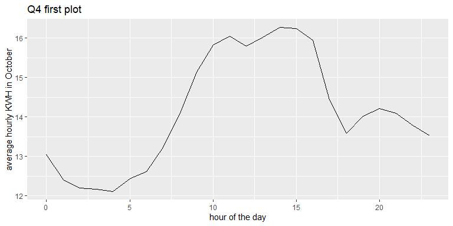
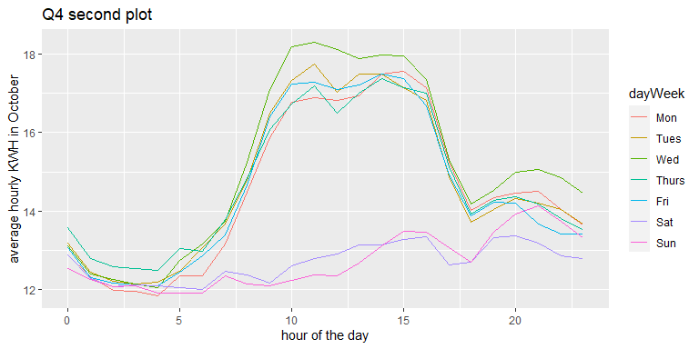
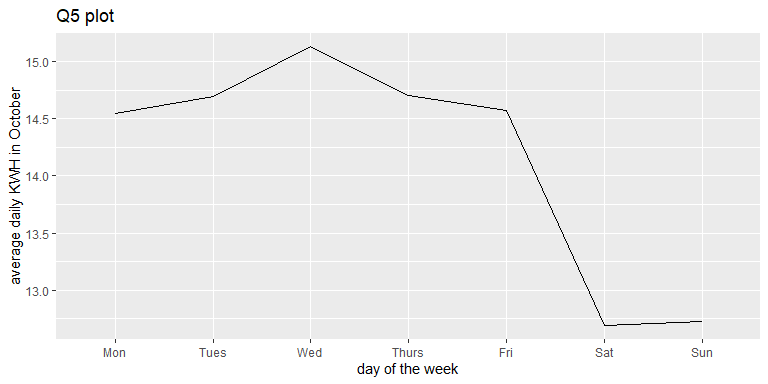
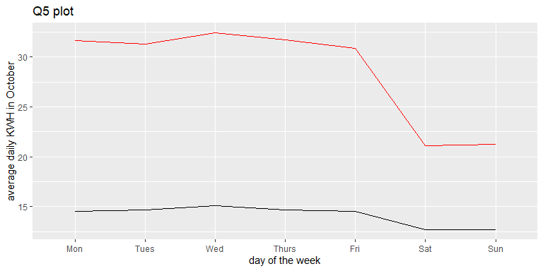

Tidy data: Carleton College Energy Activity - Solution
================
ECON 122
Day 8,9

The data for this example is from Carleton College. The goal of this
activity is to help you better understand what issues arrive from
working with real world data.

# Building Data

The `AAbuildings` dataset gives the size and year built of buildings on
campus that are considered academic or administrative buildings.

### Question 1

**1.** Run the two read commands below (`read.csv` and
`readr::read_csv`). How do they read in the data differently?

**2.** How many buildings on campus are classified as academic or
administrative?

``` r
> AAbuildings <- read.csv("https://raw.githubusercontent.com/mgelman/data/master/AcadAdminBuildings.csv",stringsAsFactors=TRUE)
> glimpse(AAbuildings)
Rows: 25
Columns: 4
$ building <fct> 200_Division_Street_Building, 212_East_2nd_St., 216_College_S…
$ Address  <fct> 200 Division St., 212 East 2nd St., 216 College St. S., 100 C…
$ year     <dbl> 1948, 1947, 1894, 1992, 1989, 1920, 1950, 1993, 1910, 1888, 1…
$ sqFt     <dbl> 21147, 3276, 4017, 20337, 2952, 4780, 30547, 42300, 33104, 11…
> AAbuildings <- read_csv("https://raw.githubusercontent.com/mgelman/data/master/AcadAdminBuildings.csv")
> glimpse(AAbuildings)
Rows: 25
Columns: 4
$ building <chr> "200_Division_Street_Building", "212_East_2nd_St.", "216_Coll…
$ Address  <chr> "200 Division St.", "212 East 2nd St.", "216 College St. S.",…
$ year     <dbl> 1948, 1947, 1894, 1992, 1989, 1920, 1950, 1993, 1910, 1888, 1…
$ sqFt     <dbl> 21147, 3276, 4017, 20337, 2952, 4780, 30547, 42300, 33104, 11…
```

#### *Answer:*

**1.** `read.csv` defaults to factor variables for anything with
characters while `read_csv` defaults to character variables. **2.**
There are 25 rows in the data set so that is the number of acad/admin
buildings.

# Energy Use Data

A second dataset gives energy use (kiloWatt hour) every 15 minutes for
the 15-16 academic year for all buildings on campus that have an energy
meter installed.

### Question 2

**1.** How have the variable types changed when using `read_csv` instead
of `read.csv`? - e.g. look at Musser, Timestamp

``` r
> energy1 <- read.csv("https://raw.githubusercontent.com/mgelman/data/master/EnergyData1516.csv")
> glimpse(energy1)
Rows: 35,129
Columns: 90
$ Timestamp                          <chr> "2015-09-01 00:00:00", "2015-09-01 …
$ year                               <int> 2015, 2015, 2015, 2015, 2015, 2015,…
$ month                              <int> 9, 9, 9, 9, 9, 9, 9, 9, 9, 9, 9, 9,…
$ weekOfYear                         <int> 35, 35, 35, 35, 35, 35, 35, 35, 35,…
$ dayOfMonth                         <int> 1, 1, 1, 1, 1, 1, 1, 1, 1, 1, 1, 1,…
$ dayWeek                            <chr> "Tues", "Tues", "Tues", "Tues", "Tu…
$ timeHour                           <int> 0, 0, 0, 0, 1, 1, 1, 1, 2, 2, 2, 2,…
$ timeMinute                         <int> 0, 15, 30, 45, 0, 15, 30, 45, 0, 15…
$ X100_Nevada_Street                 <dbl> 0.18333, NA, NA, NA, 0.18333, NA, N…
$ X104_Maple_St.                     <dbl> 1.42361, NA, NA, NA, 1.42361, NA, N…
$ X106_Winona_St.                    <dbl> 1.10278, NA, NA, NA, 1.10278, NA, N…
$ Allen_House                        <dbl> 1.51172, NA, NA, NA, 1.51172, NA, N…
$ Alumni_Guest_House.Johnson_House   <dbl> 18.4375, NA, NA, NA, 18.4375, NA, N…
$ Arboretum_Office                   <dbl> 0.27, 0.24, 0.28, 0.46, 0.27, 0.24,…
$ Art_Studios                        <dbl> 0.40, 0.38, 0.29, 0.34, 0.84, 0.50,…
$ Benton_House                       <dbl> 2.26528, NA, NA, NA, 2.26528, NA, N…
$ Berg_House                         <dbl> 1.56389, NA, NA, NA, 1.56389, NA, N…
$ Bird_House                         <dbl> 2.93194, NA, NA, NA, 2.93194, NA, N…
$ Boliou_Memorial_Art_Bldg.          <dbl> 4.5313, 4.5312, 4.5313, 4.3750, 4.3…
$ Burton_Hall                        <dbl> 5, 4, 5, 4, 4, 4, 3, 4, 4, 4, 4, 4,…
$ Cassat_Hall_._James_Hall           <dbl> 13.00, 12.25, 12.75, 12.25, 12.00, …
$ Center_for_Mathematics_._Computing <dbl> 14.3750, 14.0625, 14.3750, 14.0625,…
$ Chaney_House                       <dbl> 1.08194, NA, NA, NA, 1.08194, NA, N…
$ Clader_House                       <dbl> 0.22917, NA, NA, NA, 0.22917, NA, N…
$ College_Warehouse                  <dbl> 0.93, 0.96, 0.69, 1.10, 0.98, 0.76,…
$ Cowling_Gym                        <dbl> 6, 7, 6, 6, 6, 6, 6, 6, 6, 6, 6, 6,…
$ Dacie_Moses_House                  <dbl> 1.46944, NA, NA, NA, 1.46944, NA, N…
$ Davis_Hall                         <dbl> 3, 3, 3, 3, 3, 2, 4, 3, 3, 2, 3, 2,…
$ Douglas_House                      <dbl> 0.66389, NA, NA, NA, 0.66389, NA, N…
$ Evans_Hall                         <dbl> 9.88, 9.00, 9.00, 8.75, 8.75, 9.12,…
$ Faculty_Club_._Annex               <dbl> 0, 0, 0, 0, 0, 0, 0, 0, 0, 0, 0, 0,…
$ Farm_House                         <dbl> 12, 12, 11, 12, 12, 11, 12, 13, 11,…
$ Geffert_House                      <dbl> 0.90755, NA, NA, NA, 0.90755, NA, N…
$ Generator_Building                 <dbl> 1.46, 1.68, 0.64, 2.04, 1.46, 0.83,…
$ Goodhue_Hall                       <dbl> 7, 7, 7, 7, 6, 7, 7, 6, 7, 6, 6, 7,…
$ Goodsell_Observatory               <dbl> 6, 5, 4, 5, 5, 5, 4, 5, 5, 5, 4, 5,…
$ Gould_Memorial_Library             <dbl> 9, 10, 10, 9, 9, 9, 9, 9, 9, 8, 9, …
$ Grounds_Building                   <dbl> 0.35, 0.36, 0.37, 0.36, 0.37, 0.37,…
$ Headley_Cottage                    <dbl> 2.22083, NA, NA, NA, 2.22083, NA, N…
$ Headley_House                      <dbl> 1.53056, NA, NA, NA, 1.53056, NA, N…
$ Henrickson_House                   <dbl> 1.71111, NA, NA, NA, 1.71111, NA, N…
$ Henry_House                        <dbl> 1.70972, NA, NA, NA, 1.70972, NA, N…
$ Hill_House                         <dbl> 0.96528, NA, NA, NA, 0.96528, NA, N…
$ Hilton_House                       <dbl> 0.67188, NA, NA, NA, 0.67188, NA, N…
$ Hoppin_House_.Alumni.              <dbl> 1.77917, NA, NA, NA, 1.77917, NA, N…
$ Hulings_Hall                       <dbl> 12.250, 12.625, 12.000, 11.250, 11.…
$ Hunt_Cottage                       <dbl> 0.99444, NA, NA, NA, 0.99444, NA, N…
$ Huntington_House                   <dbl> 1.34722, NA, NA, NA, 1.34722, NA, N…
$ James_Hall                         <dbl> 4.75, 4.50, 4.50, 4.25, 4.50, 4.25,…
$ Jewett_House                       <dbl> 1.375, NA, NA, NA, 1.375, NA, NA, N…
$ Jones_House                        <dbl> 0.89444, NA, NA, NA, 0.89444, NA, N…
$ Laird_Hall                         <dbl> 21, 22, 22, 23, 23, 22, 22, 22, 22,…
$ Laird_Stadium                      <dbl> 5, 5, 4, 5, 4, 5, 4, 5, 4, 4, 5, 4,…
$ Language_._Dining_Center           <dbl> 6.38, 6.18, 6.19, 6.38, 6.37, 6.19,…
$ Leighton_Hall                      <dbl> 2, 2, 2, 2, 2, 2, 2, 2, 2, 2, 2, 3,…
$ Main_Campus                        <dbl> 153.0, 189.0, 206.5, 213.5, 213.0, …
$ Mudd_Hall_of_Science               <dbl> 9.63, 9.87, 10.13, 9.62, 10.13, 9.6…
$ Music_Hall                         <dbl> 4.22, 3.90, 4.07, 4.22, 3.90, 4.38,…
$ Musser_Hall                        <dbl> NA, NA, NA, NA, NA, NA, NA, NA, NA,…
$ Myers_Hall                         <dbl> 5, 4, 4, 4, 4, 4, 4, 4, 4, 4, 4, 4,…
$ Nourse_Hall                        <dbl> 3.63, 3.75, 3.50, 3.62, 3.50, 3.63,…
$ Nutting_House                      <dbl> 5.83611, NA, NA, NA, 5.83611, NA, N…
$ Olin_Hall_of_Science               <dbl> 9.00, 8.25, 8.13, 6.87, 7.00, 6.75,…
$ Page_House_West                    <dbl> 1.86944, NA, NA, NA, 1.86944, NA, N…
$ Parish_House_                      <dbl> 12.1875, NA, NA, NA, 12.1875, NA, N…
$ Parr_House                         <dbl> 14, 13, 12, 12, 15, 13, 11, 14, 14,…
$ Pollock_House                      <dbl> 1.4, NA, NA, NA, 1.4, NA, NA, NA, 1…
$ Prairie_Warehouse                  <dbl> 0.01667, NA, NA, NA, 0.01667, NA, N…
$ Prentice_House                     <dbl> 1.17839, NA, NA, NA, 1.17839, NA, N…
$ Rayment_House                      <dbl> 1.00833, NA, NA, NA, 1.00833, NA, N…
$ Recreation_Center                  <dbl> 12.0, 12.0, 13.5, 12.0, 12.0, 12.0,…
$ Rice_House                         <dbl> 0.84861, NA, NA, NA, 0.84861, NA, N…
$ Rogers_House                       <dbl> 1.00972, NA, NA, NA, 1.00972, NA, N…
$ Ryberg_House                       <dbl> 1.1125, NA, NA, NA, 1.1125, NA, NA,…
$ Sayles.Hill                        <dbl> 7, 6, 7, 6, 7, 7, 6, 6, 7, 7, 6, 7,…
$ Scoville_Hall                      <dbl> 2, 0, 0, 0, 2, 0, 0, 0, 2, 0, 0, 0,…
$ Seccombe_House                     <dbl> 1.75556, NA, NA, NA, 1.75556, NA, N…
$ Severance_Hall                     <dbl> -7.37, -9.37, -6.63, -6.50, -6.25, …
$ Skinner_Memorial_Chapel            <dbl> 4, 4, 4, 4, 4, 4, 6, 4, 4, 4, 4, 4,…
$ Sperry_House                       <dbl> 0.87639, NA, NA, NA, 0.87639, NA, N…
$ Stimson_House                      <dbl> 1.72778, NA, NA, NA, 1.72778, NA, N…
$ Strong_House                       <dbl> 3.05177, NA, NA, NA, 3.05177, NA, N…
$ Student_Townhouses                 <dbl> 7, 7, 7, 7, 7, 7, 6, 7, 7, 7, 6, 7,…
$ Water_Tower                        <dbl> 0.76, 0.76, 0.76, 0.75, 0.76, 0.75,…
$ Watson_Hall                        <dbl> 5.16, 5.31, 5.16, 4.84, 5.00, 5.00,…
$ Weitz_Center_for_Creativity        <dbl> 17.0, 18.5, 18.5, 19.5, 20.5, 19.5,…
$ West_Gym                           <dbl> 7, 8, 7, 8, 7, 7, 9, 9, 9, 9, 9, 9,…
$ Whittier_House                     <dbl> 0.93056, NA, NA, NA, 0.93056, NA, N…
$ Willis_Memorial_Hall               <dbl> 2, 0, 2, 2, 2, 2, 0, 2, 2, 2, 0, 2,…
$ Wilson_House                       <dbl> 1.11328, NA, NA, NA, 1.11328, NA, N…
> local_edition(1)
> energy2 <- read_csv("https://raw.githubusercontent.com/mgelman/data/master/EnergyData1516.csv")
Warning: 12460 parsing failures.
  row         col           expected actual                                                                       file
22242 Musser_Hall 1/0/T/F/TRUE/FALSE  420.9 'https://raw.githubusercontent.com/mgelman/data/master/EnergyData1516.csv'
22243 Musser_Hall 1/0/T/F/TRUE/FALSE  398   'https://raw.githubusercontent.com/mgelman/data/master/EnergyData1516.csv'
22244 Musser_Hall 1/0/T/F/TRUE/FALSE  370.2 'https://raw.githubusercontent.com/mgelman/data/master/EnergyData1516.csv'
22245 Musser_Hall 1/0/T/F/TRUE/FALSE  327.4 'https://raw.githubusercontent.com/mgelman/data/master/EnergyData1516.csv'
22246 Musser_Hall 1/0/T/F/TRUE/FALSE  322.6 'https://raw.githubusercontent.com/mgelman/data/master/EnergyData1516.csv'
..... ........... .................. ...... ..........................................................................
See problems(...) for more details.
> glimpse(energy2)
Rows: 35,129
Columns: 90
$ Timestamp                            <dttm> 2015-09-01 00:00:00, 2015-09-01 …
$ year                                 <dbl> 2015, 2015, 2015, 2015, 2015, 201…
$ month                                <dbl> 9, 9, 9, 9, 9, 9, 9, 9, 9, 9, 9, …
$ weekOfYear                           <dbl> 35, 35, 35, 35, 35, 35, 35, 35, 3…
$ dayOfMonth                           <dbl> 1, 1, 1, 1, 1, 1, 1, 1, 1, 1, 1, …
$ dayWeek                              <chr> "Tues", "Tues", "Tues", "Tues", "…
$ timeHour                             <dbl> 0, 0, 0, 0, 1, 1, 1, 1, 2, 2, 2, …
$ timeMinute                           <dbl> 0, 15, 30, 45, 0, 15, 30, 45, 0, …
$ `100_Nevada_Street`                  <dbl> 0.18333, NA, NA, NA, 0.18333, NA,…
$ `104_Maple_St.`                      <dbl> 1.42361, NA, NA, NA, 1.42361, NA,…
$ `106_Winona_St.`                     <dbl> 1.10278, NA, NA, NA, 1.10278, NA,…
$ Allen_House                          <dbl> 1.51172, NA, NA, NA, 1.51172, NA,…
$ `Alumni_Guest_House/Johnson_House`   <dbl> 18.4375, NA, NA, NA, 18.4375, NA,…
$ Arboretum_Office                     <dbl> 0.27, 0.24, 0.28, 0.46, 0.27, 0.2…
$ Art_Studios                          <dbl> 0.40, 0.38, 0.29, 0.34, 0.84, 0.5…
$ Benton_House                         <dbl> 2.26528, NA, NA, NA, 2.26528, NA,…
$ Berg_House                           <dbl> 1.56389, NA, NA, NA, 1.56389, NA,…
$ Bird_House                           <dbl> 2.93194, NA, NA, NA, 2.93194, NA,…
$ Boliou_Memorial_Art_Bldg.            <dbl> 4.5313, 4.5312, 4.5313, 4.3750, 4…
$ Burton_Hall                          <dbl> 5, 4, 5, 4, 4, 4, 3, 4, 4, 4, 4, …
$ `Cassat_Hall_/_James_Hall`           <dbl> 13.00, 12.25, 12.75, 12.25, 12.00…
$ `Center_for_Mathematics_&_Computing` <dbl> 14.3750, 14.0625, 14.3750, 14.062…
$ Chaney_House                         <dbl> 1.08194, NA, NA, NA, 1.08194, NA,…
$ Clader_House                         <dbl> 0.22917, NA, NA, NA, 0.22917, NA,…
$ College_Warehouse                    <dbl> 0.93, 0.96, 0.69, 1.10, 0.98, 0.7…
$ Cowling_Gym                          <dbl> 6, 7, 6, 6, 6, 6, 6, 6, 6, 6, 6, …
$ Dacie_Moses_House                    <dbl> 1.46944, NA, NA, NA, 1.46944, NA,…
$ Davis_Hall                           <dbl> 3, 3, 3, 3, 3, 2, 4, 3, 3, 2, 3, …
$ Douglas_House                        <dbl> 0.66389, NA, NA, NA, 0.66389, NA,…
$ Evans_Hall                           <dbl> 9.88, 9.00, 9.00, 8.75, 8.75, 9.1…
$ `Faculty_Club_/_Annex`               <dbl> 0, 0, 0, 0, 0, 0, 0, 0, 0, 0, 0, …
$ Farm_House                           <dbl> 12, 12, 11, 12, 12, 11, 12, 13, 1…
$ Geffert_House                        <dbl> 0.90755, NA, NA, NA, 0.90755, NA,…
$ Generator_Building                   <dbl> 1.46, 1.68, 0.64, 2.04, 1.46, 0.8…
$ Goodhue_Hall                         <dbl> 7, 7, 7, 7, 6, 7, 7, 6, 7, 6, 6, …
$ Goodsell_Observatory                 <dbl> 6, 5, 4, 5, 5, 5, 4, 5, 5, 5, 4, …
$ Gould_Memorial_Library               <dbl> 9, 10, 10, 9, 9, 9, 9, 9, 9, 8, 9…
$ Grounds_Building                     <dbl> 0.35, 0.36, 0.37, 0.36, 0.37, 0.3…
$ Headley_Cottage                      <dbl> 2.22083, NA, NA, NA, 2.22083, NA,…
$ Headley_House                        <dbl> 1.53056, NA, NA, NA, 1.53056, NA,…
$ Henrickson_House                     <dbl> 1.71111, NA, NA, NA, 1.71111, NA,…
$ Henry_House                          <dbl> 1.70972, NA, NA, NA, 1.70972, NA,…
$ Hill_House                           <dbl> 0.96528, NA, NA, NA, 0.96528, NA,…
$ Hilton_House                         <dbl> 0.67188, NA, NA, NA, 0.67188, NA,…
$ `Hoppin_House_(Alumni)`              <dbl> 1.77917, NA, NA, NA, 1.77917, NA,…
$ Hulings_Hall                         <dbl> 12.250, 12.625, 12.000, 11.250, 1…
$ Hunt_Cottage                         <dbl> 0.99444, NA, NA, NA, 0.99444, NA,…
$ Huntington_House                     <dbl> 1.34722, NA, NA, NA, 1.34722, NA,…
$ James_Hall                           <dbl> 4.75, 4.50, 4.50, 4.25, 4.50, 4.2…
$ Jewett_House                         <dbl> 1.375, NA, NA, NA, 1.375, NA, NA,…
$ Jones_House                          <dbl> 0.89444, NA, NA, NA, 0.89444, NA,…
$ Laird_Hall                           <dbl> 21, 22, 22, 23, 23, 22, 22, 22, 2…
$ Laird_Stadium                        <dbl> 5, 5, 4, 5, 4, 5, 4, 5, 4, 4, 5, …
$ `Language_&_Dining_Center`           <dbl> 6.38, 6.18, 6.19, 6.38, 6.37, 6.1…
$ Leighton_Hall                        <dbl> 2, 2, 2, 2, 2, 2, 2, 2, 2, 2, 2, …
$ Main_Campus                          <dbl> 153.0, 189.0, 206.5, 213.5, 213.0…
$ Mudd_Hall_of_Science                 <dbl> 9.63, 9.87, 10.13, 9.62, 10.13, 9…
$ Music_Hall                           <dbl> 4.22, 3.90, 4.07, 4.22, 3.90, 4.3…
$ Musser_Hall                          <lgl> NA, NA, NA, NA, NA, NA, NA, NA, N…
$ Myers_Hall                           <dbl> 5, 4, 4, 4, 4, 4, 4, 4, 4, 4, 4, …
$ Nourse_Hall                          <dbl> 3.63, 3.75, 3.50, 3.62, 3.50, 3.6…
$ Nutting_House                        <dbl> 5.83611, NA, NA, NA, 5.83611, NA,…
$ Olin_Hall_of_Science                 <dbl> 9.00, 8.25, 8.13, 6.87, 7.00, 6.7…
$ Page_House_West                      <dbl> 1.86944, NA, NA, NA, 1.86944, NA,…
$ Parish_House_                        <dbl> 12.1875, NA, NA, NA, 12.1875, NA,…
$ Parr_House                           <dbl> 14, 13, 12, 12, 15, 13, 11, 14, 1…
$ Pollock_House                        <dbl> 1.4, NA, NA, NA, 1.4, NA, NA, NA,…
$ Prairie_Warehouse                    <dbl> 0.01667, NA, NA, NA, 0.01667, NA,…
$ Prentice_House                       <dbl> 1.17839, NA, NA, NA, 1.17839, NA,…
$ Rayment_House                        <dbl> 1.00833, NA, NA, NA, 1.00833, NA,…
$ Recreation_Center                    <dbl> 12.0, 12.0, 13.5, 12.0, 12.0, 12.…
$ Rice_House                           <dbl> 0.84861, NA, NA, NA, 0.84861, NA,…
$ Rogers_House                         <dbl> 1.00972, NA, NA, NA, 1.00972, NA,…
$ Ryberg_House                         <dbl> 1.1125, NA, NA, NA, 1.1125, NA, N…
$ `Sayles-Hill`                        <dbl> 7, 6, 7, 6, 7, 7, 6, 6, 7, 7, 6, …
$ Scoville_Hall                        <dbl> 2, 0, 0, 0, 2, 0, 0, 0, 2, 0, 0, …
$ Seccombe_House                       <dbl> 1.75556, NA, NA, NA, 1.75556, NA,…
$ Severance_Hall                       <dbl> -7.37, -9.37, -6.63, -6.50, -6.25…
$ Skinner_Memorial_Chapel              <dbl> 4, 4, 4, 4, 4, 4, 6, 4, 4, 4, 4, …
$ Sperry_House                         <dbl> 0.87639, NA, NA, NA, 0.87639, NA,…
$ Stimson_House                        <dbl> 1.72778, NA, NA, NA, 1.72778, NA,…
$ Strong_House                         <dbl> 3.05177, NA, NA, NA, 3.05177, NA,…
$ Student_Townhouses                   <dbl> 7, 7, 7, 7, 7, 7, 6, 7, 7, 7, 6, …
$ Water_Tower                          <dbl> 0.76, 0.76, 0.76, 0.75, 0.76, 0.7…
$ Watson_Hall                          <dbl> 5.16, 5.31, 5.16, 4.84, 5.00, 5.0…
$ Weitz_Center_for_Creativity          <dbl> 17.0, 18.5, 18.5, 19.5, 20.5, 19.…
$ West_Gym                             <dbl> 7, 8, 7, 8, 7, 7, 9, 9, 9, 9, 9, …
$ Whittier_House                       <dbl> 0.93056, NA, NA, NA, 0.93056, NA,…
$ Willis_Memorial_Hall                 <dbl> 2, 0, 2, 2, 2, 2, 0, 2, 2, 2, 0, …
$ Wilson_House                         <dbl> 1.11328, NA, NA, NA, 1.11328, NA,…
```

**2.** Use the `?read_csv` help file to determine why the `read_csv`
command picks character or integer types for some variables. (Hint: look
at the `guess_max` argument)

**3.** The Musser Hall readings in `energy2` should not be logical
types. Why do the results below suggest that this is an issue? (You
could also look at `problems(energy2)`).

``` r
> summary(energy1$Musser_Hall)
   Min. 1st Qu.  Median    Mean 3rd Qu.    Max.    NA's 
   83.3   262.4   288.0   305.5   328.0 84953.2   22669 
> summary(energy2$Musser_Hall)
   Mode    NA's 
logical   35129 
```

#### Answer:

**1.** With `read_csv`, `Timestamp` is a date variable type and
`dayWeek` is a character while they were both factors with `read.csv`.
There are other numeric variables that are logical valued with
`read_csv` and double valued with `read.csv`.

**2.** `read_csv` guesses at column type by looking at the first 1000
rows (`guess_max` value). Musser Hall has no readings for the first 1000
rows so it incorrectly guesses character.

**3.** When a numeric was encountered in the Musser Hall data, it is
converted to an `NA` value. The `summary` command on the `read_csv`
version shows 35129 NA’s while the `read.csv` (double) version shows
only 22669 NA’s. Therefore, `read.csv` correctly imports the column as
`numeric` while `read_csv` incorrectly assumes it is logical from the
fact that the first 1000 rows are `NA`. The R documentation shows that
`logical` is the prefered data type when a column consists of all `NA`s.

### Question 3

Read the energy data in again using the `read_csv` command below that
specifies column type for `Timestamp` and `dayWeek` and defaults to
double types for all other. The order of the factor levels of `dayWeek`
are also given so we get days ordered correctly in plots. Note that you
will need to wrap a variable name in backticks if it starts with a
non-letter character.

**1.** What are the dimensions of the energy data?

**2.** What do the rows represent? columns represent? Is this “tidy”
data (more narrow than wide)?

**3.** How many buildings on campus are in the energy data?

``` r
> energy <- read_csv("https://raw.githubusercontent.com/mgelman/data/master/EnergyData1516.csv", 
+                    col_type = cols(.default = col_double(), 
+                                    Timestamp = col_datetime(format = ""),
+                                    dayWeek = col_factor(levels=c("Mon","Tues","Wed","Thurs","Fri","Sat","Sun"))))
> glimpse(energy)
Rows: 35,129
Columns: 90
$ Timestamp                            <dttm> 2015-09-01 00:00:00, 2015-09-01 …
$ year                                 <dbl> 2015, 2015, 2015, 2015, 2015, 201…
$ month                                <dbl> 9, 9, 9, 9, 9, 9, 9, 9, 9, 9, 9, …
$ weekOfYear                           <dbl> 35, 35, 35, 35, 35, 35, 35, 35, 3…
$ dayOfMonth                           <dbl> 1, 1, 1, 1, 1, 1, 1, 1, 1, 1, 1, …
$ dayWeek                              <fct> Tues, Tues, Tues, Tues, Tues, Tue…
$ timeHour                             <dbl> 0, 0, 0, 0, 1, 1, 1, 1, 2, 2, 2, …
$ timeMinute                           <dbl> 0, 15, 30, 45, 0, 15, 30, 45, 0, …
$ `100_Nevada_Street`                  <dbl> 0.18333, NA, NA, NA, 0.18333, NA,…
$ `104_Maple_St.`                      <dbl> 1.42361, NA, NA, NA, 1.42361, NA,…
$ `106_Winona_St.`                     <dbl> 1.10278, NA, NA, NA, 1.10278, NA,…
$ Allen_House                          <dbl> 1.51172, NA, NA, NA, 1.51172, NA,…
$ `Alumni_Guest_House/Johnson_House`   <dbl> 18.4375, NA, NA, NA, 18.4375, NA,…
$ Arboretum_Office                     <dbl> 0.27, 0.24, 0.28, 0.46, 0.27, 0.2…
$ Art_Studios                          <dbl> 0.40, 0.38, 0.29, 0.34, 0.84, 0.5…
$ Benton_House                         <dbl> 2.26528, NA, NA, NA, 2.26528, NA,…
$ Berg_House                           <dbl> 1.56389, NA, NA, NA, 1.56389, NA,…
$ Bird_House                           <dbl> 2.93194, NA, NA, NA, 2.93194, NA,…
$ Boliou_Memorial_Art_Bldg.            <dbl> 4.5313, 4.5312, 4.5313, 4.3750, 4…
$ Burton_Hall                          <dbl> 5, 4, 5, 4, 4, 4, 3, 4, 4, 4, 4, …
$ `Cassat_Hall_/_James_Hall`           <dbl> 13.00, 12.25, 12.75, 12.25, 12.00…
$ `Center_for_Mathematics_&_Computing` <dbl> 14.3750, 14.0625, 14.3750, 14.062…
$ Chaney_House                         <dbl> 1.08194, NA, NA, NA, 1.08194, NA,…
$ Clader_House                         <dbl> 0.22917, NA, NA, NA, 0.22917, NA,…
$ College_Warehouse                    <dbl> 0.93, 0.96, 0.69, 1.10, 0.98, 0.7…
$ Cowling_Gym                          <dbl> 6, 7, 6, 6, 6, 6, 6, 6, 6, 6, 6, …
$ Dacie_Moses_House                    <dbl> 1.46944, NA, NA, NA, 1.46944, NA,…
$ Davis_Hall                           <dbl> 3, 3, 3, 3, 3, 2, 4, 3, 3, 2, 3, …
$ Douglas_House                        <dbl> 0.66389, NA, NA, NA, 0.66389, NA,…
$ Evans_Hall                           <dbl> 9.88, 9.00, 9.00, 8.75, 8.75, 9.1…
$ `Faculty_Club_/_Annex`               <dbl> 0, 0, 0, 0, 0, 0, 0, 0, 0, 0, 0, …
$ Farm_House                           <dbl> 12, 12, 11, 12, 12, 11, 12, 13, 1…
$ Geffert_House                        <dbl> 0.90755, NA, NA, NA, 0.90755, NA,…
$ Generator_Building                   <dbl> 1.46, 1.68, 0.64, 2.04, 1.46, 0.8…
$ Goodhue_Hall                         <dbl> 7, 7, 7, 7, 6, 7, 7, 6, 7, 6, 6, …
$ Goodsell_Observatory                 <dbl> 6, 5, 4, 5, 5, 5, 4, 5, 5, 5, 4, …
$ Gould_Memorial_Library               <dbl> 9, 10, 10, 9, 9, 9, 9, 9, 9, 8, 9…
$ Grounds_Building                     <dbl> 0.35, 0.36, 0.37, 0.36, 0.37, 0.3…
$ Headley_Cottage                      <dbl> 2.22083, NA, NA, NA, 2.22083, NA,…
$ Headley_House                        <dbl> 1.53056, NA, NA, NA, 1.53056, NA,…
$ Henrickson_House                     <dbl> 1.71111, NA, NA, NA, 1.71111, NA,…
$ Henry_House                          <dbl> 1.70972, NA, NA, NA, 1.70972, NA,…
$ Hill_House                           <dbl> 0.96528, NA, NA, NA, 0.96528, NA,…
$ Hilton_House                         <dbl> 0.67188, NA, NA, NA, 0.67188, NA,…
$ `Hoppin_House_(Alumni)`              <dbl> 1.77917, NA, NA, NA, 1.77917, NA,…
$ Hulings_Hall                         <dbl> 12.250, 12.625, 12.000, 11.250, 1…
$ Hunt_Cottage                         <dbl> 0.99444, NA, NA, NA, 0.99444, NA,…
$ Huntington_House                     <dbl> 1.34722, NA, NA, NA, 1.34722, NA,…
$ James_Hall                           <dbl> 4.75, 4.50, 4.50, 4.25, 4.50, 4.2…
$ Jewett_House                         <dbl> 1.375, NA, NA, NA, 1.375, NA, NA,…
$ Jones_House                          <dbl> 0.89444, NA, NA, NA, 0.89444, NA,…
$ Laird_Hall                           <dbl> 21, 22, 22, 23, 23, 22, 22, 22, 2…
$ Laird_Stadium                        <dbl> 5, 5, 4, 5, 4, 5, 4, 5, 4, 4, 5, …
$ `Language_&_Dining_Center`           <dbl> 6.38, 6.18, 6.19, 6.38, 6.37, 6.1…
$ Leighton_Hall                        <dbl> 2, 2, 2, 2, 2, 2, 2, 2, 2, 2, 2, …
$ Main_Campus                          <dbl> 153.0, 189.0, 206.5, 213.5, 213.0…
$ Mudd_Hall_of_Science                 <dbl> 9.63, 9.87, 10.13, 9.62, 10.13, 9…
$ Music_Hall                           <dbl> 4.22, 3.90, 4.07, 4.22, 3.90, 4.3…
$ Musser_Hall                          <dbl> NA, NA, NA, NA, NA, NA, NA, NA, N…
$ Myers_Hall                           <dbl> 5, 4, 4, 4, 4, 4, 4, 4, 4, 4, 4, …
$ Nourse_Hall                          <dbl> 3.63, 3.75, 3.50, 3.62, 3.50, 3.6…
$ Nutting_House                        <dbl> 5.83611, NA, NA, NA, 5.83611, NA,…
$ Olin_Hall_of_Science                 <dbl> 9.00, 8.25, 8.13, 6.87, 7.00, 6.7…
$ Page_House_West                      <dbl> 1.86944, NA, NA, NA, 1.86944, NA,…
$ Parish_House_                        <dbl> 12.1875, NA, NA, NA, 12.1875, NA,…
$ Parr_House                           <dbl> 14, 13, 12, 12, 15, 13, 11, 14, 1…
$ Pollock_House                        <dbl> 1.4, NA, NA, NA, 1.4, NA, NA, NA,…
$ Prairie_Warehouse                    <dbl> 0.01667, NA, NA, NA, 0.01667, NA,…
$ Prentice_House                       <dbl> 1.17839, NA, NA, NA, 1.17839, NA,…
$ Rayment_House                        <dbl> 1.00833, NA, NA, NA, 1.00833, NA,…
$ Recreation_Center                    <dbl> 12.0, 12.0, 13.5, 12.0, 12.0, 12.…
$ Rice_House                           <dbl> 0.84861, NA, NA, NA, 0.84861, NA,…
$ Rogers_House                         <dbl> 1.00972, NA, NA, NA, 1.00972, NA,…
$ Ryberg_House                         <dbl> 1.1125, NA, NA, NA, 1.1125, NA, N…
$ `Sayles-Hill`                        <dbl> 7, 6, 7, 6, 7, 7, 6, 6, 7, 7, 6, …
$ Scoville_Hall                        <dbl> 2, 0, 0, 0, 2, 0, 0, 0, 2, 0, 0, …
$ Seccombe_House                       <dbl> 1.75556, NA, NA, NA, 1.75556, NA,…
$ Severance_Hall                       <dbl> -7.37, -9.37, -6.63, -6.50, -6.25…
$ Skinner_Memorial_Chapel              <dbl> 4, 4, 4, 4, 4, 4, 6, 4, 4, 4, 4, …
$ Sperry_House                         <dbl> 0.87639, NA, NA, NA, 0.87639, NA,…
$ Stimson_House                        <dbl> 1.72778, NA, NA, NA, 1.72778, NA,…
$ Strong_House                         <dbl> 3.05177, NA, NA, NA, 3.05177, NA,…
$ Student_Townhouses                   <dbl> 7, 7, 7, 7, 7, 7, 6, 7, 7, 7, 6, …
$ Water_Tower                          <dbl> 0.76, 0.76, 0.76, 0.75, 0.76, 0.7…
$ Watson_Hall                          <dbl> 5.16, 5.31, 5.16, 4.84, 5.00, 5.0…
$ Weitz_Center_for_Creativity          <dbl> 17.0, 18.5, 18.5, 19.5, 20.5, 19.…
$ West_Gym                             <dbl> 7, 8, 7, 8, 7, 7, 9, 9, 9, 9, 9, …
$ Whittier_House                       <dbl> 0.93056, NA, NA, NA, 0.93056, NA,…
$ Willis_Memorial_Hall                 <dbl> 2, 0, 2, 2, 2, 2, 0, 2, 2, 2, 0, …
$ Wilson_House                         <dbl> 1.11328, NA, NA, NA, 1.11328, NA,…
> summary(energy1$Musser_Hall)  # can check that summaries match
   Min. 1st Qu.  Median    Mean 3rd Qu.    Max.    NA's 
   83.3   262.4   288.0   305.5   328.0 84953.2   22669 
> summary(energy$Musser_Hall)
   Min. 1st Qu.  Median    Mean 3rd Qu.    Max.    NA's 
   83.3   262.4   288.0   305.5   328.0 84953.2   22669 
> summary(energy$`100_Nevada_Street`)  # use backticks with variable names that start with numbers
   Min. 1st Qu.  Median    Mean 3rd Qu.    Max.    NA's 
  0.072   0.120   0.710   0.671   1.106   1.504   26514 
```

#### *Answer:*

**1.** There are 35129 rows and 90 columns in the data

**2.** The rows are a unique date/hour/minute combination (minutes
recorded every 15 minutes) for the 15-16 year. Columns are mainly
composed of different academic building energy usage amounts, with some
time and date variables. This is very wide data with most columns
containing energy usage in different buildings.

**3.** The first 8 columns are time/date variables, so there are 82
buildings.

### Question 4

**1.** For the `Center_for_Mathematics_&_Computing`: Use the energy data
to plot the average hourly energy usage in Oct. What trend do you see?

**2.** For the `Center_for_Mathematics_&_Computing`: Show how your plot
for \#1 above varies by day of the week (`dayWeek`). What trends do you
see?

#### *Answer:*

**1.** The average hourly usage in Oct. will be the average of all
hourly readings for all 31 days in Oct. For example, at noon we get 4
readings (15-min increments) so over the entire month the average noon
usage is the average of 124 readings. We get this data by filtering Oct
and grouping by hour, then averaging (computing `n()` just to make sure
our grouping is correct). Then we can use a line plot to view average
usage over the day. In the CMC, we see a peak in usage during classes,
then a slight drop at dinner time (~6pm) and another smaller peak around
8pm.

``` r
> energy_time <- energy %>% 
+   filter(month==10) %>% 
+   group_by(timeHour) %>% 
+   summarize(N=n(),mean_energy=mean(`Center_for_Mathematics_&_Computing`,na.rm=TRUE)) %>%
+   print(n=5)
# A tibble: 24 × 3
  timeHour     N mean_energy
     <dbl> <int>       <dbl>
1        0   124        13.0
2        1   124        12.4
3        2   124        12.2
4        3   124        12.2
5        4   124        12.1
# … with 19 more rows
> energy_time %>%  ggplot(aes(x=timeHour,y=mean_energy)) + 
+   geom_line() + 
+   labs(title="Q4 first plot",x="hour of the day",y="average hourly KWH in October")
```

<!-- -->

**2.** Same idea as above, but now we need to also group by day of the
week. So we are averaging the 4 hourly usage amounts over the 4-5 times
a each day of the week occurs in a month. We can see a distinct
difference in hourly usage on weekdays vs. weekends. On weekends there
is only a small bump in usage during the afternoon and Sunday evening.

``` r
> energy_daytime <- energy %>% 
+   filter(month==10) %>% 
+   group_by(dayWeek,timeHour) %>% 
+   summarize(N=n(),mean_energy=mean(`Center_for_Mathematics_&_Computing`,na.rm=TRUE)) %>%
+   print(n=5)
# A tibble: 168 × 4
# Groups:   dayWeek [7]
  dayWeek timeHour     N mean_energy
  <fct>      <dbl> <int>       <dbl>
1 Mon            0    16        12.9
2 Mon            1    16        12.3
3 Mon            2    16        12.0
4 Mon            3    16        12.0
5 Mon            4    16        11.8
# … with 163 more rows
> energy_daytime %>%  ggplot(aes(x=timeHour,y=mean_energy,color=dayWeek)) +
+   geom_line() + 
+   labs(title="Q4 second plot",x="hour of the day",y="average hourly KWH in October")
```

<!-- -->

### Question 5

**1.** For the `Center_for_Mathematics_&_Computing`: Use the energy data
to plot the average energy usage in Oct. of 2015 by day of the week
(`dayWeek`).

- note: if you use `geom_line` you will need to add `group=1` to your
  `aes` to get a line graph when plotting against the categorical
  variable `dayWeek`

**2.** How could you add more buildings to your plot? How easy or hard
would this be with the data in the current (wide) format?

#### *Answer:*

**1.** Now our analysis unit is day of the week (instead of hour). There
are 96 readings per day and there will be 4 to 5 days of the week in a
month, so we should see either 384 or 480 readings averaged to get our
mean usage by day of the week in Oct. We see that usage peaks mid-week
and falls during the weekend.

``` r
> energy_dayWeek <- energy %>% 
+   filter(month==10) %>% 
+   group_by(dayWeek) %>% 
+   summarize(N=n(),mean_energy=mean(`Center_for_Mathematics_&_Computing`,na.rm=TRUE)) %>%
+   print(n=5)  
# A tibble: 7 × 3
  dayWeek     N mean_energy
  <fct>   <int>       <dbl>
1 Mon       384        14.5
2 Tues      384        14.7
3 Wed       384        15.1
4 Thurs     480        14.7
5 Fri       480        14.6
# … with 2 more rows
> energy_dayWeek %>%  ggplot(aes(x=dayWeek,y=mean_energy,group=1)) + 
+   geom_line() + 
+   labs(title="Q5 plot",x="day of the week",y="average daily KWH in October")
```

<!-- -->

**2.** In wide form, adding another building is challenging. You could
add a couple additional buildings by creating more building specific
means during the `summarize` command. You then add these lines to the
existing plot by adding more `geom` commands. But to do this for many
buildings would require a lot of code, a `for` loop or use of an `apply`
command (which we haven’t learned yet). The easier way to do this would
be to restructure the data.

``` r
> energy_dayWeek2 <- energy %>% 
+   filter(month==10) %>% 
+   group_by(dayWeek) %>% 
+   summarize(N=n(),mean_energyCMC=mean(`Center_for_Mathematics_&_Computing`,na.rm=TRUE),mean_energyLaird=mean(Laird_Hall,na.rm=TRUE)) %>%
+   print(n=5)  
# A tibble: 7 × 4
  dayWeek     N mean_energyCMC mean_energyLaird
  <fct>   <int>          <dbl>            <dbl>
1 Mon       384           14.5             31.7
2 Tues      384           14.7             31.3
3 Wed       384           15.1             32.4
4 Thurs     480           14.7             31.7
5 Fri       480           14.6             30.9
# … with 2 more rows
> energy_dayWeek2 %>%  ggplot(aes(x=dayWeek,group=1)) + 
+   geom_line(aes(y=mean_energyCMC)) + 
+     geom_line(aes(y=mean_energyLaird), color="red") +
+   labs(title="Q5 plot",x="day of the week",y="average daily KWH in October")
```

<!-- -->
