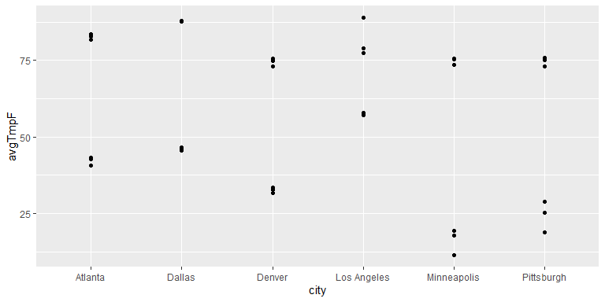

Iteration
================
ECON 122
Day 11

## Using `sapply()` and `lapply()`

#### Question 1

You are considering moving to the following cities and want to gather
information about them using the `MonthlyWeather` dataset you are
familiar with.

``` r
> weather <- read_csv("https://raw.githubusercontent.com/mgelman/data/master/MonthlyWeather.csv")
> cities <- c("Los Angeles","Atlanta","Dallas","Denver","Minneapolis","Pittsburgh")
```

Find the average monthly temperature (across all time periods available)
for each city using `dplyr`.

**ans:**

``` r
> weather %>% filter(city %in% cities) %>% group_by(city) %>% summarise(mean_tmp=mean(avgTmpF))
# A tibble: 6 × 2
  city        mean_tmp
  <chr>          <dbl>
1 Atlanta         66.3
2 Dallas          70.0
3 Denver          54.7
4 Los Angeles     68.9
5 Minneapolis     50.4
6 Pittsburgh      54.4
```

#### Question 2

Find the average monthly temperature (across all time periods available)
for each city using `sapply`.

1.  You must first create a function that calculates the `mean` when
    given a `city` and a `dataset`. Create this function and test it out
    on one city.

**ans:**

``` r
> meanfun <- function(cityarg,data) {
+   data %>% filter(city==cityarg) %>% 
+     summarise(mean_tmp=mean(avgTmpF))
+ }
```

2.  Use `sapply()` to apply your mean function to the vector of cities
    you are considering. Do you get the same answers as \`dplyr’?

**ans:**

``` r
> sapply(cities,meanfun,weather)
$`Los Angeles.mean_tmp`
[1] 68.94743

$Atlanta.mean_tmp
[1] 66.32724

$Dallas.mean_tmp
[1] 69.9917

$Denver.mean_tmp
[1] 54.67692

$Minneapolis.mean_tmp
[1] 50.40756

$Pittsburgh.mean_tmp
[1] 54.35665
```

### Question 3

While the mean is helpful, you would like to know what the extremes are.
Instead of calculating the mean, you would like to create a table that
displays the 3 coldest and hottest observations for each city.

1.  Can you perform this task using the simple `dplyr` commands?

**ans:** Yes, but it is likely going to look quite convoluted. (let me
know if you come up with an elegant solution.)

2.  You first need to write a function that outputs a `dataframe` with
    the 3 coldest and hottest observations given a `city` and `dataset`.
    Create this function and test it out on one city.

- **Hint:** `bind_rows()` allows you to combine `dataframes`

**ans:**

``` r
> extreme_temps <- function(cityarg,data) {
+   bot3 <- data %>% filter(city==cityarg) %>% select(city,avgTmpF) %>% arrange(avgTmpF) %>% head(3)
+   top3 <- data %>% filter(city==cityarg) %>% select(city,avgTmpF) %>% arrange(avgTmpF) %>% tail(3)
+   bind_rows(bot3,top3)
+ }
> 
> extreme_temps("Atlanta",weather)
# A tibble: 6 × 2
  city    avgTmpF
  <chr>     <dbl>
1 Atlanta    40.6
2 Atlanta    42.7
3 Atlanta    43.3
4 Atlanta    81.7
5 Atlanta    82.9
6 Atlanta    83.6
```

3.  Now use `sapply()` to apply your function to our selected cities. Is
    there an issue?

**ans:**

``` r
> str(sapply(cities,extreme_temps,weather))
List of 12
 $ : chr [1:6] "Los Angeles" "Los Angeles" "Los Angeles" "Los Angeles" ...
 $ : num [1:6] 57.2 57.4 57.9 77.4 78.8 ...
 $ : chr [1:6] "Atlanta" "Atlanta" "Atlanta" "Atlanta" ...
 $ : num [1:6] 40.6 42.7 43.3 81.7 82.9 ...
 $ : chr [1:6] "Dallas" "Dallas" "Dallas" "Dallas" ...
 $ : num [1:6] 45.6 46.4 46.6 87.7 87.8 ...
 $ : chr [1:6] "Denver" "Denver" "Denver" "Denver" ...
 $ : num [1:6] 31.6 32.6 33.5 73.1 74.9 ...
 $ : chr [1:6] "Minneapolis" "Minneapolis" "Minneapolis" "Minneapolis" ...
 $ : num [1:6] 11.4 17.8 19.3 73.6 75.4 ...
 $ : chr [1:6] "Pittsburgh" "Pittsburgh" "Pittsburgh" "Pittsburgh" ...
 $ : num [1:6] 18.8 25.3 28.8 73.1 75.1 ...
 - attr(*, "dim")= int [1:2] 2 6
 - attr(*, "dimnames")=List of 2
  ..$ : chr [1:2] "city" "avgTmpF"
  ..$ : chr [1:6] "Los Angeles" "Atlanta" "Dallas" "Denver" ...
```

`sapply()` returns a list of 12 but doesn’t preserve the `dataframe`
structure. We can still recover the data but it is slightly harder to
work with

4.  What happens if you use `lapply()`? Can you transform your output to
    create 1 table that has a list of cities and their 3 hottest and
    coldest temperatures?

``` r
> tlist <- lapply(cities,extreme_temps,weather)
> ttable <- tlist %>% bind_rows() 
```

**ans:** The output from `lapply()` is slightly easier to work with
because it preserves the dataframe structure. We can simply bind the
list together (as seen in the class notes) in order to create one
dataframe

5.  Visualize your results by plotting the 3 hottest and coldest monthly
    temperatures for each city. Which city do you prefer?

``` r
> ttable %>% 
+   ggplot(aes(x=city,y=avgTmpF)) + geom_point()
```

<!-- -->

**ans:** Los Angeles looks very appealing if you ignore the one outlier
month that is very hot.
