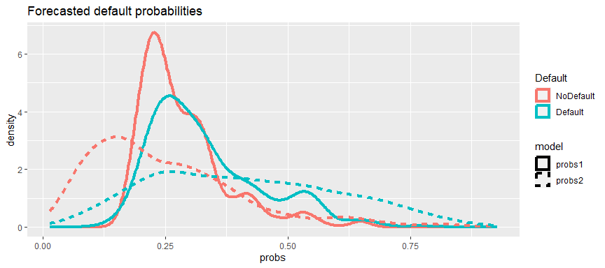
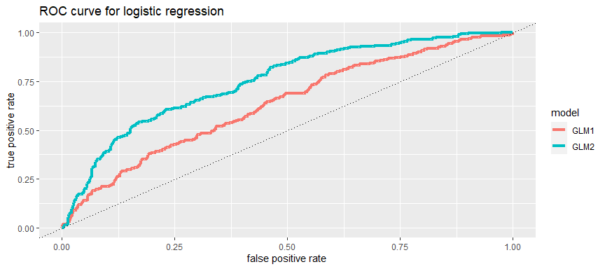

Logistic Regression
================
ECON 122
Day 14

## Comparing models

In this activity you will be comparing the model we used in lecture
(model 1) with a slightly more flexible model that uses more variables
(model 2). I’ll add the code to replicate what we did in lecture

##### Load data and create a factor for good loan/bad loan

``` r
> loans <- read_csv("https://raw.githubusercontent.com/mgelman/data/master/CreditData.csv")
> loans <- loans %>% 
+   mutate(Default = recode_factor(Good.Loan, GoodLoan = "NoDefault",BadLoan = "Default" ))
```

##### Fit the model

``` r
> default.glm1 <- glm(Default ~ log(Credit.amount) + Duration.in.month, 
+                     family="binomial", data=loans)
> default.glm1

Call:  glm(formula = Default ~ log(Credit.amount) + Duration.in.month, 
    family = "binomial", data = loans)

Coefficients:
       (Intercept)  log(Credit.amount)   Duration.in.month  
          -0.70026            -0.13969             0.04333  

Degrees of Freedom: 999 Total (i.e. Null);  997 Residual
Null Deviance:      1222 
Residual Deviance: 1176     AIC: 1182
```

##### Add probabilities and evaluation rates using 0.5 as the cutoff

``` r
> loans <- loans %>%
+   mutate(probs1 = predict(default.glm1, type="response"), 
+          prediction1 = ifelse( probs1 >= .5, "Default", "NoDefault") ) 
> 
> stats <- loans %>% summarize(accuracy = mean(Default == prediction1), 
+             precision = sum(Default == "Default" &  prediction1 == "Default")/sum(prediction1 == "Default"),
+             recall = sum(Default == "Default" & 
+                      prediction1 == "Default")/sum(Default == "Default"))
> stats
# A tibble: 1 × 3
  accuracy precision recall
     <dbl>     <dbl>  <dbl>
1    0.709     0.565   0.13
```

#### Question 1: Fit a logistic model that includes the following predictors (3-6 are new)

1.  log credit amount (`log(Credit.amount)`)
2.  Loan duration (`Duration.in.month`)
3.  age of loan holder (`Age.in.years`)
4.  credit history (`Credit.history`)
5.  loan purpose (`Purpose`)
6.  present employment (`Present.employment.since`)

**ans:**

``` r
> default.glm2 <- glm(Default ~ log(Credit.amount) + Duration.in.month+  
+                       Age.in.years + Credit.history + Purpose+ Present.employment.since,
+                     family="binomial", data=loans)
```

#### Question 2: Calculate accuracy, precision, and recall for the new model. How does it compare to the simpler model?

- **Note:** I’ve called the predicted probabilities for the simpler
  model `probs1` so something like `probs2` would make sense for your
  new model.

**ans:**

``` r
> loans <- loans %>%
+   mutate(probs2 = predict(default.glm2, type="response"),
+          prediction2 = ifelse( probs2 >= .5, "Default", "NoDefault") ) 
> loans %>% summarize(accuracy = mean(Default == prediction2),
+             precision = sum(Default == "Default" &  prediction2 == "Default")/sum(prediction2 == "Default"),
+             recall = sum(Default == "Default" &
+                      prediction2 == "Default")/sum(Default == "Default")) %>%
+       mutate(model = "GLM 2") %>%
+   bind_rows(mutate(stats, model="GLM 1"))
# A tibble: 2 × 4
  accuracy precision recall model
     <dbl>     <dbl>  <dbl> <chr>
1    0.749     0.658   0.34 GLM 2
2    0.709     0.565   0.13 GLM 1
```

#### Question 3: Plot the double density for model 1 and model 2 at the same time. How do the densities compare across the models? What does that tell you?

- **Hint**: Using the `gather` command on `probs1` and `probs2` may help
  you here.

**ans:** There is less overlap of the densities in model 2 relative to
model 1. We can intepret this to mean that the second model does a
better job prediting default probabilities relative to the first model.

``` r
> loans %>% gather(key=model,value=probs, probs1, probs2) %>%
+ ggplot(aes(x=probs, color=Default)) + 
+   geom_density(aes(linetype=model),size=1.5) + ggtitle("Forecasted default probabilities")
Warning: Using `size` aesthetic for lines was deprecated in ggplot2 3.4.0.
ℹ Please use `linewidth` instead.
This warning is displayed once every 8 hours.
Call `lifecycle::last_lifecycle_warnings()` to see where this warning was
generated.
```

<!-- -->

#### Question 4: Plot the ROC curve for both models on the same figure. Whad that does ROC model tell you about the relative performance of model 1 vs model 2?

- **Hint**: Create a performance object for the second model and use
  `bind_rows` to create one dataframe that has both models. Then when
  you plot the ROC curve, you can use `color=model` to distinguish
  between the two.

\#####First, create ROC curve for model 1 (replicating what we did in
lecture)

``` r
> preds_obj1 <- prediction(loans$probs1, loans$Default, label.ordering=c("NoDefault","Default"))
> perf_obj1 <- performance(preds_obj1, "tpr","fpr")
> perf_df1 <- data_frame(fpr=unlist(perf_obj1@x.values),
+                        tpr= unlist(perf_obj1@y.values),
+                        threshold=unlist(perf_obj1@alpha.values), 
+                        model="GLM1")
Warning: `data_frame()` was deprecated in tibble 1.1.0.
ℹ Please use `tibble()` instead.
This warning is displayed once every 8 hours.
Call `lifecycle::last_lifecycle_warnings()` to see where this warning was
generated.
```

**ANS:** The ROC curve shows that the more complex model has more area
under the ROC curve. More specifically, it has a better tradeoff of True
Postive vs False Positive rates (e.g. at 50% FPR we now have about
10-15% higher TPR). Therefore, we can say model 2 outperforms model 1.

``` r
> preds_obj2 <- prediction(loans$probs2, loans$Default, label.ordering=c("NoDefault","Default"))
> perf_obj2 <- performance(preds_obj2, "tpr","fpr")
> perf_df2 <- data_frame(fpr=unlist(perf_obj2@x.values),
+                        tpr= unlist(perf_obj2@y.values),
+                        threshold=unlist(perf_obj2@alpha.values), 
+                        model="GLM2")
> perf_df <- bind_rows(perf_df1, perf_df2)
> ggplot(perf_df, aes(x=fpr, y=tpr, color=model)) +  geom_line(size=1.5) + 
+   labs(x="false positive rate", y="true positive rate", title="ROC curve for logistic regression") + 
+   geom_abline(slope=1,intercept=0, linetype=3) 
```

<!-- -->
