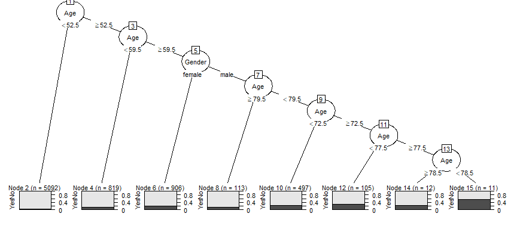
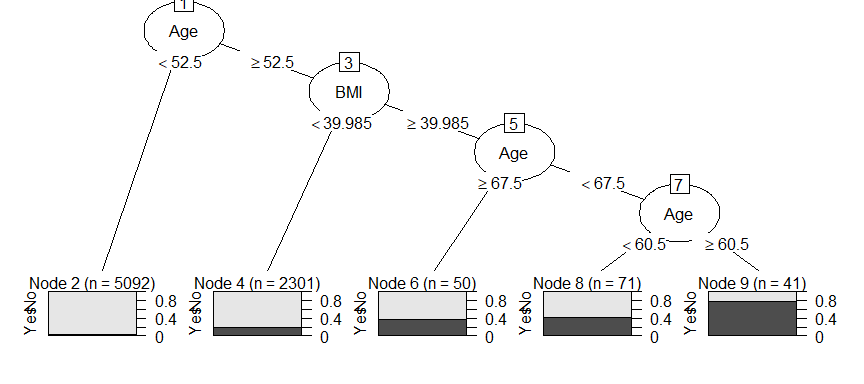
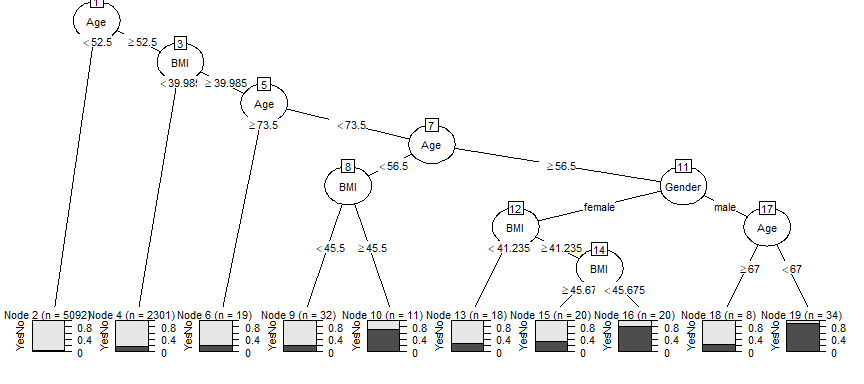

Decision Trees
================
ECON 122
Day 16

### Diabetes Example:

Let’s take a look at the diabetes example from textbook section 8.5.
Here we data frm the NHANES study, and only want to consider complete
cases using the variables:
`Gender, Diabetes, Age, BMI, PhysActive, HHIncome`.

``` r
> table(NHANES$Gender, NHANES$Diabetes)
        
           No  Yes
  female 4592  357
  male   4506  403
> NHANES %>% group_by(Gender, Diabetes) %>% count()
# A tibble: 6 × 3
# Groups:   Gender, Diabetes [6]
  Gender Diabetes     n
  <fct>  <fct>    <int>
1 female No        4592
2 female Yes        357
3 female <NA>        71
4 male   No        4506
5 male   Yes        403
6 male   <NA>        71
> diabetes <- NHANES %>% select(Gender, Diabetes, Age, BMI, PhysActive, HHIncome) %>% na.omit()
> diabetes
# A tibble: 7,555 × 6
   Gender Diabetes   Age   BMI PhysActive HHIncome   
   <fct>  <fct>    <int> <dbl> <fct>      <fct>      
 1 male   No          34  32.2 No         25000-34999
 2 male   No          34  32.2 No         25000-34999
 3 male   No          34  32.2 No         25000-34999
 4 female No          49  30.6 No         35000-44999
 5 female No          45  27.2 Yes        75000-99999
 6 female No          45  27.2 Yes        75000-99999
 7 female No          45  27.2 Yes        75000-99999
 8 male   No          66  23.7 Yes        25000-34999
 9 male   No          58  23.7 Yes        more 99999 
10 male   No          54  26.0 Yes        65000-74999
# … with 7,545 more rows
> diabetes %>% group_by(Gender, Diabetes) %>% count() %>% group_by(Gender) %>% mutate(propByGender = n/sum(n))
# A tibble: 4 × 4
# Groups:   Gender [2]
  Gender Diabetes     n propByGender
  <fct>  <fct>    <int>        <dbl>
1 female No        3475       0.917 
2 female Yes        316       0.0834
3 male   No        3396       0.902 
4 male   Yes        368       0.0978
> prop.table(table(diabetes$Gender, diabetes$Diabetes),1)
        
                 No        Yes
  female 0.91664468 0.08335532
  male   0.90223167 0.09776833
```

There are 7,555 complete cases (rows) with these variables. Of the
females in this group, about 8.3% have diabetes while about 9.8% of
males do.

#### Question 1

Fit a decision tree just using the variables `Gender` and `Age`. What
tree does it produce? What are your error and accuracy rates?

#### *Answer:*

Well, the default parameter settings that control splitting (or not)
decided that there is only one node in the tree. The variables `Age` and
`Gender` by themselves don’t add enough information about `Diabetes` to
make any splits that make subgroups that are “more pure” (based on the
1% criteria) than the parent node group (which is the entire sample).
Using “majority” rules, the entire sample (first node) would be
predicted to not have diabetes since over 90% of this node is not
diabetic. The confusion matrix then looks like:

| result:            | predicted No Diabetes | predicted Diabetes |
|--------------------|-----------------------|--------------------|
| actual No Diabetes | 6871                  | 0                  |
| actual Diabetes    | 684                   | 0                  |

The accuracy rate is 90.9% (6871/7555) and the error rate is 9.1%
(684/7555)

``` r
> diab_rpart <- rpart(Diabetes ~ Gender + Age, data=diabetes)
> diab_rpart
n= 7555 

node), split, n, loss, yval, (yprob)
      * denotes terminal node

1) root 7555 684 No (0.90946393 0.09053607) *
> summary(diab_rpart)
Call:
rpart(formula = Diabetes ~ Gender + Age, data = diabetes)
  n= 7555 

  CP nsplit rel error xerror xstd
1  0      0         1      0    0

Node number 1: 7555 observations
  predicted class=No  expected loss=0.09053607  P(node) =1
    class counts:  6871   684
   probabilities: 0.909 0.091 
```

#### Question 2

The default control parameter for the `rpart` splitting algorithm is 1%
(`cp=0.01`). This means that a split will occur from a parent node if
the overall purity of the children is at least 1% better than the
parent. Do you have to *increase* or *decrease* this value to make your
tree bigger (i.e. more splits)? Play around with this value to try to
get your tree from question 1 to split. Here is the argument to add to
the `rpart` command: `control=rpart.control(cp=.01)`. Change the 0.01
value to something higher or lower from this default setting.

#### *Answer:*

To make the tree bigger you have to allow more nodes to split. The `cp`
setting needs to be lowered to make this happen, since that allows us to
split a node if there is a smaller than 1% increase in purity. E.g. if
we use 0.0001 for `cp` then we are saying that purity of the child nodes
only needs to be 0.01% better than their parent node. Here we change the
parameter to 0.01% and get a tree with 15 nodes, 8 of which are terminal
(i.e. no branches off of terminal nodes).

``` r
> diab_rpart <- rpart(Diabetes ~ Gender + Age, data=diabetes, control=rpart.control(cp=.0001))
> diab_rpart
n= 7555 

node), split, n, loss, yval, (yprob)
      * denotes terminal node

  1) root 7555 684 No (0.90946393 0.09053607)  
    2) Age< 52.5 5092 188 No (0.96307934 0.03692066) *
    3) Age>=52.5 2463 496 No (0.79861957 0.20138043)  
      6) Age< 59.5 819 125 No (0.84737485 0.15262515) *
      7) Age>=59.5 1644 371 No (0.77433090 0.22566910)  
       14) Gender=female 906 189 No (0.79139073 0.20860927) *
       15) Gender=male 738 182 No (0.75338753 0.24661247)  
         30) Age>=79.5 113  17 No (0.84955752 0.15044248) *
         31) Age< 79.5 625 165 No (0.73600000 0.26400000)  
           62) Age< 72.5 497 123 No (0.75251509 0.24748491) *
           63) Age>=72.5 128  42 No (0.67187500 0.32812500)  
            126) Age< 77.5 105  33 No (0.68571429 0.31428571) *
            127) Age>=77.5 23   9 No (0.60869565 0.39130435)  
              254) Age>=78.5 12   3 No (0.75000000 0.25000000) *
              255) Age< 78.5 11   5 Yes (0.45454545 0.54545455) *
> plot(as.party(diab_rpart),gp = gpar(fontsize = 8))
```

<!-- -->

#### Question 3

The book authors fit the model below to all variables except income:

``` r
> diab_rpart <- rpart(Diabetes ~ Gender + Age + BMI + PhysActive, data=diabetes, control=rpart.control(cp=.005, minbucket = 30))
> diab_rpart
n= 7555 

node), split, n, loss, yval, (yprob)
      * denotes terminal node

 1) root 7555 684 No (0.90946393 0.09053607)  
   2) Age< 52.5 5092 188 No (0.96307934 0.03692066) *
   3) Age>=52.5 2463 496 No (0.79861957 0.20138043)  
     6) BMI< 39.985 2301 416 No (0.81920904 0.18079096) *
     7) BMI>=39.985 162  80 No (0.50617284 0.49382716)  
      14) Age>=67.5 50  18 No (0.64000000 0.36000000) *
      15) Age< 67.5 112  50 Yes (0.44642857 0.55357143)  
        30) Age< 60.5 71  30 No (0.57746479 0.42253521) *
        31) Age>=60.5 41   9 Yes (0.21951220 0.78048780) *
> plot(as.party(diab_rpart))
```

<!-- -->

What happens if you omit the `minbucket` part of the control argument?
What does including this option do to your tree?

#### *Answer:*

`minbucket` controls the final sample size in each terminal node
(partition). Setting that parameter equal to 30 ensures that all subset
sizes are 30 or more. If we relax this then we could potentially allow a
split of a node into children nodes that are less than 30 cases in size.
When we take away this restriction, our tree grows in size for this
example:

``` r
> diab_rpart <- rpart(Diabetes ~ Gender + Age + BMI + PhysActive, data=diabetes, control=rpart.control(cp=.005))
> diab_rpart
n= 7555 

node), split, n, loss, yval, (yprob)
      * denotes terminal node

  1) root 7555 684 No (0.90946393 0.09053607)  
    2) Age< 52.5 5092 188 No (0.96307934 0.03692066) *
    3) Age>=52.5 2463 496 No (0.79861957 0.20138043)  
      6) BMI< 39.985 2301 416 No (0.81920904 0.18079096) *
      7) BMI>=39.985 162  80 No (0.50617284 0.49382716)  
       14) Age>=73.5 19   4 No (0.78947368 0.21052632) *
       15) Age< 73.5 143  67 Yes (0.46853147 0.53146853)  
         30) Age< 56.5 43  15 No (0.65116279 0.34883721)  
           60) BMI< 45.5 32   7 No (0.78125000 0.21875000) *
           61) BMI>=45.5 11   3 Yes (0.27272727 0.72727273) *
         31) Age>=56.5 100  39 Yes (0.39000000 0.61000000)  
           62) Gender=female 58  28 No (0.51724138 0.48275862)  
            124) BMI< 41.235 18   5 No (0.72222222 0.27777778) *
            125) BMI>=41.235 40  17 Yes (0.42500000 0.57500000)  
              250) BMI>=45.675 20   7 No (0.65000000 0.35000000) *
              251) BMI< 45.675 20   4 Yes (0.20000000 0.80000000) *
           63) Gender=male 42   9 Yes (0.21428571 0.78571429)  
            126) Age>=67 8   2 No (0.75000000 0.25000000) *
            127) Age< 67 34   3 Yes (0.08823529 0.91176471) *
> plot(as.party(diab_rpart),gp = gpar(fontsize = 8))
```

<!-- -->

#### Question 4

Fit the model from question 3 without the `minbucket` option to a
training dataset composed of just 2009-10 survey responses. Then use
this model to predict diabetes cases for the 2011-2012 survey. What are
your `test` and `training` `error` and `accuracy` rates? `Precision` and
`recall`?

#### *Answer:*

We first need to go back and add `SurveyYr` to the diabetes data frame
we created without NAs:

``` r
> diabetes <- NHANES %>% select(SurveyYr, Gender, Diabetes, Age, BMI, PhysActive, HHIncome) %>% na.omit()
```

Then we can create the training and testing datasets:

``` r
> diabetes_train <- filter(diabetes, SurveyYr == "2009_10")
> diabetes_test <- filter(diabetes, SurveyYr == "2011_12")
```

Then fit the decision tree from question 3 to the training set:

``` r
> diab_rpart <- rpart(Diabetes ~ Gender + Age + BMI + PhysActive, data=diabetes_train, control=rpart.control(cp=.005))
> diab_rpart
n= 3761 

node), split, n, loss, yval, (yprob)
      * denotes terminal node

  1) root 3761 341 No (0.90933262 0.09066738)  
    2) Age< 48.5 2323  58 No (0.97503229 0.02496771) *
    3) Age>=48.5 1438 283 No (0.80319889 0.19680111)  
      6) BMI< 31.125 974 138 No (0.85831622 0.14168378) *
      7) BMI>=31.125 464 145 No (0.68750000 0.31250000)  
       14) BMI< 40.2 370 102 No (0.72432432 0.27567568)  
         28) BMI>=33.205 221  47 No (0.78733032 0.21266968) *
         29) BMI< 33.205 149  55 No (0.63087248 0.36912752)  
           58) Age< 57.5 42  10 No (0.76190476 0.23809524) *
           59) Age>=57.5 107  45 No (0.57943925 0.42056075)  
            118) PhysActive=No 71  24 No (0.66197183 0.33802817)  
              236) BMI< 31.725 28   6 No (0.78571429 0.21428571) *
              237) BMI>=31.725 43  18 No (0.58139535 0.41860465)  
                474) BMI>=32.65 14   3 No (0.78571429 0.21428571) *
                475) BMI< 32.65 29  14 Yes (0.48275862 0.51724138)  
                  950) Age< 77.5 18   6 No (0.66666667 0.33333333) *
                  951) Age>=77.5 11   2 Yes (0.18181818 0.81818182) *
            119) PhysActive=Yes 36  15 Yes (0.41666667 0.58333333) *
       15) BMI>=40.2 94  43 No (0.54255319 0.45744681)  
         30) BMI>=40.43 86  36 No (0.58139535 0.41860465)  
           60) Age< 60.5 45  12 No (0.73333333 0.26666667) *
           61) Age>=60.5 41  17 Yes (0.41463415 0.58536585)  
            122) Age>=69 19   8 No (0.57894737 0.42105263) *
            123) Age< 69 22   6 Yes (0.27272727 0.72727273) *
         31) BMI< 40.43 8   1 Yes (0.12500000 0.87500000) *
```

We can use the `predict` command to get the decision tree
classifications for each case in the training dataset (to be used to get
the confusion matrix):

``` r
> diabetes_train <- diabetes_train %>% mutate(pred_dtree = predict(diab_rpart, type="class"))
> conf_mat <- with(diabetes_train,table(Diabetes, pred_dtree))
> conf_mat
        pred_dtree
Diabetes   No  Yes
     No  3396   24
     Yes  288   53
> sum(diag(conf_mat))/sum(conf_mat)
[1] 0.9170433
> prop.table(conf_mat, 1)
        pred_dtree
Diabetes          No         Yes
     No  0.992982456 0.007017544
     Yes 0.844574780 0.155425220
> prop.table(conf_mat, 2)
        pred_dtree
Diabetes        No       Yes
     No  0.9218241 0.3116883
     Yes 0.0781759 0.6883117
```

The accuracy of this model on the test data is 91.7% with a precision of
68.8%, and recall of 15.5%.

Next, we just repeat the predictions using the test data
(`newdata=diabetes_test`)and recompute the confusion matrix:

``` r
> diabetes_test <- diabetes_test %>% mutate(pred_dtree = predict(diab_rpart,newdata=diabetes_test, type="class"))
> conf_mat <- with(diabetes_test,table(Diabetes, pred_dtree))
> conf_mat
        pred_dtree
Diabetes   No  Yes
     No  3414   37
     Yes  321   22
> sum(diag(conf_mat))/sum(conf_mat)
[1] 0.9056405
> prop.table(conf_mat, 1)
        pred_dtree
Diabetes         No        Yes
     No  0.98927847 0.01072153
     Yes 0.93586006 0.06413994
> prop.table(conf_mat, 2)
        pred_dtree
Diabetes         No        Yes
     No  0.91405622 0.62711864
     Yes 0.08594378 0.37288136
```

The accuracy of this model on the test data is 90.6% with a precision of
37.3%, and recall of 6.4%.

We could use some `dplyr` commands to create a data frame to compare
stats:

``` r
> diabetes_test <- diabetes_test %>% mutate(name="test")
> diabetes_train <- diabetes_train %>% mutate(name="train")
> diabetes_both <- bind_rows(diabetes_train, diabetes_test)
> rates <- diabetes_both  %>% group_by(name) %>%
+   summarize(N=n(),
+             accuracy = sum(Diabetes == pred_dtree)/N, 
+             N_Defaults = sum(Diabetes == "Yes"),
+             true_Default = sum(Diabetes == pred_dtree & Diabetes == "Yes"), 
+             true_noDefault = sum(Diabetes == pred_dtree & Diabetes == "No"), 
+             precision = true_Default/sum(pred_dtree == "Yes"),
+             recall = true_Default/N_Defaults, 
+             ) %>%
+   select(- N_Defaults, - true_Default, - true_noDefault)
> rates
# A tibble: 2 × 5
  name      N accuracy precision recall
  <chr> <int>    <dbl>     <dbl>  <dbl>
1 test   3794    0.906     0.373 0.0641
2 train  3761    0.917     0.688 0.155 
```
