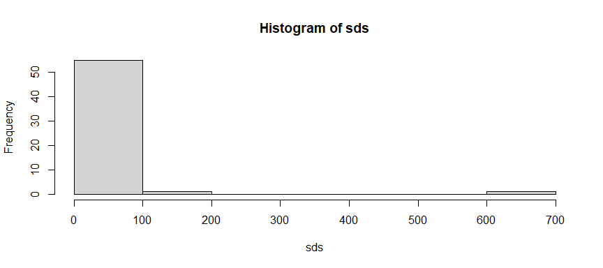
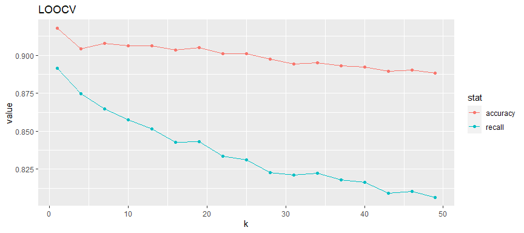
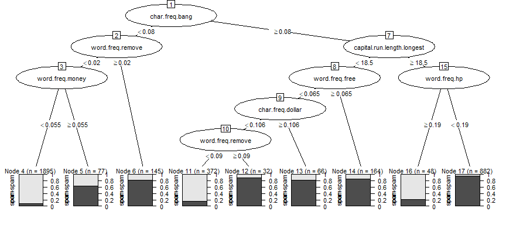
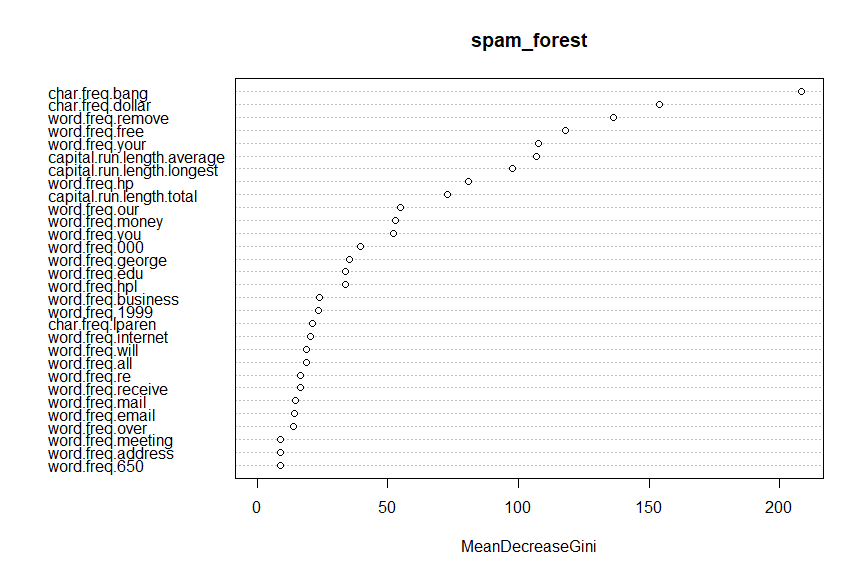

Other Classifiers Activity - Solution
================
ECON 122
Day 17

## Example 1: Spam using k-nn

This example looks at a data set of about 4600 emails that are
classified as spam or not spam, along with over 50 variables measuring
different characteristic of the email. Details about these variables are
found on the [Spambase
example](http://archive.ics.uci.edu/ml/datasets/Spambase) on the machine
learning data archive. The dataset linked to below is a slightly cleaned
up version of this data. The only extra column in the data is `rgroup`
which is a randomly assigned grouping variable (groups 0 through 99).

Read the data in

``` r
> # tsv = tab separated values!
> spam <- read_delim("https://raw.githubusercontent.com/mgelman/data/master/spamD.txt", delim="\t", col_types = cols(spam = col_factor(levels=c("non-spam","spam")), .default = col_double()))
```

Here we fit a k-nn classifier using the 57 quantitative predictors from
the spam data to an 80%/20% training and test set split. We used
.

``` r
> set.seed(7)
> n <- nrow(spam)
> train_index <- sample(1:n, size=round(.8*n))
> trainX <- spam %>% slice(train_index) %>% select(-rgroup, -spam)
> testX <- spam %>% slice(-train_index) %>% select(-rgroup, -spam)
> spam_knn1 <- knn(trainX, testX, cl= spam$spam[train_index], k=10)
```

#### Question 1

Compute the accuracy, error rate and recall for the 20% test set.

#### *Answer:*

``` r
> (conf.mat <- table(spam$spam[-train_index], spam_knn1))
          spam_knn1
           non-spam spam
  non-spam      447   99
  spam           86  288
> sum(diag(prop.table(conf.mat))) 
[1] 0.798913
> 1-sum(diag(prop.table(conf.mat))) 
[1] 0.201087
> prop.table(conf.mat,1) 
          spam_knn1
            non-spam      spam
  non-spam 0.8186813 0.1813187
  spam     0.2299465 0.7700535
```

For the k-nn method with
: the
accuracy for predicting the test set is 79.9%, the error rate is 20.1%,
and the recall detecting spam is 77%.

#### Question 2

Any statistical method that uses a distance metric can yield results
that are sensitive to the scale of the variables. In the k-nn we are
using a distance measure with the predictors. Use an `apply` command to
compute the sd of the 57 predictors. Are they similar or different in
value?

#### *Answer:*

No, the histogram of sd’s for all the predictor variables show a wide
range. A closer look at these variables shows that anything that is a
frequency value (# of this type out of total number) has a fairly small
scale sd while the run length variables have large SDs.

``` r
> sds <- apply(spam[,1:57], 2, sd)
> hist(sds)
```

<!-- -->

``` r
> head(sds)
   word.freq.make word.freq.address     word.freq.all      word.freq.3d 
        0.3053576         1.2905752         0.5041429         1.3951514 
    word.freq.our    word.freq.over 
        0.6725128         0.2738241 
> tail(sds)
            char.freq.bang           char.freq.dollar 
                 0.8156716                  0.2458820 
            char.freq.hash capital.run.length.average 
                 0.4293421                 31.7294487 
capital.run.length.longest   capital.run.length.total 
               194.8913095                606.3478507 
```

#### Question 3

We can use the `scale` function on a data frame to standardize each
column of the test and training sets. Verify that the sd of the scaled
training and test sets are now all equal to 1.

#### *Answer:*

The min and max of both sets are equal to 1.

``` r
> sds_train <- apply(trainX, 2, sd)
> sds_test <- apply(testX, 2, sd)
> summary(sds_train)
   Min. 1st Qu.  Median    Mean 3rd Qu.    Max. 
      1       1       1       1       1       1 
> summary(sds_test)
   Min. 1st Qu.  Median    Mean 3rd Qu.    Max. 
      1       1       1       1       1       1 
```

#### Question 4

Refit the k-nn classifier to the scaled predictor sets using
. How have
accuracy, error and recall rates changed?

#### *Answer:*

``` r
> spam_knn2 <- knn(trainX, testX, cl= spam$spam[train_index], k=10)
> (conf.mat <- table(spam$spam[-train_index], spam_knn2))
          spam_knn2
           non-spam spam
  non-spam      515   31
  spam           47  327
> sum(diag(prop.table(conf.mat))) 
[1] 0.9152174
> 1-sum(diag(prop.table(conf.mat))) 
[1] 0.08478261
> prop.table(conf.mat,1) 
          spam_knn2
             non-spam       spam
  non-spam 0.94322344 0.05677656
  spam     0.12566845 0.87433155
```

For the k-nn method with
 and
standardized predictors: the accuracy for predicting the test set is
91.5%, the error rate is 8.5%, and the recall detecting spam is 87.4%.

#### Question 5

Refit the k-nn classifier using the scaled predictors from question 4,
but this time let `k` vary from 1 to 30. Write a function that returns
the Error/accuracy and recall rates for any value of k, then use an
`sapply` command to get the rates for the k’s up to 30. Which value of k
looks optimal for this data?

#### *Answer:*

The function just needs a data frame of predictors variables and the
responses for these predictors. It uses LOOCV to predict the response
for each case (e.g. each case is a single test set) and it returns a
vector of classifications for each case in the data:

``` r
> k <- seq(1,50,by=3)
> scaledX <- scale(spam[,1:57])  # scale x variables
> knn_fn <- function(k)
+ {
+   data_frame(k=k, prediction = knn.cv(scaledX, cl= spam$spam, k=k), y=spam$spam)
+ }
> preds <- lapply(k, knn_fn)
Warning: `data_frame()` was deprecated in tibble 1.1.0.
ℹ Please use `tibble()` instead.
This warning is displayed once every 8 hours.
Call `lifecycle::last_lifecycle_warnings()` to see where this warning was
generated.
> preds_df <- bind_rows(preds)
> stats.cv.scale<- preds_df %>% group_by(k) %>% 
+   summarize(accuracy = mean(prediction == y), 
+                    recall = sum(prediction == "spam" & y == "spam")/sum(y == "spam"),
+                     predictors = "scaled") 
> stats.cv.scale %>%  gather(key=stat, value = value, 2:3) %>%
+   ggplot(aes(x=k, y=value, color=stat))  + 
+     geom_point() + geom_line() + 
+   ggtitle("LOOCV")
```

<!-- -->

It looks like k’s between 5 and 20 yeild an error rate just under 10%,
but because recall drops a lot in this range. I would pick either 1 (the
highest `accuracy` and `recall` rates) or a `k` between 5 and 10 if I’m
worried a `k` might over-fit too much

## Example 2: Spam using tree methods

Let’s now consider tree-based methods for classifying spam. Let’s go
back to the original scale of the predictor variables (and incldue spam
in the training/test data frames):

``` r
> set.seed(7)
> n <- nrow(spam)
> train_index <- sample(1:n, size=round(.8*n))
> train <- spam %>% slice(train_index) %>% select(-rgroup)
> test <- spam %>% slice(-train_index) %>% select(-rgroup)
```

We will also steal the formula from the logistic model from day 18:

``` r
> xvars <- str_c(names(spam)[1:57], collapse="+")
> myform <- as.formula(str_c("spam ~ ", xvars))
> myform
spam ~ word.freq.make + word.freq.address + word.freq.all + word.freq.3d + 
    word.freq.our + word.freq.over + word.freq.remove + word.freq.internet + 
    word.freq.order + word.freq.mail + word.freq.receive + word.freq.will + 
    word.freq.people + word.freq.report + word.freq.addresses + 
    word.freq.free + word.freq.business + word.freq.email + word.freq.you + 
    word.freq.credit + word.freq.your + word.freq.font + word.freq.000 + 
    word.freq.money + word.freq.hp + word.freq.hpl + word.freq.george + 
    word.freq.650 + word.freq.lab + word.freq.labs + word.freq.telnet + 
    word.freq.857 + word.freq.data + word.freq.415 + word.freq.85 + 
    word.freq.technology + word.freq.1999 + word.freq.parts + 
    word.freq.pm + word.freq.direct + word.freq.cs + word.freq.meeting + 
    word.freq.original + word.freq.project + word.freq.re + word.freq.edu + 
    word.freq.table + word.freq.conference + char.freq.semi + 
    char.freq.lparen + char.freq.lbrack + char.freq.bang + char.freq.dollar + 
    char.freq.hash + capital.run.length.average + capital.run.length.longest + 
    capital.run.length.total
```

#### Question 6

Fit a decision tree to training data then compute the accuracy, error
and recall for the test data. What predictors look to be the important
predictors of spam based on this tree?

#### *Answer:*

``` r
> spam_dtree <- rpart(myform, data=train)
> spam_dtree
n= 3681 

node), split, n, loss, yval, (yprob)
      * denotes terminal node

 1) root 3681 1439 non-spam (0.60907362 0.39092638)  
   2) char.freq.bang< 0.0795 2117  316 non-spam (0.85073217 0.14926783)  
     4) word.freq.remove< 0.02 1972  199 non-spam (0.89908722 0.10091278)  
       8) word.freq.money< 0.055 1895  150 non-spam (0.92084433 0.07915567) *
       9) word.freq.money>=0.055 77   28 spam (0.36363636 0.63636364) *
     5) word.freq.remove>=0.02 145   28 spam (0.19310345 0.80689655) *
   3) char.freq.bang>=0.0795 1564  441 spam (0.28196931 0.71803069)  
     6) capital.run.length.longest< 18.5 634  280 non-spam (0.55835962 0.44164038)  
      12) word.freq.free< 0.065 470  141 non-spam (0.70000000 0.30000000)  
        24) char.freq.dollar< 0.106 404   87 non-spam (0.78465347 0.21534653)  
          48) word.freq.remove< 0.09 372   59 non-spam (0.84139785 0.15860215) *
          49) word.freq.remove>=0.09 32    4 spam (0.12500000 0.87500000) *
        25) char.freq.dollar>=0.106 66   12 spam (0.18181818 0.81818182) *
      13) word.freq.free>=0.065 164   25 spam (0.15243902 0.84756098) *
     7) capital.run.length.longest>=18.5 930   87 spam (0.09354839 0.90645161)  
      14) word.freq.hp>=0.19 48   10 non-spam (0.79166667 0.20833333) *
      15) word.freq.hp< 0.19 882   49 spam (0.05555556 0.94444444) *
> plot(as.party(spam_dtree),gp = gpar(fontsize = 8))
```

<!-- -->

``` r
> test <- test %>% mutate(pred_dtree = predict(spam_dtree, newdata=test, type="class"))
> (conf.mat <- table(test$spam, test$pred_dtree))
          
           non-spam spam
  non-spam      504   42
  spam           67  307
> sum(diag(prop.table(conf.mat))) 
[1] 0.8815217
> 1-sum(diag(prop.table(conf.mat))) 
[1] 0.1184783
> prop.table(conf.mat,1) 
          
             non-spam       spam
  non-spam 0.92307692 0.07692308
  spam     0.17914439 0.82085561
```

For a decision tree: the accuracy for predicting the test set is 88.2%,
the error rate is 11.8%, and the recall detecting spam is 82.1%. Some of
the important predictors look to be the frequency of \$ (more \$ signs
means more spam), ! (bang) (fewer ! means less spam), the frequency of
the word remove (more instances means more spam), and the frequency of
the word free (more free means more spam).

#### Question 7

Fit a random forest model to the spam data using the `randomForest`
command. Use the default settings (with produce 500 trees with
).
Compute the accuracy, error and recall for the test data. What
predictors look to be the important predictors of spam based on this
method? Are they similar to the variable found in question 6?

#### *Answer:*

``` r
> spam_forest <- randomForest(myform, data=train)
> spam_forest

Call:
 randomForest(formula = myform, data = train) 
               Type of random forest: classification
                     Number of trees: 500
No. of variables tried at each split: 7

        OOB estimate of  error rate: 4.67%
Confusion matrix:
         non-spam spam class.error
non-spam     2180   62  0.02765388
spam          110 1329  0.07644197
> test <- test %>% mutate(pred_forest = predict(spam_forest, newdata=test, type="class"))
> ( conf.mat <- table(test$spam, test$pred_forest))
          
           non-spam spam
  non-spam      530   16
  spam           26  348
> varImpPlot(spam_forest)
```

<!-- -->

``` r
> sum(diag(prop.table(conf.mat))) 
[1] 0.9543478
> 1-sum(diag(prop.table(conf.mat))) 
[1] 0.04565217
> prop.table(conf.mat,1) 
          
             non-spam       spam
  non-spam 0.97069597 0.02930403
  spam     0.06951872 0.93048128
```

For a random forest classifier: the accuracy for predicting the test set
is 95.4%, the error rate is 4.6%, and the recall detecting spam is 93%.
Similar predictors to those found in Q6 look important, like frequency
of dollar and “bang” characters and remove frequency.

**Note**: Having a high importance itself doesn’t tell us whether that
variable is positively or negatively associated with the outcome. In
this case, the examples are provided by “George” from “HP” so emails
with those words are likely **NOT** spam.
