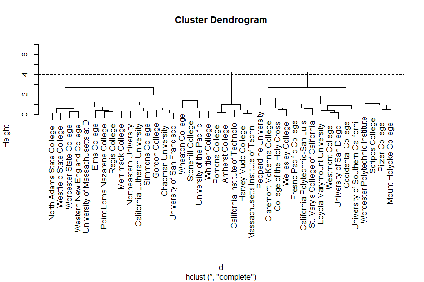
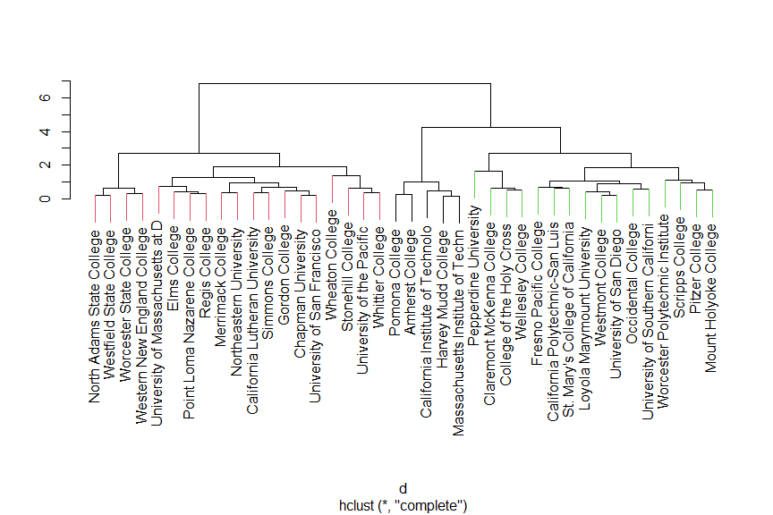
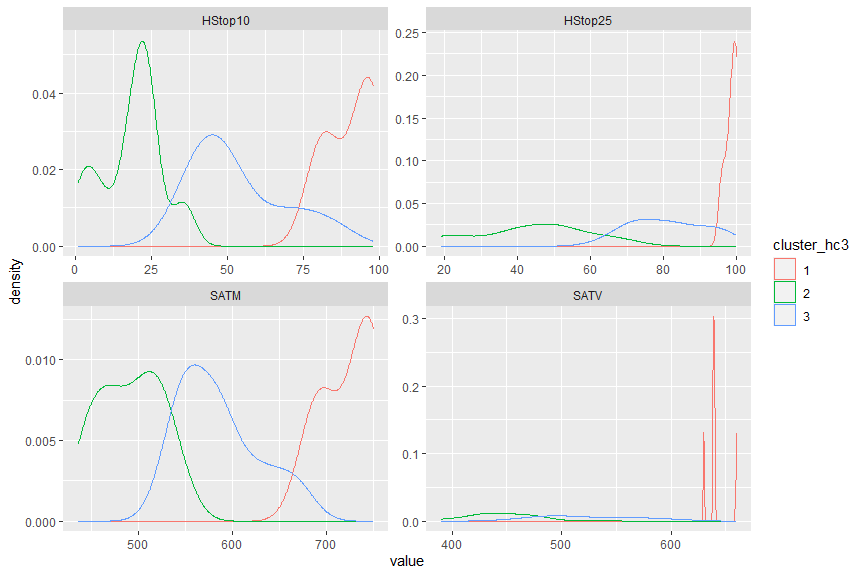
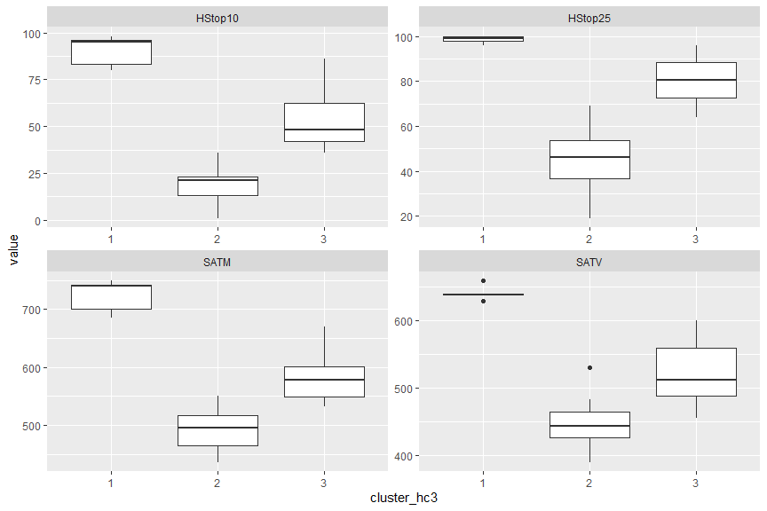

Hierarchical Clustering Activity
================
ECON 122
Day 19

## Clustering on incoming student characteristics

We will again look at the “classic” college data set of a random sample
of colleges and universities. This time we will look at CA **AND** MA
schools

``` r
> colleges <- read_csv("https://raw.githubusercontent.com/mgelman/data/master/Colleges.csv")
> names(colleges)
 [1] "State"       "College"     "SATM"        "SATV"        "AppsReceive"
 [6] "AppsAccept"  "HStop10"     "HStop25"     "FullTime"    "Tuition"    
[11] "RoomBoard"   "Books"       "Ratio"       "Donate"      "Expend"     
[16] "GradRate"    "Type"        "AvgSalary"   "NumFaculty" 
> colleges2 <- colleges %>% filter(State %in% c("MA","CA"))
> table(colleges2$State)

CA MA 
21 19 
```

We will also focus on the proportion of the incoming class that is in
the top 10% or 25% of their HS class.

``` r
> coll_vars <- names(colleges2)[c(3,4,7,8)]
> coll_vars
[1] "SATM"    "SATV"    "HStop10" "HStop25"
> summary(colleges2[,coll_vars])
      SATM            SATV          HStop10         HStop25      
 Min.   :436.0   Min.   :390.0   Min.   : 1.00   Min.   : 19.00  
 1st Qu.:499.5   1st Qu.:451.5   1st Qu.:22.50   1st Qu.: 47.50  
 Median :547.5   Median :483.0   Median :36.50   Median : 69.50  
 Mean   :557.9   Mean   :502.7   Mean   :41.52   Mean   : 65.70  
 3rd Qu.:590.5   3rd Qu.:551.8   3rd Qu.:54.00   3rd Qu.: 86.25  
 Max.   :750.0   Max.   :660.0   Max.   :98.00   Max.   :100.00  
```

Let’s cluster schools by their incoming class characteristics.

#### Question 1

Why should we standardize the variables of interest before using a
clustering method?

**Ans:**

> The size and variability of the variables differs. If we didn’t
> standardize then any method that uses Euclidean distance will favor
> SAT measures at the expense of the HS measures.

#### Question 2

Standardize our four variables of interest and fit a hierarchical
clustering model.

**Ans:** Here we fit a hierarchical clustering model to the four
variables of interest:

``` r
> d <- dist(scale(colleges2[,coll_vars]))
> coll_hc <- hclust(d)
```

We can then make a basic dendrogram with label names added:

``` r
> plot(coll_hc, labels = colleges2$College)
```

<!-- -->

#### Question 3:

Which school seems most similar to University of San Francisco? Compare
the SAT and HS class variable values to verify your answer

**Ans:**

> Chapman University is the first school it would be fused with if we
> cut the tree at a low height. These schools have identical HS values
> and very similar SAT values (within 15 points).

``` r
> colleges2 %>% filter(College %in% c("Chapman University","University of San Francisco"))
# A tibble: 2 × 19
  State College       SATM  SATV AppsR…¹ AppsA…² HStop10 HStop25 FullT…³ Tuition
  <chr> <chr>        <dbl> <dbl>   <dbl>   <dbl>   <dbl>   <dbl>   <dbl>   <dbl>
1 CA    Chapman Uni…   501   456     959     771      23      48    1662   16624
2 CA    University …   514   463    2306    1721      23      48    4309   13226
# … with 9 more variables: RoomBoard <dbl>, Books <dbl>, Ratio <dbl>,
#   Donate <dbl>, Expend <dbl>, GradRate <dbl>, Type <chr>, AvgSalary <dbl>,
#   NumFaculty <dbl>, and abbreviated variable names ¹​AppsReceive, ²​AppsAccept,
#   ³​FullTime
```

#### Question 4:

What height would you have to cut this tree to create 3 clusters? Use
the `abline(h=)` function to add a cut line to the previous plot.

**Ans:**

> A height (dissimilarity measure) of about 4 would lead to three
> clusters.

``` r
> plot(coll_hc, labels = colleges2$College)
> abline(h=4, lty=2)
```

<!-- -->

#### Question 5

Make 3 clusters and add them as characters to the data frame. Plot a
dendogram that identifies each cluster with a different color.

**Ans:**

> We can cut the tree into k clusters using `cutree`. Here we make 3
> clusters and add them as characters to the data frame:

``` r
> hc_clusters <- cutree(coll_hc, k=3)
> colleges2 <- colleges2 %>%
+   mutate(cluster_hc3 = as.character(hc_clusters))
```

> We can add cluster colors to the dendrogram using the
> `ColorDendrogram` function in the `sparcl` package.

``` r
> ColorDendrogram(coll_hc, y=colleges2$cluster_hc3, labels=colleges2$College, branchlength = 1.6)
```

<!-- -->

#### Question 6

What are the characteristics of each cluster? Use either
`density curves` or `boxplots` for the `SAT` and `HS` variables. How
would you label the clusters in a way the general public would
understand?

**Ans:**

``` r
> colleges2 %>% 
+   select(cluster_hc3, SATM,SATV,HStop10,HStop25) %>%
+   gather(key=variable, value=value, SATM:HStop25) %>%
+   ggplot(aes(x=value, color=cluster_hc3)) + geom_density() + facet_wrap(~variable, scales="free") 
```

<!-- -->

``` r
> colleges2 %>% 
+   select(cluster_hc3, SATM,SATV,HStop10,HStop25) %>%
+   gather(key=variable, value=value, SATM:HStop25) %>%
+   ggplot(aes(y=value, x=cluster_hc3)) + geom_boxplot() + facet_wrap(~variable, scales="free") 
```

<!-- -->

``` r
> colleges2 %>% filter(cluster_hc3 == "1") %>% select(College)
# A tibble: 5 × 1
  College                         
  <chr>                           
1 California Institute of Technolo
2 Harvey Mudd College             
3 Pomona College                  
4 Amherst College                 
5 Massachusetts Institute of Techn
```

> The cluster numbers don’t necessarily correspond to the ranking of the
> schools in each cluster. One way to label the clusters is by the
> competitiveness of each school. Cluster 1 tends to to have the highest
> `SAT` scores as well as the highest proportion of HS students in the
> `top10` and `top25`. Cluster 3 and 2 have lower scores. The density
> and boxplots show that the gap between the cluster 1 and cluster 2 and
> 3 schools is larger than the gap between the cluster 2 and 3 schools.

#### Question 7

Do you prefer kmeans or hiearchical clustering? What are the pros and
cons?

**Ans:**

Personally I prefer `hiearchical clustering` because the `dendogram`
creates a nice structure to visualize the data and we don’t have to
specify a `k` before hand.

In terms of pros and cons

- Advantages of `kmeans` vs `hiearchical`
  - If you have a large dataset, `kmeans` is faster
  - `kmeans` allows you to easily quantify (using `withinss`) the
    tradeoff of adding more clusters
- Advantages of `hiearchical` vs `kmeans`
  - Provides a nice visualization of the data
  - No requirement to choose `k` ahead of time
  - Can customize the algorithm by choosing different ways to calculate
    distance between leafs
