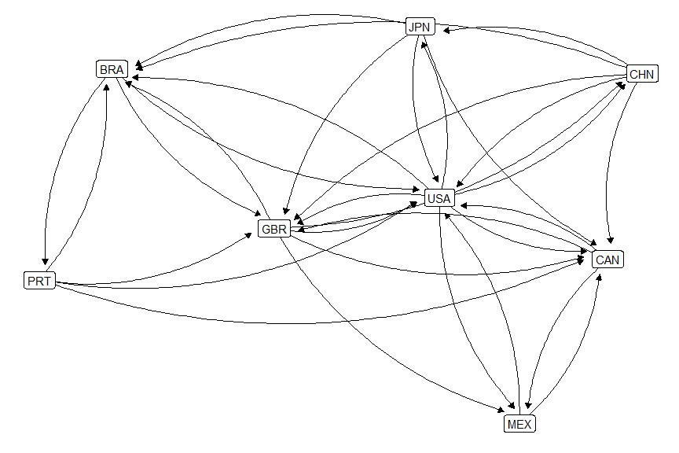
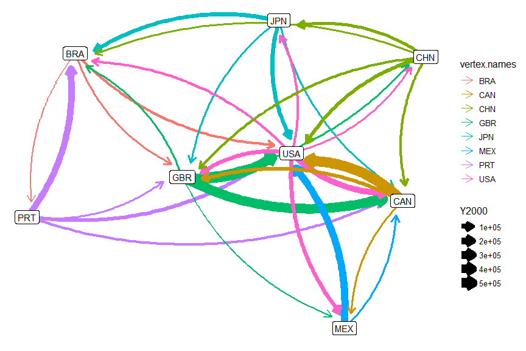
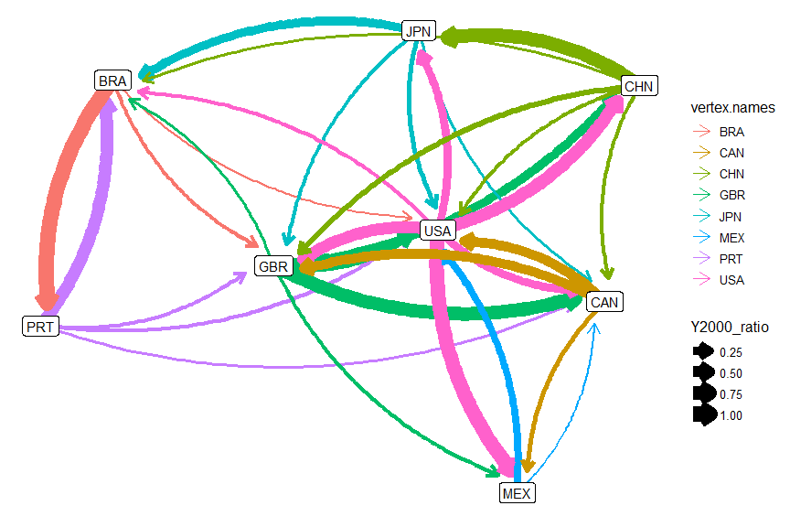

Network Graphs Activity
================
ECON 122
Day 20

## Country Migration

The following dataset contains migration counts for decades between 1960
and 2000 between the origin (`origincode`)and destination (`destcode`)
countries given in the data.

``` r
> MigrationFlows <- read_csv("https://raw.githubusercontent.com/mgelman/data/master/MigrationFlows.csv")
> MigrationFlows
# A tibble: 107,184 × 8
   sex   destcode origincode  Y1960  Y1970  Y1980  Y1990  Y2000
   <chr> <chr>    <chr>       <dbl>  <dbl>  <dbl>  <dbl>  <dbl>
 1 Male  FRA      AFG          1471     29     55     91    923
 2 Male  FRA      DZA        521679 723746 794288 861691 425229
 3 Male  FRA      AUS         14614   1906   1483    903   9168
 4 Male  FRA      AUT         12375   4861   4686   2761   7764
 5 Male  FRA      AZE           188      4     20     12    118
 6 Male  FRA      BLR           390      0     26     88    245
 7 Male  FRA      BLZ           623     22     25     38    391
 8 Male  FRA      BEN           233   5736   4409    397    166
 9 Male  FRA      ALB         15967     17      4   3586  10017
10 Male  FRA      ASM             0      0      0      0      0
# … with 107,174 more rows
```

#### Question 1

Create a subsetted version of this data, called `MigrationFlowsF`, that
only contains migration counts of `females` `over 1000` in 2000. How
many cases are in this dataset?

#### *Answer:*

We filter according to our criteria, select our origin, destination and
migration count variables.

``` r
> MigrationFlowsF <- MigrationFlows %>% 
+   filter(sex == "Female", Y2000>1000) %>% 
+   select(origincode, destcode, Y2000) 
> MigrationFlowsF
# A tibble: 1,437 × 3
   origincode destcode  Y2000
   <chr>      <chr>     <dbl>
 1 DZA        FRA      201387
 2 AUS        FRA        8385
 3 AUT        FRA        7100
 4 ALB        FRA        9162
 5 AGO        FRA        3140
 6 ARG        FRA        5096
 7 BGD        FRA        6632
 8 BRB        FRA        1486
 9 BEL        FRA       15164
10 BIH        FRA       10555
# … with 1,427 more rows
```

There are 1,437 cases in this dataset.

#### Question 2

The data frame you created in question 1 can be used as the edge list
for a migration network in 2000. Create a `network` object that makes a
directional network with edges indicating migration from the origin
country to a destination country. How many nodes are in this network?
How many edges?

#### *Answer:*

The data provided in `MigrationFlows` gives us an *edge list* once we
filter it to country combos with positive migration counts. To create
the network object we need to enter a matrix or data frame with two
columns: the first is the origin and the second is the destination. This
network has 198 nodes (vertices) and 1437 total (directional) edges.

``` r
> migration <- network(select(MigrationFlowsF,origincode,destcode), matrix.type="edgelist")
> migration
 Network attributes:
  vertices = 198 
  directed = TRUE 
  hyper = FALSE 
  loops = FALSE 
  multiple = FALSE 
  bipartite = FALSE 
  total edges= 1437 
    missing edges= 0 
    non-missing edges= 1437 

 Vertex attribute names: 
    vertex.names 

 Edge attribute names not shown 
```

#### Question 3

Visualizing all countries at once is likely to be overwhelming. Let’s
analyze the following countries:

``` r
> smallerGroup <- c("USA","CAN","MEX","BRA","CHN","JPN","GBR","PRT")
```

Draw a plot of this network with `ggnetwork` and `ggplot` with vertex
labels added. What patterns do you see in the plot?

- **Note:** Because we have arrows going into and out of the same
  countries, using `curvature=0.2` in `geom_edges` helps better
  visualize the flows
- **Note:** Setting a seed `set.seed(x)` can help to keep your network
  figyre constant each time you run your code

#### *Answer:*

USA and GBR appear to be pretty central in the network with lots of
inflows, while PRT, JPN, and CHN have fewer inflows.

``` r
> MigrationFlowsF_small <- filter(MigrationFlowsF,origincode %in% smallerGroup, destcode %in% smallerGroup)
> mynet_small <- network(MigrationFlowsF_small[,1:2], matrix.type="edgelist")
> 
> # ggplot option
> set.seed(6)
> ggplot(data = ggnetwork(mynet_small,arrow.gap=.04), aes(x = x, y = y, xend = xend, yend = yend)) + 
+   geom_edges(arrow=arrow(length=unit(6,"pt"), type="closed"),curvature = 0.20) + 
+   geom_nodes() + 
+   theme_blank() + 
+   geom_nodelabel(aes(label=vertex.names)) 
```

<!-- -->

#### Question 4

Is `Y2000`, migration in 2000, an edge or vertex attribute? Add it to
your smaller network from question 3 using the
`set.xxxx.attribute(network, "name", values)`.

#### *Answer:*

This is an edge attribute since is measures the flow between countries
and is not a single value associate with each country (e.g. like GDP
would be). Add this attribute using the same edge list order as the
original edgelist used to create the network. These values will be
mapped correctly to the 32 edges. We can check the edgelist entries to
verify the correct mapping of value to edge:

``` r
> set.edge.attribute(mynet_small, "Y2000", MigrationFlowsF_small$Y2000)
> mynet_small
 Network attributes:
  vertices = 8 
  directed = TRUE 
  hyper = FALSE 
  loops = FALSE 
  multiple = FALSE 
  bipartite = FALSE 
  total edges= 32 
    missing edges= 0 
    non-missing edges= 32 

 Vertex attribute names: 
    vertex.names 

 Edge attribute names: 
    Y2000 
> 
> # check work: node numbering is alphabetical
> as.edgelist(mynet_small,"Y2000")
      [,1] [,2]   [,3]
 [1,]    1    2  23849
 [2,]    1    4   5826
 [3,]    1    5  40529
 [4,]    1    7  11664
 [5,]    1    8   2200
 [6,]    2    4   1513
 [7,]    2    5  67841
 [8,]    2    7   3268
 [9,]    2    8  73942
[10,]    3    4   2140
[11,]    3    5  38777
[12,]    3    7   5524
[13,]    3    8 203217
[14,]    4    1   1816
[15,]    4    5 500550
[16,]    4    6   1263
[17,]    4    7 487980
[18,]    4    8   2501
[19,]    5    1   4169
[20,]    5    2   5970
[21,]    5    4  52927
[22,]    5    6  51323
[23,]    5    7 148490
[24,]    5    8   5759
[25,]    6    5 286128
[26,]    6    7   3205
[27,]    7    4  32687
[28,]    7    5 567975
[29,]    7    6   2789
[30,]    8    3   1243
[31,]    8    4   1791
[32,]    8    5   7181
attr(,"n")
[1] 8
attr(,"vnames")
[1] "CHN" "JPN" "PRT" "GBR" "USA" "MEX" "CAN" "BRA"
attr(,"directed")
[1] TRUE
attr(,"bipartite")
[1] FALSE
attr(,"loops")
[1] FALSE
attr(,"class")
[1] "matrix_edgelist" "edgelist"        "matrix"          "array"          
```

#### Question 5

Modify your plot from question 3 so that edge width is a function of
migration flow size. Use the `size` option in `geom_edges`. What
patterns do you notice about migration flows?

- **Note:** Coloring each edge by country of origin is helpful to
  visualize the flows better

#### *Answer:*

The largest flows are into USA from GBR and CAN. CHN has a lot of
outflows but not a lot of inflows.

``` r
> set.seed(6)
> ggplot(data = ggnetwork(mynet_small,arrow.gap=.05), aes(x = x, y = y, xend = xend, yend = yend)) + 
+   geom_edges(arrow=arrow(length=unit(10,"pt"), type="open"), aes(size=Y2000,color=vertex.names),curvature = 0.20) + 
+   geom_nodes() + 
+   theme_blank() + 
+   geom_nodelabel(aes(label=vertex.names)) 
Warning: Using `size` aesthetic for lines was deprecated in ggplot2 3.4.0.
ℹ Please use `linewidth` instead.
This warning is displayed once every 8 hours.
Call `lifecycle::last_lifecycle_warnings()` to see where this warning was
generated.
```

<!-- -->

#### Question 6

For a given country, imagine we want to focus on where the inflows of
migrants are coming from. Create a new `edge attribute` that calculates
for each destination country the ratio of inward migration from relative
to all inward migration. Do you learn anything different from this
Figure relative to Q5?

#### *Answer:*

Certain trends regarding inflows are easier to see. For example, this
Figure makes it clear that most inflows into JPN are coming from CHN and
PRT (portugal) and BRA make up the vast majority of migrants in each
country respectively.

``` r
> MigrationFlowsF_small <- MigrationFlowsF_small %>% group_by(destcode) %>%
+   mutate(Y2000_ratio=Y2000/sum(Y2000))
> 
> set.edge.attribute(mynet_small, "Y2000_ratio", MigrationFlowsF_small$Y2000_ratio)
> 
> set.seed(6)
> ggplot(data = ggnetwork(mynet_small,arrow.gap=.05), aes(x = x, y = y, xend = xend, yend = yend)) + 
+   geom_edges(arrow=arrow(length=unit(10,"pt")), aes(size=Y2000_ratio,color=vertex.names),curvature = 0.20) + 
+   geom_nodes() + 
+   theme_blank() + 
+   geom_nodelabel(aes(label=vertex.names)) 
```

<!-- -->
