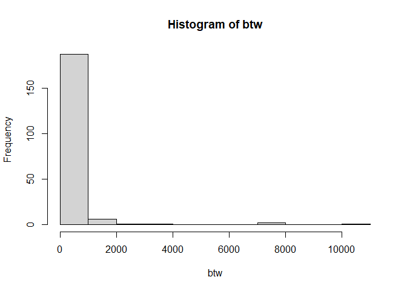
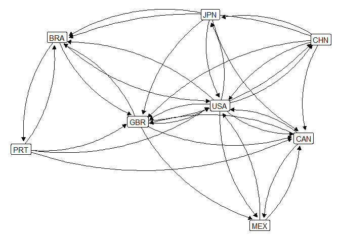
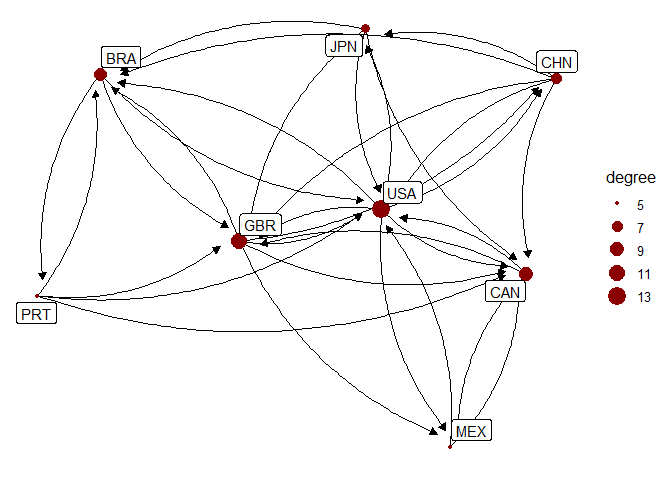
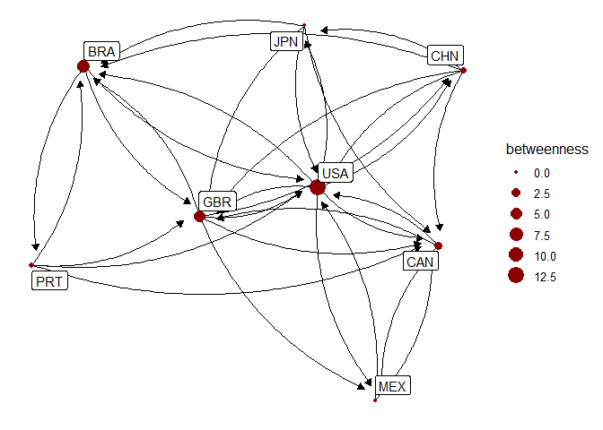

Network Stats Activity - Solution
================
ECON 122

## Country Migration

Let’s use the same dataset from the previous activity that contains
migration counts for decades between 1960 and 2000 between the origin
(`origincode`) and destination (`destcode`) countries given in the data.
We create a subsetted version of this data that only contains migration
counts of females over 1000 in 2000.

``` r
> MigrationFlows <- read_csv("https://raw.githubusercontent.com/mgelman/data/master/MigrationFlows.csv")
> MigrationFlowsF <- MigrationFlows %>% 
+    filter(sex == "Female", Y2000>1000) %>% 
+    select(origincode, destcode, Y2000)
> migration <- network(select(MigrationFlowsF,origincode,destcode), matrix.type="edgelist")
```

#### Question 1

Compute the betweenness measure for your migration network using the
`sna` package command `betweenness(network, gmode="digraph")` (since you
have a directed graph). Save the results in a vector then look at
numerical and graphical summaries of the betweenness measure. Which 10
countries have the highest measure of betweenness?

- **Hint:** Creating a dataframe of vertex names and betweeness can help
  with figuring out the top 10.

#### *Answer:*

Here we save our betweenness measure is a vector `btw`, the order of
which matches the order of our vertex names.

``` r
> btw <- betweenness(migration, gmode="digraph") 
> head(btw)
[1]  45.477772 572.580256 192.273929   2.821355 478.531376 358.560828
> vnames <- migration %v% "vertex.names"
> head(vnames)
[1] "DZA" "AUS" "AUT" "ALB" "AGO" "ARG"
```

So `AFG` has a betweeness measure of 102.82, `AGO` 478.53, and so on.
The histogram and summary stats reveal a few countries with very large
betweenness values.

``` r
> summary(btw)
    Min.  1st Qu.   Median     Mean  3rd Qu.     Max. 
    0.00     0.00    19.39   310.69   219.10 10191.04 
> hist(btw) 
```

<!-- -->

The countries with the 10 largest values are listed below and for the
most part make sense.

``` r
> data.frame(names=vnames,btw=btw) %>% arrange(desc(btw)) %>% head(10)
   names       btw
1    USA 10191.043
2    FRA  7731.988
3    GBR  7683.472
4    POL  3115.459
5    IND  2465.477
6    ZAF  1852.147
7    NGA  1524.156
8    CHN  1392.055
9    DEU  1348.332
10   GHA  1337.427
```

#### Question 2

Create a subgraph from the previous activity using the following smaller
subset of countries. Draw a plot of this network with vertex labels
added. (You can use your code from the previous activity)

``` r
> smallerGroup <- c("USA","CAN","MEX","BRA","CHN","JPN","GBR","PRT")
```

#### *Answer:*

``` r
> MigrationFlowsF_small <- filter(MigrationFlowsF,origincode %in% smallerGroup, destcode %in% smallerGroup)
> mynet_small <- network(MigrationFlowsF_small[,1:2], matrix.type="edgelist")
> 
> # ggplot option
> set.seed(6)
> ggplot(data = ggnetwork(mynet_small,arrow.gap=.04), aes(x = x, y = y, xend = xend, yend = yend)) + 
+   geom_edges(arrow=arrow(length=unit(6,"pt"), type="closed"),curvature = 0.20) + 
+   geom_nodes() + 
+   theme_blank() + 
+   geom_nodelabel(aes(label=vertex.names)) 
```

<!-- -->

#### Question 3

Modify your plot so that node size is a function of `degree`. Use the
`size` option in `geom_nodes`. What can you learn from this modified
plot?

#### *Answer:*

The figure scales each node for how many edges they have connected to
them. We see that USA and GBR have high levels of degree while PRT and
MEX have much smaller levels.

<!-- -->

#### Question 4

Repeat Q3 but use `betweenness` instead of `degree`. What differences do
you notice? Do they make sense intuitively?

#### *Answer:*

The figure below scales each node by `betweenness`. While there is
cetainly a correlation with degree some nodes do differ. For example,
BRA and CAN have a degree measure but BRA has a higher betweenness
measure. Therefore, while both countries have the same amount of edges
connected to it, BRA appears to be a more important node for which
migration flows through. Similarly, while JPN has a degree of 6, it has
a betweenness of 0 which means none of the shortest routes between nodes
pass through JPN.

<!-- -->

#### Question 5

Compute the density, transitivity (clustering), and diameter values for
this network. What do they tell you about its structure? How do you
think the numbers would vary if we looked at only countries in South
America?

#### *Answer:*

The density of this network is about 57%, transitivity is about 66% and
diameter 3. Just over 1/2 of all possible two-way migration connections
are observed and about 2/3 of possible triads are observed. Given that
these nodes cover a disperse geographical area, the numbers aren’t too
surprising.

If we looked at countries only in South America, we would probably get
higher density and transitivity numbers. When analyzing just that
sub-region, it’s likely that each country has strong connections with
other countries within the region.

``` r
> gden(mynet_small)  # density
[1] 0.5714286
> gtrans(mynet_small) # transitivity
[1] 0.6576577
> max(geodist(mynet_small)$gdist) # diameter
[1] 3
```
