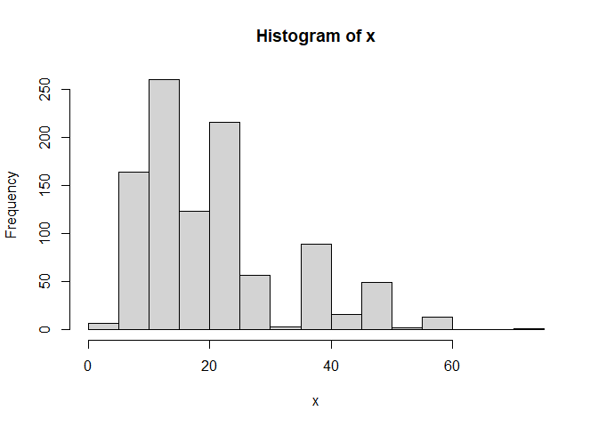

R Objects Activity - Solution
================
ECON 122
Day 3

## Objects used in this handout:

``` r
> x <- c(8,2,1,3)
> loans <- read.csv("https://raw.githubusercontent.com/mgelman/data/master/CreditData.csv")
> tweets<- read.csv("https://raw.githubusercontent.com/mgelman/data/master/TrumpTweetData.csv")
> x.mat2 <- cbind(x,2*x)
> x.df <- data.frame(x=x,double.x=x*2)
> my.list <- list(myVec=x, myDf=x.df, myString=c("hi","bye"))
```

### Question 1: data types

-   What data type is `x`? What data type is `loans$Duration.in.month`?

``` r
> typeof(x)
[1] "double"
> typeof(loans$Duration.in.month)
[1] "integer"
```

-   What data type is the vector `c(x, loans$Duration.in.month)`?

**answer:** double is more flexible than integer so the combined vector
will be turned into double.

``` r
> typeof(c(x, loans$Duration.in.month))
[1] "double"
```

-   What data type is the vector `c(x,"NA")`?

**answer:** The entry `"NA"` is a character string so the vector is
coerced into a character vector. To denote a missing value, simply use
an unquoted `NA`.

``` r
> typeof(c(x,"NA"))
[1] "character"
> typeof(c(x,NA)) # missing value added, still a double
[1] "double"
```

### Question 2: subsetting and coercion - may be multiple correct solutions

-   How can we get an `x` vector with entries 1 and 2 without using the
    numbers 1 and 2?

``` r
> x[-c(3,4)]
[1] 8 2
```

-   How can we reverse the order of entries in `x`?

``` r
> x[4:1]
[1] 3 1 2 8
```

-   What does `which(x < 5)` equal? **answer:** gives index (location)
    values of entries less than 5

``` r
> x < 5
[1] FALSE  TRUE  TRUE  TRUE
> which(x < 5)
[1] 2 3 4
```

-   What does `sum(c(TRUE,FALSE,TRUE,FALSE))` equal? **answer:** number
    of TRUE’s in the vector

``` r
> sum(c(TRUE,FALSE,TRUE,FALSE))
[1] 2
```

-   What does `sum(x[c(TRUE,FALSE,TRUE,FALSE)])` equal? **answer:**
    first, subset `x` to be just the first and third entries, then sum
    up these entry values

``` r
> x[c(TRUE,FALSE,TRUE,FALSE)]
[1] 8 1
> sum(x[c(TRUE,FALSE,TRUE,FALSE)])
[1] 9
```

-   What does `sum(x < 5)` equal? **answer:** number of entries less
    than 5

``` r
> x < 5
[1] FALSE  TRUE  TRUE  TRUE
> sum(x < 5)
[1] 3
```

-   What does `sum(x[x < 5])` equal? **answer:** sums the `x` values
    that are less than 5

``` r
> x[x < 5]
[1] 2 1 3
> sum(x[x < 5])
[1] 6
```

-   Why does `dim(x.mat2[1:2,1])` return `NULL` while
    `dim(x.mat2[1:2,1:2])` returns a dimension?
    -   **answer:** The first gives the first two rows of the first
        column of a matrix. Taking only one column from a matrix results
        in a one-dimensional vector (not a matrix) that no longer has a
        dimension. The second subset still has more than one row and
        column, so it is still a matrix and hence has a dimension.

``` r
> class(x.mat2[1:2,1])
[1] "numeric"
> dim(x.mat2[1:2,1])
NULL
> class(x.mat2[1:2,1:2])
[1] "matrix" "array" 
> dim(x.mat2[1:2,1:2])
[1] 2 2
```

### Question 3: Data frames

``` r
> str(tweets$text)
 chr [1:1512] "My economic policy speech will be carried live at 12:15 P.M. Enjoy!" ...
```

-   The data set `TrumpTweetData.csv` contains data collected on about
    1500 Trump tweets. The variable `text` contains the text of the
    selected tweets. After reading data in with `read.csv`, R thinks the
    `text` variable is a factor. Does this make sense? (e.g. would you
    treat this as a categorical grouping variable in any analysis?)
    -   **answer:** No it doesn’t really make sense for it to be a
        factor.
-   Use **two methods** to find the `text` of the 180th tweet in the
    Trump data.

``` r
> tweets$text[180]
[1] "MAKE AMERICA SAFE AND GREAT AGAIN! #TrumpPence16\nhttps://t.co/4O4yjh7X4O https://t.co/cptBaZbV1v"
> tweets[180,"text"]
[1] "MAKE AMERICA SAFE AND GREAT AGAIN! #TrumpPence16\nhttps://t.co/4O4yjh7X4O https://t.co/cptBaZbV1v"
```

-   What is the class of the `attributes` of the data frame `tweets`?

``` r
> class(attributes(tweets))
[1] "list"
```

### Question 4: Lists - may have more than one correct answer

-   Using `my.list`, show three ways to write one command that gives the
    3rd entry of variable `x` in data frame `myDf`

``` r
> my.list
$myVec
[1] 8 2 1 3

$myDf
  x double.x
1 8       16
2 2        4
3 1        2
4 3        6

$myString
[1] "hi"  "bye"
> my.list$myDf$x[3]
[1] 1
> my.list[["myDf"]]$x[3]
[1] 1
> my.list[[2]][3,1]
[1] 1
```

-   What class of object does the command `my.list[3]` return?
    **answer:** list

``` r
> class(my.list[3])
[1] "list"
```

-   What class of object does the command `my.list[[3]]` return?
    **answer:** (atomic) character vector

``` r
> class(my.list[[3]])
[1] "character"
```

-   What class of object does the command `unlist(my.list)` return? Why
    are all the entries `character`s? **answer:** (atomic) character
    vector

``` r
> class(unlist(my.list))
[1] "character"
```

### Question 5: Loans revisited

-   Give meaning to the following statistical summaries of the loans
    data from the test-assignment (interpret the numbers given!):
    -   `mean(loans$Good.Loan == "BadLoan")` **answer:** proportion of
        all loans that are “bad loans” (defaults)
    -   `mean(loans$Duration.in.month <= 24)` **answer:** proportion of
        all loans that are less than or equal to 24 months duration
    -   `mean(loans$Duration.in.month[loans$Good.Loan == "BadLoan"] <= 24)`
        **answer:** proportion of *all loans that defaulted* that are
        less or equal to 24 months duration.
-   Explain what the following `ifelse` command produces. **answer:**
    creates a new variable that predicts bad loan for cases over 24
    months duration and over 10,000 in credit.

``` r
> loans$pred.Default1 <- ifelse(loans$Duration.in.month > 24 & loans$Credit.amount > 10000, "predBad", "predGood")
> head(loans[, c("Duration.in.month","Credit.amount","pred.Default1")], 10)
   Duration.in.month Credit.amount pred.Default1
1                  6          1169      predGood
2                 48          5951      predGood
3                 12          2096      predGood
4                 42          7882      predGood
5                 24          4870      predGood
6                 36          9055      predGood
7                 24          2835      predGood
8                 36          6948      predGood
9                 12          3059      predGood
10                30          5234      predGood
```

-   Explain what the following `ifelse` command produces. **answer:**
    creates a new variable that predicts bad loan for cases over 24
    months duration and less than 2,200 10,000 in credit OR for cases
    less than or equal to 24 months and less than 2,000 in credit.

``` r
> loans$pred.Default <- ifelse(loans$Duration.in.month <= 24 & loans$Credit.amount < 2200, "predBad", loans$pred.Default1)
> head(loans[, c("Duration.in.month","Credit.amount","pred.Default1","pred.Default")], 10)
   Duration.in.month Credit.amount pred.Default1 pred.Default
1                  6          1169      predGood      predBad
2                 48          5951      predGood     predGood
3                 12          2096      predGood      predBad
4                 42          7882      predGood     predGood
5                 24          4870      predGood     predGood
6                 36          9055      predGood     predGood
7                 24          2835      predGood     predGood
8                 36          6948      predGood     predGood
9                 12          3059      predGood     predGood
10                30          5234      predGood     predGood
```

-   What data type do the `ifelse` commands above produce (factor or
    character)? **answer:** character

### Question 6: Functions

``` r
> MeanSD <- function(x,plot=FALSE,...)
+ {
+   mean.x <- mean(x,...)
+   sd.x <- sd(x,...)
+   if (plot) 
+     hist(x)
+   return(list(Mean=mean.x,SD=sd.x))
+ }
```

-   Use the `MeanSD` function to get mean, sd and histogram for
    `loans$Duration.in.month`

``` r
> MeanSD(loans$Duration.in.month, plot=TRUE)
```

<!-- -->

    $Mean
    [1] 20.903

    $SD
    [1] 12.05881

-   Why does the first command below return NA’s while the second
    returns mean and SD? **answer:** The commands `mean` and `sd`
    produce `NA` when there is a missing value in the data entered. The
    option `na.rm` is used to computes these stats only for non missing
    values.

``` r
> MeanSD(c(1,2,3,4,NA))
$Mean
[1] NA

$SD
[1] NA
> MeanSD(c(1,2,3,4,NA), na.rm=TRUE)
$Mean
[1] 2.5

$SD
[1] 1.290994
```

-   Change the function above to also include the median in it’s
    statistical summary output.

``` r
> MeanSD2 <- function(x,plot=FALSE,...)
+ {
+   mean.x <- mean(x,...)
+   sd.x <- sd(x,...)
+   med.x <- median(x,...)
+   if (plot) 
+     hist(x)
+   return(list(Mean=mean.x,SD=sd.x, Median=med.x))
+ }
> MeanSD2(loans$Duration.in.month)
$Mean
[1] 20.903

$SD
[1] 12.05881

$Median
[1] 18
```
