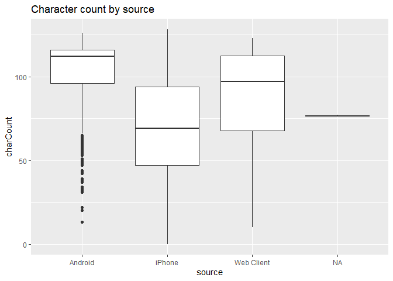
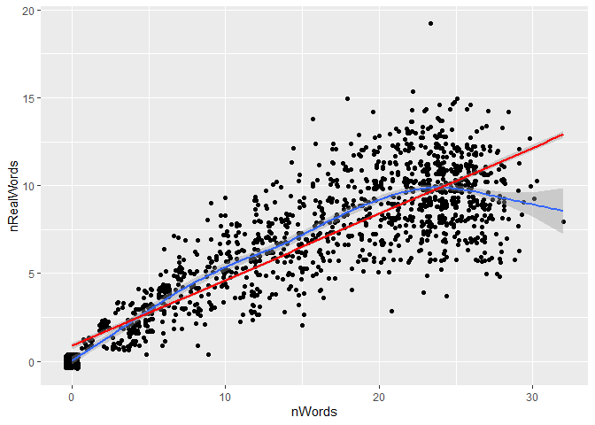
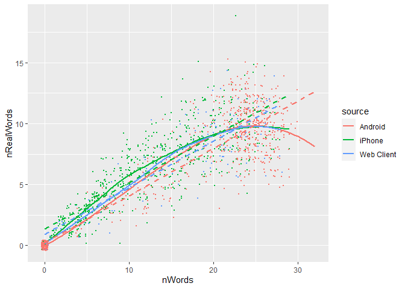
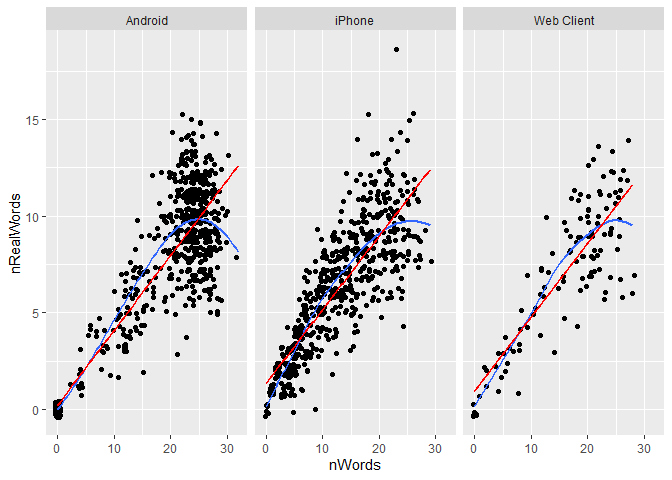

Intro to `ggplot2`
================
ECON 122
Day 4

## Trump Tweets

Let’s revisit the data collected on Trump tweets.

``` r
> tweets<- read.csv("https://raw.githubusercontent.com/mgelman/data/master/TrumpTweetData.csv")
> tweets[226,"charCount"]=76 #modification for density
```

We will focus on the following variables:

| Variable     | Description                                                                             |
|--------------|-----------------------------------------------------------------------------------------|
| `source`     | type of device used to sent the tweet                                                   |
| `charCount`  | how many characters used in the tweet (excluding spaces and weblinks)                   |
| `nWords`     | number of “words”” in the tweet (excluding weblinks and retweets)                       |
| `nRealWords` | `nwords` minus the number of numbers or “stopwords” (like “a”, “the”, etc) in the tweet |

First look at basic summaries of the variables

``` r
> summary(tweets[,c("source","charCount","nWords","nRealWords")])
    source            charCount          nWords       nRealWords    
 Length:1512        Min.   :  0.00   Min.   : 0.0   Min.   : 0.000  
 Class :character   1st Qu.: 63.00   1st Qu.: 6.0   1st Qu.: 3.000  
 Mode  :character   Median : 97.00   Median :16.0   Median : 7.000  
                    Mean   : 86.96   Mean   :14.6   Mean   : 6.364  
                    3rd Qu.:114.00   3rd Qu.:23.0   3rd Qu.:10.000  
                    Max.   :128.00   Max.   :32.0   Max.   :19.000  
```

## Graphs for quantitative variable

The basic graphs for quantitative (numeric) variables are geoms for
`histogram`, `density`, `boxplot`, and `points` plot. Let’s first just
explore the distribution of character count.

The distribution of character count is

``` r
> library(ggplot2)
Warning: package 'ggplot2' was built under R version 4.2.3
> w <- ggplot(data=tweets, aes(x=charCount))
> w + geom_histogram() + ggtitle("Character Count Distribution") + xlab("Number of characters per tweet")
```

<!-- -->

You can change the `binwidth` size to modify bar width:

``` r
> w + geom_histogram(binwidth = 1) + ggtitle("Character Count Distribution")
```

<!-- -->

### Question 1: Create a histogram of `nWords`. Note the many tweets with word counts of 0. Word counts of 0 mean the tweet was a retweet or link. Create a histogram of word counts that omits 0 word tweets.

**answer:** Histogram of `nWords`

``` r
> ggplot(data=tweets, aes(x=nWords)) + 
+   geom_histogram()
```

<!-- -->

Histogram of `nWords` without 0 word tweets

``` r
> ggplot(data=tweets[tweets$nWords>0,], aes(x=nWords)) + 
+   geom_histogram()
```

<!-- -->

How does character count relate to tweet source? We could compare
distributions with a side-by-side boxplot:

``` r
> w <- ggplot(data=tweets, aes(x=source,y=charCount))
> w + geom_boxplot() + ggtitle("Character count by source")
```

<!-- -->

You can create a horizontal version by calling the `last_plot()` created
and flipping axes with `coord_flip()`:

``` r
> last_plot() + coord_flip()
```

<!-- -->

You can also compare distributions more thoroughly using density curves
for each group. The variable `source` will be used to set the aesthetic
`color`:

``` r
> w <- ggplot(data=tweets, aes(x=charCount))
> w + geom_density(aes(color=source)) + ggtitle("Character count by source")
```

<!-- -->

### Question 2: Why is there a spike in the density? Can you really compare source distributions with this density included?

**answer:** The spike in density comes from the fact that `NA` has very
few observations. It’s hard to compare the source distributions with
`NA` included because the scale has been adjusted to fit `NA` but not
the others.

Recreate the density plot but excluding missing data sources:

``` r
> w <- ggplot(data=tweets[!is.na(tweets$source),], aes(x=charCount))
> w + geom_density(aes(color=source)) + ggtitle("Character count by source")
```

<!-- -->

### Question 3: Do you have any idea why different tweet device sources have different character count distributions?

**answer:** This qusetion is based on an
[analysis](http://varianceexplained.org/r/trump-tweets/) of Trump tweets
that show the different device sources likely reflect different people
tweeting from the same account.

How do `nWords` and `nRealWords` relate? We could explore this with a
scatterplot because both variables are quantitative. We will show how to
add both a least squares line and a trend smoother line.

``` r
> w <- ggplot(data=tweets, aes(x=nWords, y=nRealWords)) + geom_point()
> w + geom_smooth()  # adds smoother (loess or gam)
```

<!-- -->

``` r
> last_plot() + geom_smooth(method="lm", color="red") 
```

<!-- -->

### Question 4: Does the relationship look linear? linear over a restricted range of `nWords`? What does adding `scale_x_sqrt()` and `scale_y_sqrt()` to the previous plot do to the plot? Does it make the relationship follow a linear trend better than the original scale?

**answer:** The relationship looks linear up until `nWords`=20 then
starts to flatten out. Converting the x and y axis to a square root
scale makes the plot look more linear because it de-emphasizes the
larger values where the relationship is not as linear.

``` r
> w <- ggplot(data=tweets, aes(x=nWords, y=nRealWords)) + geom_point()
> w + geom_smooth() + geom_smooth(method="lm", color="red") + scale_x_sqrt() + scale_y_sqrt()
```

<!-- -->

### Question 5: There are over 1000 tweets in the data. Why don’t we see over 1000 glyphs in the plot. In the previous code chunk, what happens when you replace `geom_point()` with `geom_jitter()`?

**answer:** While there are over 1000 tweets, many of the observations
have the same values (for example `nWords`=20) so they will show up as
one point. `geom_jitter()` adds a small amount of statistical noise to
these values so that we can identify each different point on the plot.

``` r
> w <- ggplot(data=tweets, aes(x=nWords, y=nRealWords)) + geom_jitter()
> w + geom_smooth() + geom_smooth(method="lm", color="red") 
```

<!-- -->

### Question 6: Are there tweets that are all “real words”? Add `geom_abline(intercept=0,slope=1)` to the original (unjittered) scatterplot to see.

**answer:** Yes, there are tweets that are all “real words.”
`geom_abline(intercept=0,slope=1)` adds a 45 degree line at y=x so that
we can identify which tweets have the same value for `nWords` and
`nRealWords`.

``` r
> w <- ggplot(data=tweets, aes(x=nWords, y=nRealWords)) + geom_point() 
> w + geom_smooth() + geom_smooth(method="lm", color="red") + geom_abline(intercept=0,slope=1)
```

<!-- -->

Does this relationship depend on tweet source? We could explore this
visually a couple ways: using a color cue assigned to each glyph or by
faceting.

Here is a plot colored by `source` after omitting the 2 NA sources from
the data frame. (The NA `source` group will cause the smoother to fail
because there are not enough cases to produce a good smoother trend
line.)

``` r
> w <- ggplot(data=tweets[!is.na(tweets$source),], aes(x=nWords, y=nRealWords, color=source)) + geom_jitter()
> w + geom_smooth(se=FALSE) + geom_smooth(method="lm", se=FALSE)
```

<!-- -->

### Question 7: What does `se=FALSE` do (you can try removing it to compare plots)? Why did we have to remove the `color` argument from `geom_smooth`?

**answer:** `se=FALSE` turns off the standard error bands in the plot.
When you are compaing many lines, the standard error bands can make the
plot look messy so it’s best to remoev them here. We had to remove the
`color` argument from `geom_smooth` because the `color=source` argument
is not setting the color of the lines.

### Question 8: Add `size=.4` to the `jitter` geom and `linetype=2` to the `lm` smoother. What changes?

**answer:** These commands adjust the style of the jitter points as well
as the `lm` smoother. These simple changes make the plot much easier to
analyze.

``` r
> w <- ggplot(data=tweets[!is.na(tweets$source),], aes(x=nWords, y=nRealWords, color=source)) + geom_jitter(size=0.4)
> w + geom_smooth(se=FALSE) + geom_smooth(method="lm", se=FALSE,linetype=2)
```

<!-- -->

Now we will try faceting by `source`:

``` r
> w <- ggplot(data=tweets[!is.na(tweets$source),], aes(x=nWords, y=nRealWords)) + geom_jitter()
> w + geom_smooth(se=FALSE) + geom_smooth(method="lm", se=FALSE, color="red") + facet_wrap(~source)
```

<!-- -->

### Question 9: Try rerunning the facet chunk without omitting the NA sources. What happens?

**answer:** If we don’t omit `NA` we get an error because the smoothing
algorithm doesn’t work with only 2 points.

``` r
> w <- ggplot(data=tweets, aes(x=nWords, y=nRealWords)) + geom_jitter()
> w + geom_smooth(se=FALSE) + geom_smooth(method="lm", se=FALSE, color="red") + facet_wrap(~source)
Warning in simpleLoess(y, x, w, span, degree = degree, parametric =
parametric, : span too small. fewer data values than degrees of freedom.
Warning in simpleLoess(y, x, w, span, degree = degree, parametric =
parametric, : at 3.945
Warning in simpleLoess(y, x, w, span, degree = degree, parametric =
parametric, : radius 0.003025
Warning in simpleLoess(y, x, w, span, degree = degree, parametric =
parametric, : all data on boundary of neighborhood. make span bigger
Warning in simpleLoess(y, x, w, span, degree = degree, parametric =
parametric, : pseudoinverse used at 3.945
Warning in simpleLoess(y, x, w, span, degree = degree, parametric =
parametric, : neighborhood radius 0.055
Warning in simpleLoess(y, x, w, span, degree = degree, parametric =
parametric, : reciprocal condition number 1
Warning in simpleLoess(y, x, w, span, degree = degree, parametric =
parametric, : at 15.055
Warning in simpleLoess(y, x, w, span, degree = degree, parametric =
parametric, : radius 0.003025
Warning in simpleLoess(y, x, w, span, degree = degree, parametric =
parametric, : all data on boundary of neighborhood. make span bigger
Warning in simpleLoess(y, x, w, span, degree = degree, parametric =
parametric, : There are other near singularities as well. 0.003025
Warning in simpleLoess(y, x, w, span, degree = degree, parametric =
parametric, : zero-width neighborhood. make span bigger

Warning in simpleLoess(y, x, w, span, degree = degree, parametric =
parametric, : zero-width neighborhood. make span bigger
Warning: Computation failed in `stat_smooth()`
Caused by error in `predLoess()`:
! NA/NaN/Inf in foreign function call (arg 5)
```

<!-- -->

### Question 10: Which visual method gives a clearer comparison of the word trends in the three sources?

**answer:** This is subjective, but I prefer the facet approach rather
than the color approach for this particular exercise.
