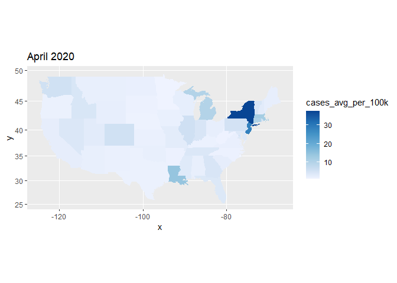
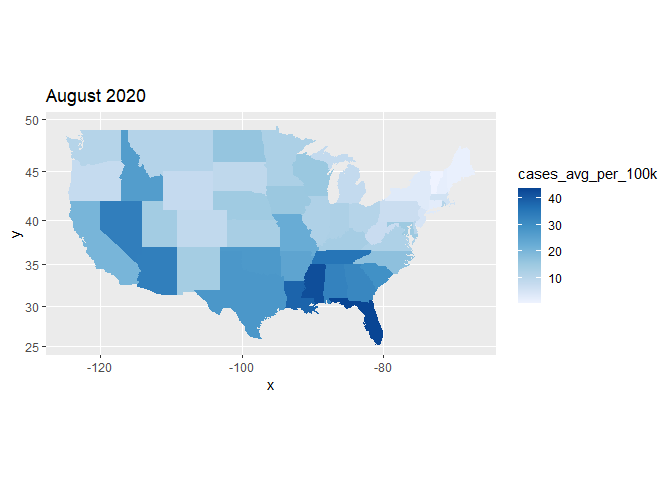
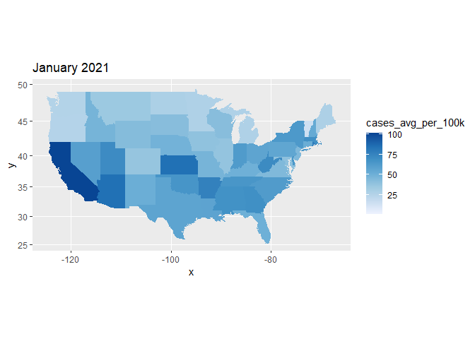
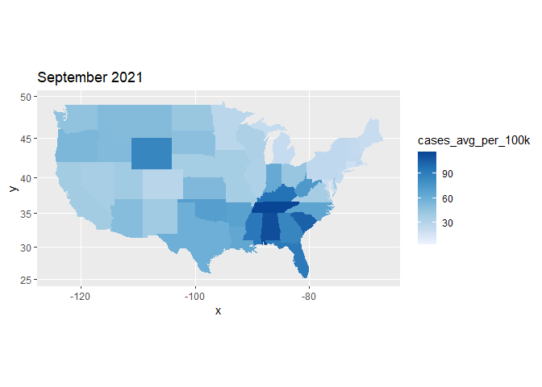
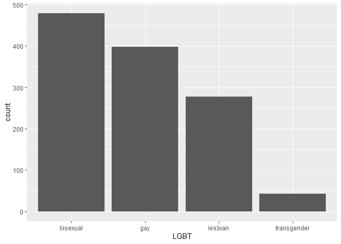
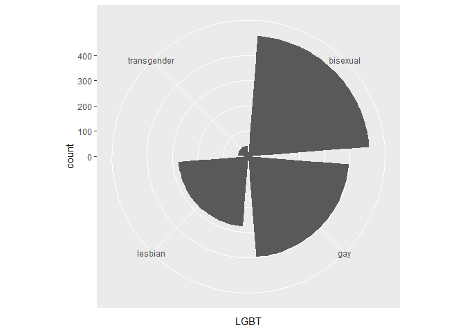
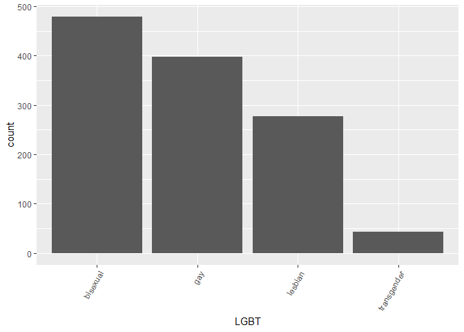
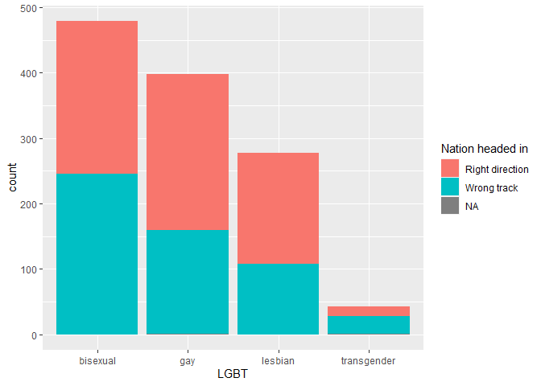
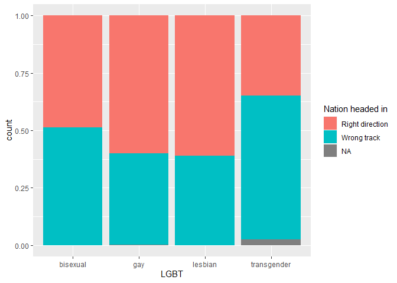
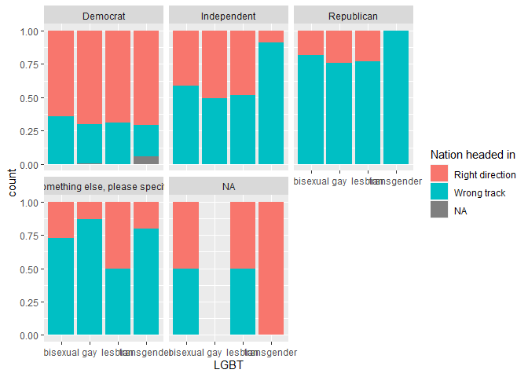

Intro to `ggplot2`
================
ECON 122
Day 4

## Analyzing COVID-19 data.

Data for this section was downloaded from [The New York
Times](https://github.com/nytimes/covid-19-data/tree/master/rolling-averages)
COVID-19 case data.

The following chunk imports seven day rolling averages of COVID-19 case
counts per 100k residents. The important variables for this analysis are
`region` which represents each US State and `cases_avg_per_100k` which
hold the case data.

``` r
> library("dplyr")
> library("ggplot2")
> library("maps")
Warning: package 'maps' was built under R version 4.2.3
> COVID_DATA <- read.csv("https://raw.githubusercontent.com/mgelman/data/master/us-states.csv")
> COVID_DATA <- as_tibble(COVID_DATA)
> COVID_DATA <- COVID_DATA %>%  rename(region=state)
> COVID_DATA$region <- tolower(COVID_DATA$region)  # lower case (match MainStates regions)
```

The following chunk creates a snapshot of the data roughly at the peak
of each of the four waves we’ve had so far

``` r
> APR_20 <- COVID_DATA %>% filter(date == "2020-04-01")
> AUG_20 <- COVID_DATA %>% filter(date == "2020-08-01")
> JAN_21 <- COVID_DATA %>% filter(date == "2021-01-01")
> SEP_21 <- COVID_DATA %>% filter(date == "2021-09-01")
```

### Question 1: Create a series of four maps of the US states that shows the case load at each snapshot in time. Label each map appropiately so we can tell the difference between them.

*Hint:* The lecture notes on mapping can help guide you

``` r
> MainStates <- map_data("state")
> ggplot() + coord_map() + 
+   geom_map(data=APR_20, aes(map_id = region, fill=cases_avg_per_100k), map = MainStates) + 
+ expand_limits(x=MainStates$long, y=MainStates$lat) + ggtitle("April 2020") + scale_fill_distiller(palette="Blues",direction=1) 
```

<!-- -->

``` r
> ggplot() + coord_map() + 
+   geom_map(data=AUG_20, aes(map_id = region, fill=cases_avg_per_100k), map = MainStates) + 
+ expand_limits(x=MainStates$long, y=MainStates$lat) + ggtitle("August 2020") + scale_fill_distiller(palette="Blues",direction=1)
```

<!-- -->

``` r
> ggplot() + coord_map() + 
+   geom_map(data=JAN_21, aes(map_id = region, fill=cases_avg_per_100k), map = MainStates) + 
+ expand_limits(x=MainStates$long, y=MainStates$lat) + ggtitle("January 2021") + scale_fill_distiller(palette="Blues",direction=1)
```

<!-- -->

``` r
> ggplot() + coord_map() + 
+   geom_map(data=SEP_21, aes(map_id = region, fill=cases_avg_per_100k), map = MainStates) + 
+ expand_limits(x=MainStates$long, y=MainStates$lat) + ggtitle("September 2021") + scale_fill_distiller(palette="Blues",direction=1)
```

<!-- -->

### Question 2: For each wave, which region of the US is most impacted?

**answer:** The maps reflect the following data:

- Wave 1: New York was the most impacted state
- Wave 2: The spread was more dispersed with large case loads in the
  South and West
- Wave 3: CA and KS were the hardest hit states
- Wave 4: The delta wave impacted many states in the South

### Question 3: Play around with the palette colors. Are there some color schemes that work better than others for visualizing the case counts?

**answer:** This depends on your taste but I like the Blue palette with
the reverse direction so that darker colors represent higher case
counts.

## Graphs for categorical variables

Survey data is a good source for variables with categorical responses.
We will switch to data collected from the 2013 Pew Survey of LGBT
Americans. Non-responses are denoted as blank spaces in the dataset and
we need to inform R of this when reading in this `.csv` (otherwise blank
responses will be treated as an actual response level when R reads in
this type of (mainly) factor data):

``` r
> pew<- read.csv("https://raw.githubusercontent.com/mgelman/data/master/PewLGBT2013.csv", na.strings = c(NA," ","Refused"))
```

A bar graph of `LGBT` variable summarizes the distribution of
respondents LGBT identity:

``` r
> a <- ggplot(pew, aes(x=LGBT) )
> a + geom_bar() 
```

<!-- -->

### Question 11: What happens if you change coordinate systems and add `coord_polar()` to the last plot? (This is called a Coxcomb graph.)

**answer:** `coord_polar()` uses polar coordinates instead of the
standard cartesian coordinates.

``` r
> a <- ggplot(pew, aes(x=LGBT) )
> a + geom_bar()  + coord_polar()
```

<!-- -->

You can rotate labels by rotating text on the x-axis.

``` r
> a + geom_bar() + theme(axis.text.x=element_text(angle=60,hjust=1))
```

<!-- -->

### Question 12: What happens when you change the `hjust` number to something bigger? something negative?

**answer:** `hjust` is meant to have values between 0 and 1 so setting
it something too big or negative leads to strange results. The point is
that you should really look up the function to understand what it does
and what parameters make sense before using a command.

Let’s explore how LGBT identify relates to another categorical variable
response, `Q2`, that measures whether an individual thinks the nation is
on the “right direction” or “wrong track”. Here we use `Q2` answers to
`fill` the bars and create a stacked bar graph:

``` r
> a + geom_bar(aes(fill=Q2)) + scale_fill_discrete(name="Nation headed in")
```

<!-- -->

Note that the scale type is `fill`, so we used `scale_fill_discrete` to
change the legend name.

Let’s make another change by adding `position=fill` to the `bar` geom:

``` r
> a + geom_bar(aes(fill=Q2), position="fill") + scale_fill_discrete(name="Nation headed in") 
```

<!-- -->

### Question 13: What is the scale of the y-axis? Once you figure this out, change the label from `count` to something more appropriate. Is there an association between LGBT identity and the response to the right track/wrong track question?

**answer:** the scale is a proportion and not a count. We can correct
this by adding `ylab("Proportion")`. It looks like the response
“transgender” is associated with a higher fraction of responses for
“Wrong track.”

### Question 14: What do the gray sections represent? The gray sections are present in the count version of this graph, but why are they hard to see?

**answer:** The gray sections represent individuals who did not give a
response. There are much fewer indivdiuals who respnd with “transgender”
so the actual count data for `NA` is hard to see when using a scale to
match the other categories. By converting all the answers to a
proportion, we can better see the `NA` responses.

### Question 15: Facet the previous graph by `PARTY`, the political affiliation of the respondent. Does the relationship between LGBT and right track/wrong track seem to depend upon `PARTY`?

**answer:** Yes, it looks like those that respsonded as “Democrat” have
a much higher proportion of “Right direction” answers relative to those
that responded as “Republican.”

``` r
> a + geom_bar(aes(fill=Q2), position="fill") + scale_fill_discrete(name="Nation headed in") + facet_wrap(~PARTY)
```

<!-- -->
