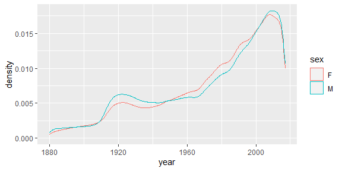
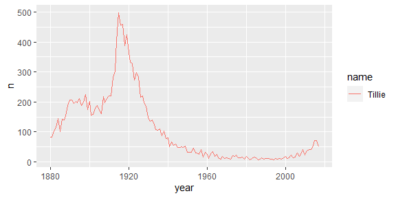
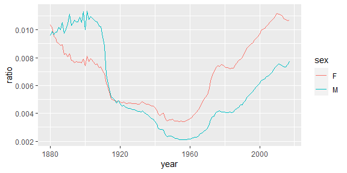

Data wrangling: one data table
================
ECON 122
Day 6

## Historical baby names (section 3.3)

The package `babynames` contains the data set `babynames`. This data set
gives name rates for births recorded by the Social Security
Administration from 1880 - 2017 (138 years).

``` r
> glimpse(babynames)
Rows: 1,924,665
Columns: 5
$ year <dbl> 1880, 1880, 1880, 1880, 1880, 1880, 1880, 1880, 1880, 1880, 1880,~
$ sex  <chr> "F", "F", "F", "F", "F", "F", "F", "F", "F", "F", "F", "F", "F", ~
$ name <chr> "Mary", "Anna", "Emma", "Elizabeth", "Minnie", "Margaret", "Ida",~
$ n    <int> 7065, 2604, 2003, 1939, 1746, 1578, 1472, 1414, 1320, 1288, 1258,~
$ prop <dbl> 0.07238359, 0.02667896, 0.02052149, 0.01986579, 0.01788843, 0.016~
```

-   Over 1.8 million rows giving the names of all baby names born in any
    year
-   Each row specifies a:
    -   `year`
    -   `sex`
    -   `name`
    -   `n` number with a name in a given year
    -   `prop` yearly proportion with a given name (by sex). E.g. 7065
        females named Mary were recorded in SSA applicants born in 1880,
        this makes up about 7.2% of all females applicants with 1880
        birth dates.

### 1. what does this plot show?

``` r
> ggplot(babynames, aes(x=year)) + geom_density(aes(color=sex)) 
```

<!-- -->

*answer:* Number of *distinct* baby names assigned by year, the height
represents the number of male/female names in a given year. (More
creative parents over time? Or larger, more diverse population?)

### 2. What does this plot show?

``` r
> babynames %>% 
+   filter(name == "Tillie", sex == "F") %>% 
+   ggplot(aes(x=year)) + 
+     geom_line(aes(y=n, color=name))
```

<!-- -->

*answer:* The plots the yearly count `n` vs `year`, so we are seeing
popularity of this name over time. The biggest spike in popularity
occured just prior to 1920.

### 3. The following command shows there are 142 years with at least one baby named Tillie. Is this statement necessarily true? (Hint: Think about what 1 row represents)

``` r
> filter(babynames, name == "Tillie")
# A tibble: 142 x 5
    year sex   name       n     prop
   <dbl> <chr> <chr>  <int>    <dbl>
 1  1880 F     Tillie    83 0.000850
 2  1881 F     Tillie    82 0.000830
 3  1882 F     Tillie   104 0.000899
 4  1883 F     Tillie   114 0.000950
 5  1884 F     Tillie   145 0.00105 
 6  1885 F     Tillie   101 0.000712
 7  1886 F     Tillie   143 0.000930
 8  1887 F     Tillie   140 0.000901
 9  1888 F     Tillie   154 0.000813
10  1889 F     Tillie   188 0.000994
# ... with 132 more rows
```

*answer:* We know that the maximum number of years is 138 years so it
doesn’t make sense that there are more years in which a Tillie was born.
The issue is that we are double counting Males and Females.

``` r
> babynames %>% filter(name == "Tillie") %>% 
+   select(year) %>% 
+   distinct() %>% 
+   nrow(.)
[1] 137
```

Let’s filter by Tillie and male:

``` r
> filter(babynames, name == "Tillie" & sex == "M")
# A tibble: 5 x 5
   year sex   name       n       prop
  <dbl> <chr> <chr>  <int>      <dbl>
1  1909 M     Tillie     5 0.0000283 
2  1915 M     Tillie     6 0.00000681
3  1917 M     Tillie     5 0.00000521
4  1920 M     Tillie     6 0.00000545
5  1923 M     Tillie     5 0.00000442
```

There are 5 years with male Tillies recorded, 137 years with female
Tillies.

### 4. What does this command do?

``` r
> filter(babynames, name %in% c("Tillie","Tilly","Mathilda","Matilda"))
# A tibble: 457 x 5
    year sex   name         n     prop
   <dbl> <chr> <chr>    <int>    <dbl>
 1  1880 F     Matilda    210 0.00215 
 2  1880 F     Tillie      83 0.000850
 3  1880 F     Mathilda    72 0.000738
 4  1881 F     Matilda    187 0.00189 
 5  1881 F     Tillie      82 0.000830
 6  1881 F     Mathilda    69 0.000698
 7  1882 F     Matilda    242 0.00209 
 8  1882 F     Tillie     104 0.000899
 9  1882 F     Mathilda    68 0.000588
10  1883 F     Matilda    167 0.00139 
# ... with 447 more rows
```

*answer:* filters the data to only contain names in the vector given
above.

### 5. Write the following command using piping:

``` r
> tillies <- filter(babynames, name=="Tillie")
> summarize(group_by(tillies, sex), tillie_mean = mean(n), tillie_sd = sd(n), n_years = n())
# A tibble: 2 x 4
  sex   tillie_mean tillie_sd n_years
  <chr>       <dbl>     <dbl>   <int>
1 F           106.    114.        137
2 M             5.4     0.548       5
```

*answer:*

``` r
> tilliesSum <- babynames %>% filter(name=="Tillie") %>%
+   group_by(sex) %>%
+   summarize(tillie_mean = mean(n), tillie_sd = sd(n), n_years = n())
> tilliesSum
# A tibble: 2 x 4
  sex   tillie_mean tillie_sd n_years
  <chr>       <dbl>     <dbl>   <int>
1 F           106.    114.        137
2 M             5.4     0.548       5
```

### 6. Interpret the summaries given in 5.

*answer:* For the 137 years when female Tillies were recorded, the
average number of Tillies born in a year was about 106.5 (sd = 113.9).
For the 5 years with male Tillies recorded, the average number born in a
year was about 5.4 (sd=0.5).

### 7. Which year did not have any babies named Tillie for female births?

*answer:* Group by `year` then summarize to count # Tillies that year
and look for counts equal to 0

``` r
> babynames %>%
+   filter(sex == "F") %>%
+   group_by(year) %>%
+   summarize(TillieYear = sum(name == "Tillie")) %>%
+   filter(TillieYear == 0)
# A tibble: 1 x 2
   year TillieYear
  <dbl>      <int>
1  1992          0
```

### 8. Counting babies

Use the `yearSizes` data to answer the following questions. (You will
need to transform this dataset to answer some questions.)

``` r
> yearSizes <- babynames %>% 
+   group_by(year,sex) %>%
+   summarize(n_names = n(), size = sum(n))
> yearSizes
# A tibble: 276 x 4
# Groups:   year [138]
    year sex   n_names   size
   <dbl> <chr>   <int>  <int>
 1  1880 F         942  90993
 2  1880 M        1058 110491
 3  1881 F         938  91953
 4  1881 M         997 100743
 5  1882 F        1028 107847
 6  1882 M        1099 113686
 7  1883 F        1054 112319
 8  1883 M        1030 104627
 9  1884 F        1172 129020
10  1884 M        1125 114442
# ... with 266 more rows
```

-   What do `n_names` and `size` measure?

*answer:* `n_names` counts the number of distinct male and female names
given to babies born in a year. `size` records the total number of male
and female births recorded in a year.

-   Which year saw the most male babies born? female babies?

``` r
> yearSizes %>% 
+   filter(sex == "M") %>% 
+   arrange(desc(size))
# A tibble: 138 x 4
# Groups:   year [138]
    year sex   n_names    size
   <dbl> <chr>   <int>   <int>
 1  1957 M        4552 2155758
 2  1959 M        4573 2133342
 3  1960 M        4590 2132359
 4  1961 M        4652 2122653
 5  1958 M        4499 2120705
 6  1956 M        4450 2113638
 7  2007 M       14390 2073388
 8  1962 M        4623 2068669
 9  1955 M        4388 2059007
10  2006 M       14032 2053406
# ... with 128 more rows
> yearSizes %>% 
+   filter(sex == "F") %>% 
+   arrange(desc(size))
# A tibble: 138 x 4
# Groups:   year [138]
    year sex   n_names    size
   <dbl> <chr>   <int>   <int>
 1  1957 F        7012 2044249
 2  1959 F        7196 2023092
 3  1960 F        7331 2022018
 4  1961 F        7529 2017591
 5  1958 F        7022 2010952
 6  1956 F        6885 2007432
 7  1962 F        7583 1966565
 8  1955 F        6725 1955034
 9  1954 F        6616 1941857
10  1963 F        7663 1927286
# ... with 128 more rows
```

*answer:* 1957 for both male and females

-   Find the year with the highest number of babies born (both male and
    female)

``` r
> yearSizes %>% 
+   group_by(year) %>% 
+   summarize(size_all = sum(size)) %>% 
+   arrange(desc(size_all))
# A tibble: 138 x 2
    year size_all
   <dbl>    <int>
 1  1957  4200007
 2  1959  4156434
 3  1960  4154377
 4  1961  4140244
 5  1958  4131657
 6  1956  4121070
 7  1962  4035234
 8  1955  4014041
 9  2007  3994007
10  1954  3979884
# ... with 128 more rows
```

*answer:* since the year is the same for both male and female, it will
be 1957 again.

-   Compute the ratio of number of distinct names in a year over the
    number of babies born (for each sex). Then plot this versus `year`.
    When was “diversity” in naming the lowest and highest for:
    1.  females?
    2.  males?
    3.  both males and females?

*answer:* For females, lowest name diversity was 1954 and highest was
2010 while for males lowest was 1956 and highest was 1901. When
combining both sexes, the lowest diversity was 1956 and highest was
1881.

``` r
> yearSizes <- yearSizes %>% 
+   mutate(ratio = n_names/size) 
> yearSizes %>% 
+   ggplot(aes(x=year,y=ratio)) + 
+   geom_line(aes(color=sex))
```

<!-- -->

One way to get the min/max years by sex is to just filter and arrange:

``` r
> yearSizes %>% filter(sex == "M") %>%
+   arrange(ratio) %>% print(n=1)
# A tibble: 138 x 5
# Groups:   year [138]
   year sex   n_names    size   ratio
  <dbl> <chr>   <int>   <int>   <dbl>
1  1956 M        4450 2113638 0.00211
# ... with 137 more rows
> yearSizes %>% filter(sex == "M") %>%
+   arrange(desc(ratio)) %>% print(n=1)
# A tibble: 138 x 5
# Groups:   year [138]
   year sex   n_names   size  ratio
  <dbl> <chr>   <int>  <int>  <dbl>
1  1901 M        1210 106469 0.0114
# ... with 137 more rows
> yearSizes %>% filter(sex == "F") %>%
+   arrange(ratio) %>% print(n=1)
# A tibble: 138 x 5
# Groups:   year [138]
   year sex   n_names    size   ratio
  <dbl> <chr>   <int>   <int>   <dbl>
1  1954 F        6616 1941857 0.00341
# ... with 137 more rows
> yearSizes %>% filter(sex == "F") %>%
+   arrange(desc(ratio)) %>% print(n=1)
# A tibble: 138 x 5
# Groups:   year [138]
   year sex   n_names    size  ratio
  <dbl> <chr>   <int>   <int>  <dbl>
1  2010 F       19811 1774758 0.0112
# ... with 137 more rows
```

We can use `summarize` to pull the min and max values, but this needs to
be done outside of the current `group_by` of `year` that `yearSizes` has
associated with it. We need to ungroup to get overall min/max and not
group min/max. Otherwise your min/max stats are computed **for each
year** not **across all years**

``` r
> yearSizes %>% print(n=2)  # has year grouping
# A tibble: 276 x 5
# Groups:   year [138]
   year sex   n_names   size   ratio
  <dbl> <chr>   <int>  <int>   <dbl>
1  1880 F         942  90993 0.0104 
2  1880 M        1058 110491 0.00958
# ... with 274 more rows
> yearSizes %>% filter(sex == "M") %>%
+   ungroup() %>% # get rid of grouping
+   filter(ratio == min(ratio) | ratio == max(ratio))
# A tibble: 2 x 5
   year sex   n_names    size   ratio
  <dbl> <chr>   <int>   <int>   <dbl>
1  1901 M        1210  106469 0.0114 
2  1956 M        4450 2113638 0.00211
> yearSizes %>% filter(sex == "F") %>%
+   ungroup() %>% 
+   filter(ratio == min(ratio) | ratio == max(ratio))
# A tibble: 2 x 5
   year sex   n_names    size   ratio
  <dbl> <chr>   <int>   <int>   <dbl>
1  1954 F        6616 1941857 0.00341
2  2010 F       19811 1774758 0.0112 
```

Get overall ratio means combining M/F counts for each year:

``` r
> yearSizes %>% 
+   summarize(n_names_tot = sum(n_names), size_tot = sum(size))%>%  
+   mutate(ratio = n_names_tot/size_tot)  %>% 
+   ungroup() %>% 
+   filter(ratio == min(ratio) | ratio == max(ratio))
# A tibble: 2 x 4
   year n_names_tot size_tot   ratio
  <dbl>       <int>    <int>   <dbl>
1  1881        1935   192696 0.0100 
2  1956       11335  4121070 0.00275
```

### 9. Using the `babynames` data, what are the most “unisex” names (historically, most balance between males and females).

Try filtering to get more common names, e.g. so there are at least, say,
10,000 male and female occurances (each) of the name over all years in
the dataset. Then you will find the “common” unisex names and not rare
ones that, for example, have 1 instance of a male and 1 of a female
(which would be 50% male and 50% female).

``` r
> babynames %>% group_by(name,sex) %>%
+   summarize(tot_n_bysex = sum(n)) %>% 
+   group_by(name) %>%
+   mutate(name_prop = tot_n_bysex/sum(tot_n_bysex), abs_diff = abs(.5 - name_prop)) %>% 
+   filter(tot_n_bysex > 10000) %>%
+   arrange(abs_diff,name) %>%
+   print(n=50)
# A tibble: 2,569 x 5
# Groups:   name [2,456]
   name    sex   tot_n_bysex name_prop abs_diff
   <chr>   <chr>       <int>     <dbl>    <dbl>
 1 Blair   M           14470     0.505  0.00480
 2 Blair   F           14195     0.495  0.00480
 3 Elisha  F           13599     0.505  0.00499
 4 Elisha  M           13330     0.495  0.00499
 5 Kerry   F           48534     0.495  0.00541
 6 Kerry   M           49596     0.505  0.00541
 7 Kris    F           13490     0.491  0.00895
 8 Kris    M           13982     0.509  0.00895
 9 Robbie  F           22264     0.516  0.0162 
10 Robbie  M           20863     0.484  0.0162 
11 Justice F           15782     0.480  0.0197 
12 Justice M           17080     0.520  0.0197 
13 Riley   F          100881     0.521  0.0209 
14 Riley   M           92789     0.479  0.0209 
15 Emery   F           19367     0.521  0.0214 
16 Emery   M           17779     0.479  0.0214 
17 Quinn   F           28283     0.475  0.0248 
18 Quinn   M           31230     0.525  0.0248 
19 Jackie  F           90604     0.536  0.0361 
20 Jackie  M           78405     0.464  0.0361 
21 Frankie F           33236     0.450  0.0496 
22 Frankie M           40552     0.550  0.0496 
23 Amari   F           13599     0.450  0.0499 
24 Amari   M           16612     0.550  0.0499 
25 Emerson F           18957     0.449  0.0506 
26 Emerson M           23223     0.551  0.0506 
27 Finley  F           12612     0.560  0.0603 
28 Stevie  M           12143     0.564  0.0642 
29 Alva    M           11201     0.564  0.0642 
30 Carey   F           12696     0.431  0.0690 
31 Carey   M           16760     0.569  0.0690 
32 Jaime   F           49673     0.424  0.0764 
33 Jaime   M           67582     0.576  0.0764 
34 Shea    F           10814     0.589  0.0890 
35 Casey   F           76020     0.408  0.0917 
36 Casey   M          110165     0.592  0.0917 
37 Peyton  M           47682     0.408  0.0922 
38 Peyton  F           69256     0.592  0.0922 
39 Pat     F           40123     0.600  0.100  
40 Pat     M           26731     0.400  0.100  
41 Jessie  F          167010     0.603  0.103  
42 Jessie  M          110027     0.397  0.103  
43 Phoenix M           13800     0.612  0.112  
44 Gale    F           19888     0.617  0.117  
45 Gale    M           12362     0.383  0.117  
46 Rowan   F           12087     0.382  0.118  
47 Rowan   M           19554     0.618  0.118  
48 Milan   M           10218     0.623  0.123  
49 Skyler  M           38303     0.624  0.124  
50 Skyler  F           23032     0.376  0.124  
# ... with 2,519 more rows
> 
> # check work!
> babynames %>% filter(name %in% c("Kerry","Jessie", "Riley")) %>%
+   group_by(name,sex) %>%
+   summarize(tot_n_bysex = sum(n))
# A tibble: 6 x 3
# Groups:   name [3]
  name   sex   tot_n_bysex
  <chr>  <chr>       <int>
1 Jessie F          167010
2 Jessie M          110027
3 Kerry  F           48534
4 Kerry  M           49596
5 Riley  F          100881
6 Riley  M           92789
```
