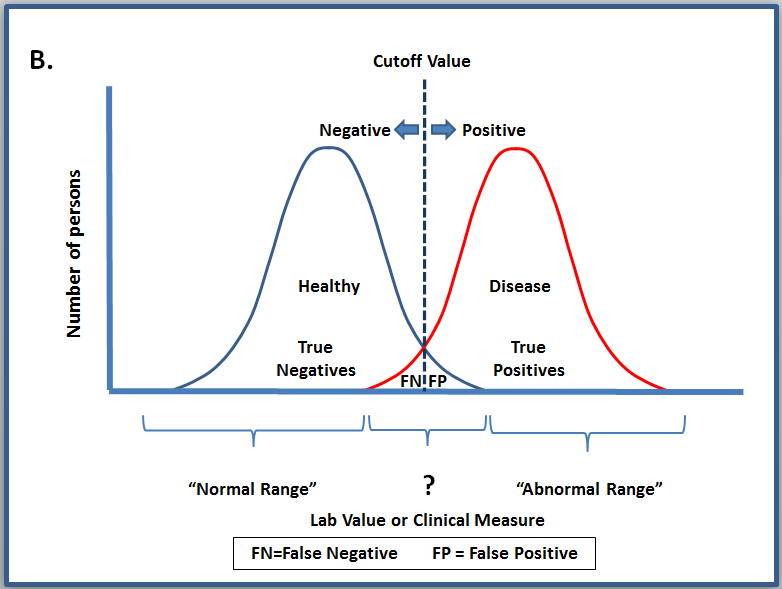

```{r setup, include=FALSE}
knitr::opts_chunk$set(collapse=TRUE, prompt=TRUE, eval=TRUE, message=F, include=T,comment=NULL, warning=FALSE, error=FALSE, fig.width = 9)
```

```{r packageCheck, include=FALSE}
# run the update below in the console if you get an error with str_view
# update.packages(oldPkgs = "stringr", ask=FALSE, repos = "http://cran.us.r-project.org")
mypacks <- c("ggplot2","dplyr","readr","tidyr", "ROCR")  # what packages are needed?
packs <- installed.packages()   # find installed package list
install.me <- mypacks[!(mypacks %in% packs[,"Package"])]  #what needs to be installed?
if (length(install.me) >= 1) install.packages(install.me, repos = "http://cran.us.r-project.org")   # install (if needed)
lapply(mypacks, library, character.only=TRUE)  # load all packages
```

## Classification models {.build}

- Last class we had a very simple rule for classifying "Good Loan" vs "Bad Loan": whether $\text{Credit amount} > \$X$
    - Not based on any optimization 

- Today: We start working with classification models optimized to fit the data


## Logistic Regression Model {.build}

- We have a set of $p$ explanatory (predictor) variables $X_1, ..., X_p$
- We have a binary response $Y$ (1/0, yes/no, success/failure)
- Given a set of predictor values $X_1, ..., X_p$, the response is a Bernoulli random variable with success probability (What are the parameters here?)
$$
\pi(X) = \dfrac{e^{\beta_0 + \beta_1 X_1 + ... + \beta_p X_p}}{1+e^{\beta_0 + \beta_1 X_1 + ... + \beta_p X_p}}
$$
- This is the *logistic* function that maps the predictor space ($R^p$) to a probability in $(0,1)$  
- Estimates of $\beta$ parameters are found using MLE methods:

$$
L(\beta) = \prod_{i=1}^n \pi(x_i)^{y_i}(1-\pi(x_i))^{1-y_i}
$$

## Logistic Regression and odds {.build}

- To interpret the effect of a predictor $X$ on $Y$ (or $\pi$), we can use some algebra to show:

$$
\log\left( \dfrac{\pi(X)}{1-\pi(X)} \right) = \beta_0 + \beta_1 X_1 + ... + \beta_p X_p
$$

- The left-hand side is called the **log-odds** (logit) of success. The **odds** of success is just the ratio of the probability of success and failure
- Holding all other predictors constant, 
    + a one-unit increase in $X_1$ is associated with a $\beta_1$ unit change (additive) in the log-odds of success.
- While effects may be hard to compute, the sign is always easy to interpret

## Visualizing a logistic regression model {.build}

```{r, echo=FALSE, fig.show='asis'}
set.seed(7)
x <- rnorm(100,45,10)
y<- rbinom(100,1,plogis(-15 + .3*x))
my.glm <- glm(y~x, family="binomial")
mydata.log <- data_frame(x,y,p=predict(my.glm, type="response"))
ggplot(mydata.log, aes(x,y)) + 
  geom_point() + 
  geom_line(aes(x,p), color="red", size=1.1) +
  ggtitle("Predict Y from one x variable. \nRed curve is the fitted logistic function.") +   labs(y="probability") 
```

## Visualizing a logistic regression model {.build}

- Predict success for any estimated probability > 0.5:
```{r, echo=FALSE, fig.show='asis'}
set.seed(7)
x <- rnorm(100,45,10)
y<- rbinom(100,1,plogis(-15 + .3*x))
my.glm <- glm(y~x, family="binomial")
t<-.5
mydata.log <- data_frame(x,y,p=predict(my.glm, type="response"),
                         prediction = ifelse(p>t,1,0),
                         conf.mat = ifelse(prediction==1 & y==1, "True Pos",
                                           ifelse(prediction == 0 & y==1,"False Neg",
                                                  ifelse(prediction == 0 & y ==0, "True Neg","False Pos")))) 
x.thres<- (log(t/(1-t))-my.glm$coefficients[1])/my.glm$coefficients[2]
stats<- mydata.log %>% summarize(accuracy = mean(y == prediction), 
            precision = sum(y*prediction)/sum(prediction),
            recall = sum(y*prediction)/sum(y))
ggplot(mydata.log, aes(x,y)) + 
  geom_point(aes(color=conf.mat)) + 
  geom_line(aes(x,p), color="red", size=1.1) +
  ggtitle("Predict Y from one x variable. \nThreshold of t=0.5.") +
  labs(y="probability") + 
  geom_hline(yintercept=t, linetype=3,color="blue") + 
  geom_vline(xintercept=x.thres, linetype=2,color="blue") + 
  geom_label(aes(x=30,y=t, label="threshold")) +
  geom_label(data=stats,aes(x=65,y=.25,label=paste("accuracy=",round(accuracy,2),"\nprecision=",round(precision,2),"\nrecall=",round(recall,2))) )
```

## Visualizing a logistic regression model {.build}

- Predict success for any estimated probability > 0.25 (how should that affect our metrics?)
```{r, echo=FALSE, fig.show='asis'}
set.seed(7)
x <- rnorm(100,45,10)
y<- rbinom(100,1,plogis(-15 + .3*x))
my.glm <- glm(y~x, family="binomial")
t<-.25
mydata.log <- data_frame(x,y,p=predict(my.glm, type="response"),
                         prediction = ifelse(p>t,1,0),
                         conf.mat = ifelse(prediction==1 & y==1, "True Pos",
                                           ifelse(prediction == 0 & y==1,"False Neg",
                                                  ifelse(prediction == 0 & y ==0, "True Neg","False Pos")))) 
x.thres<- (log(t/(1-t))-my.glm$coefficients[1])/my.glm$coefficients[2]
stats<- mydata.log %>% summarize(accuracy = mean(y == prediction), 
            precision = sum(y*prediction)/sum(prediction),
            recall = sum(y*prediction)/sum(y))
ggplot(mydata.log, aes(x,y)) + 
  geom_point(aes(color=conf.mat)) + 
  geom_line(aes(x,p), color="red", size=1.1) +
  ggtitle("Predict Y from one x variable. \nThreshold of t=0.25.") +
  labs(y="probability") + 
  geom_hline(yintercept=t, linetype=3,color="blue") + 
  geom_vline(xintercept=x.thres, linetype=2,color="blue") + 
  geom_label(aes(x=30,y=t, label="threshold")) +
  geom_label(data=stats,aes(x=65,y=.25,label=paste("accuracy=",round(accuracy,2),"\nprecision=",round(precision,2),"\nrecall=",round(recall,2))) )
  
```


## Fitting a logistic regression model {.build}

- The basic R command is 

```
my.glm <- glm(Y ~ X1 + X2, data=, family=binomial)
```

- To get predicted probabilities $\hat{\pi}$ for each case in the data:

```
predict(my.glm, type="response")
```

- Important note: in the `glm` command, `Y` can either be a 1/0 variable or a factor (character) variable
    + 1/0 coded: the `glm` defines $\pi$ as the probability of `Y=1`
    + factor coded: the `glm` defines $\pi$ as the probability of the **second** level of `Y`


## Loans example (fit the model)  {.build}

- First I created a new response with `Default` as the second level:
```{r}
loans <- read_csv("https://raw.githubusercontent.com/mgelman/data/master/CreditData.csv")
loans <- loans %>% 
  mutate(Default = recode_factor(Good.Loan, GoodLoan = "NoDefault",BadLoan = "Default" ))
table(loans$Good.Loan, loans$Default)
```
- The I fit the glm:
```{r}
default.glm1 <- glm(Default ~ log(Credit.amount) + Duration.in.month, 
                    family="binomial", data=loans)
```

## Loans example  {.build}


```{r}
summary(default.glm1)
```

## Loans example (prob estimation) {.build}

- The probability of default is estimated to be:

$$ \hat{\pi} = \dfrac{e^{-0.700-0.140ln(Credit) + 0.0433Duration}}{1 + e^{-0.700-0.140ln(Credit) + 0.0433Duration}}$$

## Loans example (add predictions) {.build}

- Add the estimated probabilities and predicted responses to the data frame using a 0.5 threshold:
```{r}
loans <- loans %>%
  mutate(probs1 = predict(default.glm1, type="response"), 
         prediction1 = ifelse( probs1 >= .5, "Default", "NoDefault") ) 
loans %>% select(Default, probs1, prediction1) %>% print(n=4)
```

## Loans example (confusion matrix and rates)  {.build}

```{r}
with(loans,table(Default,prediction1))

(stats <- loans %>% summarize(accuracy = mean(Default == prediction1), 
            precision = sum(Default == "Default" &  prediction1 == "Default")/sum(prediction1 == "Default"),
            recall = sum(Default == "Default" & 
                     prediction1 == "Default")/sum(Default == "Default")) )
```
- With a threshold of 50%, we are underpredicting the number of loans that will default (very low recall). Good from a consumer perspective, bad for the banker!  

## Loans example (visualization)  {.build}

- the black line is the boundary between default and no default predictions using a threshold of 0.5.
```{r, echo=FALSE}
ggplot(loans, aes(x=Duration.in.month,y=log(Credit.amount), color=Default)) + 
  geom_point(aes(shape=prediction1)) +
  ggtitle("Duration vs. Credit by default type \nLogistic Classifier") + 
  geom_abline(intercept=-.7/.140, slope=.0433/.14, color="black")
```

<!-- ## Loans example  {.build} -->

<!-- - Code for previous plot. We know that log-odds are: -->
<!-- $$ \log\left( \dfrac{\pi(X)}{1-\pi(X)} \right) = \beta_0 + \beta_1 X_1 + ... + \beta_p X_p $$ -->
<!-- - Fill in values for $\pi(X), \beta,$ and $X$. Solve for credit amount to get boundry between default/no default prediction -->
<!-- $$\log\left(\dfrac{0.5}{1-0.5}\right) = 0 =  -0.700-0.140ln(Credit) + 0.0433Duration $$ -->
<!-- ```{r, eval=FALSE} -->
<!-- ggplot(loans, aes(x=Duration.in.month,y=log(Credit.amount), color=Default)) +  -->
<!--   geom_point(aes(shape=prediction1)) + -->
<!--   ggtitle("Duration vs. Credit by default type \nLogistic Classifier") +  -->
<!--   geom_abline(intercept=-.7/.140, slope=.0433/.14, color="black") -->
<!-- ``` -->


## Loans example  {.build}

- Here is the same plot but on the original credit scale, with the boundary for `t=0.3` included for comparison 
```{r, echo=FALSE, warning=FALSE}
thres_fn2 <-  function(x,t) {(-.7 + 0.0433*x - log(t/(1-t)))/.14}
ggplot(loans, aes(x=Duration.in.month,y=log(Credit.amount), color=Default)) + 
  geom_point(aes(shape=prediction1)) +
  ggtitle("Duration vs. log Credit by default type \nLogistic Classifier") + 
  stat_function(fun=thres_fn2, geom="line", color="black",args = list(t=.5)) + 
  stat_function(fun=thres_fn2, geom="line", color="black",args = list(t=.3),linetype=2) + 
  geom_text(x=28+2,y=thres_fn2(28,.3), label="t=0.30", color="black") + 
  scale_y_continuous(limits=c(5,10))  
```

## Evaluating probability (forecasting) models {.build}

- **Double density curves**: Plot two density curves for the estimated probabilities $\hat{p}$:
    + for all true successes ($Y=1$)
    + for all true failures ($Y=0$)
- a "good" model  will see little overlap between these curves
    + true successes curve will be close to $\hat{p}$'s of 1
    + true failures curve will be close to $\hat{p}$'s of 0
- can be used to pick/explain classifier thresholds

## Loan defaults: double densities {.build}

```{r}
ggplot(loans, aes(x=probs1, color=Default)) + 
  geom_density(size=1.5) + ggtitle("Forecasted default probabilities")
```

## More ideal double density {.build}

<center>



</center>

## Evaluating probability (forecasting) models {.build}

- **ROC**: A receiver operating characteristic curve varies the threshold value $t$ of a classifier, then plots:
    + x = false positive rate $\frac{FP}{n_0}=\frac{FP}{TN + FP}$
    + y = true positive rate $\frac{TP}{n_1}=\frac{TP}{TP + FN}$ (recall) 
- Idea: As we loosen the threshold (low $t$), both $TP$ and $FP$ rate should increase
    - What is the relative increase? 


## ROC curve   {.build}

- You could calculate everything manually but the `ROCR` package helps automate it
    + `prediction(probs, y, label.ordering=)` creates a prediction object of probabilities and responses
    + `performance(pred, rates)` computes performance rates for a range of threshold values
- `label.ordering` is a vector of (negative,positive) labels in `y`
- if response `y` is binary (0/1) then `label.ordering` is not needed (1=positive)
```{r}
str(loans$Default)
```
- Need to tell it the ordering or else it will think "NoDefault" is "positive"


<!-- ## ROC curve   {.build} -->


<!-- ```{r} -->
<!-- preds_obj <- prediction(loans$probs1, loans$Default, label.ordering=c("NoDefault","Default")) -->
<!-- perf_obj <- performance(preds_obj, "tpr","fpr") -->
<!-- str(perf_obj) -->
<!-- ``` -->
<!-- - The objects produced by `ROCR` are "S4" class of objects -->
<!--     - access elements with `@` symbol (instead of `$`) -->

## Loan defaults: `ROC` curve  {.build}
- Can plot ROC curve directly from performance object:
```{r,echo=FALSE}
preds_obj <- prediction(loans$probs1, loans$Default, label.ordering=c("NoDefault","Default"))
perf_obj <- performance(preds_obj, "tpr","fpr")
```
```{r}
plot(perf_obj)
```

## Loan defaults: `ROC` curve  {.build}

- Or create using ggplot by saving rates in a data frame:
```{r, fig.show='hide'}
perf_df <- data_frame(fpr=unlist(perf_obj@x.values),
                       tpr= unlist(perf_obj@y.values),
                       threshold=unlist(perf_obj@alpha.values), 
                       model="GLM1")
head(perf_df,n=3)
ggplot(perf_df, aes(x=fpr, y=tpr, color=threshold)) +  geom_line() + 
  labs(x="false positive rate", y="true positive rate", title="ROC curve for logistic") + 
  geom_abline(slope=1,intercept=0, linetype=3) + 
  scale_color_gradient2(midpoint=0.5, mid="black", low="orange", high="pink")
```

## Loan defaults: `ROC` curve  {.build}

```{r, echo=FALSE}
ggplot(perf_df, aes(x=fpr, y=tpr, color=threshold)) +  geom_line(size=2) + 
  labs(x="false positive rate", y="true positive rate", title="ROC curve for logistic regression") + 
  geom_abline(slope=1,intercept=0, linetype=3) + 
  scale_color_distiller(palette="YlOrRd", direction = 1)
```

- ROC curves with area = 1 under the curve (AUC) are perfect classifiers
- ROC curves with area = 0.5 AUC are just as good as random guesses

## `ROC` curve example

<center>


</center>

## Summary  {.build}

- Defined a logistic model
- Estimated a logistic model
- Discussed the impacts of changing the threshold
- Introduced two more evaluation metrics
  - Double density plot
  - ROC curve
- Today's activity: estimating a model with more variables