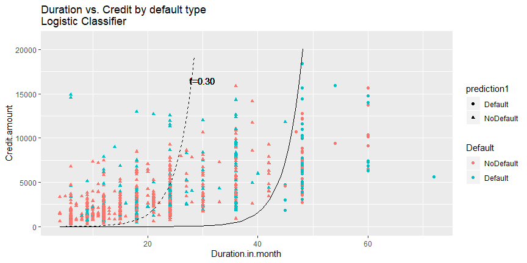
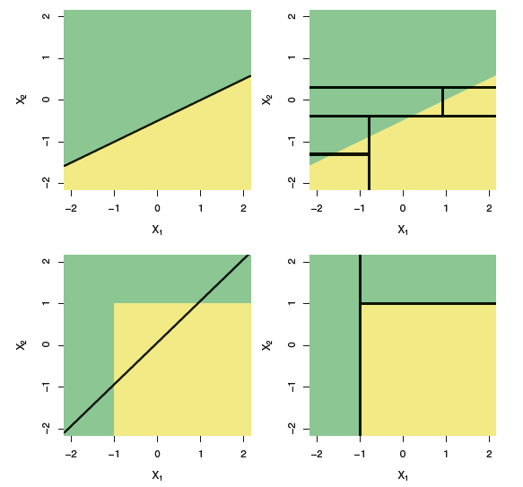

```{r setup, include=FALSE}
knitr::opts_chunk$set(collapse=TRUE, prompt=TRUE, eval=TRUE, message=F, include=T,comment=NULL, warning=FALSE, error=FALSE, fig.width = 9)
```

```{r packageCheck, include=FALSE}
mypacks <- c("ggplot2","dplyr","readr","tidyr", "ROCR", "boot","rpart","partykit","rpart.plot")  # what packages are needed?
packs <- installed.packages()   # find installed package list
install.me <- mypacks[!(mypacks %in% packs[,"Package"])]  #what needs to be installed?
if (length(install.me) >= 1) install.packages(install.me, repos = "http://cran.us.r-project.org")   # install (if needed)
lapply(mypacks, library, character.only=TRUE)  # load all packages
```

## Decision Trees {.build}

- Basic idea: Build a model that splits the sample into regions that best explain our variable of interest
- Example: If you are looking to hire a fresh college grad, what three questions would you ask?
    - In this example our variable of interest is "Good worker", "Bad worker"
    - Good questions will allow you to better decide whether that candidate is "Good worker", or "Bad worker"
    - Bad questions will not be at all correlated with "Good worker" or "Bad worker"
- Loans: suppose we just want to use Duration and Credit amount to predict default. What combinations lead to default?

## Loans example  {.build}

- Split the predictor space into regions for each outcome
```{r,  echo=FALSE}
loans <- read_csv("https://raw.githubusercontent.com/mgelman/data/master/CreditData.csv")
loans <- loans %>% 
  mutate(Default = recode_factor(Good.Loan, GoodLoan = "NoDefault",BadLoan = "Default" ))
ggplot(loans, aes(x=Duration.in.month, y=Credit.amount, color=Default)) + 
  geom_point() + 
  geom_segment(x=34.5,xend=34.5,y=0,yend=2249, color="black") + 
  geom_segment(x=34.5,xend=34.5,y=10975.5,yend=Inf, color="black") + 
  geom_segment(x=0,xend=34.5, y=10975.5,yend=10975.5, color="black") + 
  geom_segment(x=34.5,xend=Inf, y=2249,yend=2249, color="black") +
  geom_segment(x=34.5,xend=34.5, y=0,yend=Inf, color="black") +
  annotate("rect",xmin=0,xmax=34.5,ymin=10975.5,ymax=Inf, fill="blue", alpha=.1)+
  annotate("rect",xmin=34.5,xmax=Inf,ymin=0,ymax=2249, fill="blue", alpha=.1) + 
  geom_text(x=15, y=15000,label="Region 1: Default",show.legend = FALSE,size=5,color="blue") + 
  geom_text(x=15, y=5000,label="Region 2: No Default",show.legend = FALSE,size=5,color="black") +
  geom_text(x=55, y=10000,label="Region 3: No Default",show.legend = FALSE,size=5,color="black") + 
  geom_text(x=55, y=1000,label="Region 4: Default",show.legend = FALSE,size=5,color="blue") + 
  ggtitle("Blue = predicted default regions using a decision tree classifier")
```

## Comparison with Logistic regression  {.build}

- Generalized linear models can only split the region into two based on some curve 



## Loans example  {.build}

- A decision tree divided the predictor space into four regions, two of which were majority default responses and hence are predicted default regions 
- The accuracy of this model is 71.5%
```{r, include=FALSE}
loans_rpart <- rpart(Default ~ Credit.amount + Duration.in.month, 
                     data=loans, control=rpart.control(maxdepth=2))
loans <- loans %>% mutate(pred_dtree = predict(loans_rpart, type="class"))
conf_mat <- with(loans,table(Default, pred_dtree))
```
```{r}
conf_mat
sum(diag(conf_mat))/sum(conf_mat)
```
- logistic regression: 70.9%

## Loans example {.build}

- A tree view of this model:
- Think of it like 20 questions (each node corresponds with a region)
```{r, echo=FALSE}
plot(as.party(loans_rpart))
```

## Decision trees {.build}

- Consider the top node of the loans data: 1000 cases (30% default)
    + which cuts of Duration or Credit will make subsets that are more "pure" (homogeneous)? how many splits based on Duration do we have to consider? by Credit?
- The top-level node was split into two child nodes:
    + duration < 34.5: 26.3% default (218/(218+612))
    + duration >= 34.5: 48.2% default (82/(82+88))

## Decision trees {.build}

- How do we determine the *best* split (if any) at each node? 
- A node is split (or not) based on a "purity" measure
    - Gini coefficient: $Gini(t)=\sum_{i=1}^2w_i(t)(1-w_i(t))$
- $t$ represents the node, and $w_i(t)$ represents the fraction of records belonging to class $i$
    - Ex: If `duration > 50` split `default` and `no default` evenly
        - $0.5 \times 0.5 + 0.5 \times 0.5=0.5$. This is the "worst" case
    - Ex: If `duration > 50` split `default` and `no default` perfectly
        - $1 \times 0 + 0 \times 1=0$. This is the "best" case
- measures closer to 0 indicate higher purity (wrt y) among the cases in a node
- `rpart` uses the Gini coefficient as default

## Decision trees {.build}

- a node is split into two child nodes if the purity of the children exceeds the purity of the parent node by a threshold (aka stopping criteria)
    + `rpart` default will split a node if the purity of a child is 1% better than parent
    - can change stopping criteria to obtain different trees

## Decision trees {.build}

- How do we make predictions? 
    + convention is to use the "majority" class within each node 
        - $\hat{y} = Success$: more than 50% of cases in a node are success
        - $\hat{y} = Failure$: less than 50% of cases in a node are success


## Using `rpart` package {.build}

- This first decision tree used the `rpart` (recursive partitioning) package and function
- To make a "simple" tree, I set the `maxdepth` value to 2:
    - this stops splitting after 2 splits

```{r}
loans_rpart <- rpart(Default ~ Credit.amount + Duration.in.month, 
                     data=loans, control=rpart.control(maxdepth=2))
```

## Using `rpart` package{.build}

- The `rpart` object shows the tree structure in list form, with **terminal** nodes highlighted with *
```{r}
loans_rpart
```

## Graphing the tree {.build}

- Use the `partykit` package:
```{r}
plot(as.party(loans_rpart))
```

## Graphing the tree {.build}

- simple version has no bar plot
```{r}
plot(as.party(loans_rpart), type="simple")
```


## Prediction {.build}

- Use `type="class"` to get predictions 

```{r}
loans %>% mutate(predictions = predict(loans_rpart, type="class")) %>%
  select(Default, predictions, Duration.in.month, Credit.amount) %>% print(n=6)
```

## Loans example: More flexible model {.build}

- Earlier I restricted the tree depth to 2
- Now, relax that restriction
```{r}
loans_rpart <- rpart(Default ~ Credit.amount + Duration.in.month, 
                     data=loans)
loans %>% mutate(prediction = predict(loans_rpart, type="class")) %>%
  summarize(accuracy = mean(Default == prediction))
```
- Accuracy is slightly higher (73.3% vs 71.5%)

## Loans example: More flexible model {.build}

```{r, echo=FALSE}
#plot(as.party(loans_rpart), type="simple")
plot(as.party(loans_rpart), gp = gpar(fontsize = 9))
```

## Loans example: change parameter {.build}

- Change `cp`: need a 1.5% improvement in Gini index for a split
- Should we get more or fewer splits?
```{r}
loans_rpart <- rpart(Default ~ Credit.amount + Duration.in.month, data=loans, 
                     control=rpart.control(cp=.015))
loans %>% mutate(prediction = predict(loans_rpart, type="class")) %>%
  summarize(accuracy = mean(Default == prediction))
```
- Accuracy is slightly lower (72.4%) and fewer splits

## Loans example: change parameter {.build}

```{r, echo=FALSE}
plot(as.party(loans_rpart),gp = gpar(fontsize = 9))
```

## When to use decision trees? {.build}

<div class="columns-2">


- If boundaries are linear (first row), then linear methods outperform
- If boundaries are non-linear (second row), tree methods will do well
- Ex: Predict meat consumption by income (across the whole world)
    - In some parts of Asia, higher income associated with eating more meat
    - In the U.S. higher income associated with eating less meat
    - Easy to capture this with decision tree, but harder with linear methods
</div>


## Final comments:

- Decision trees are generally easy to make and understand
- They have more "tuning parameters" than other models
    - What is the gini coefficient cutoff?
    - What is the maximum depth of the tree?
    - What is the minimum observations in each leaf
- Biggest criticism is overfitting: they might look great on a training set but perform poorly on a test set
- Solution: use cross-validation or other methods (next class)


