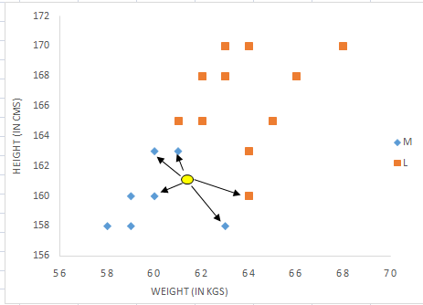
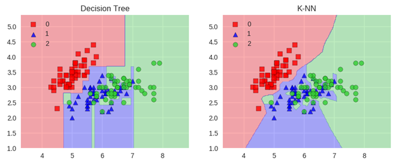

```{r setup, include=FALSE}
knitr::opts_chunk$set(collapse=TRUE, prompt=TRUE, eval=TRUE, message=F, include=T,comment=NULL, warning=FALSE, error=FALSE, fig.width = 9)
```

```{r packageCheck, include=FALSE}
mypacks <- c("ggplot2","dplyr","readr","tidyr", "ROCR", "boot","class","randomForest","e1071")  # what packages are needed?
packs <- installed.packages()   # find installed package list
install.me <- mypacks[!(mypacks %in% packs[,"Package"])]  #what needs to be installed?
if (length(install.me) >= 1) install.packages(install.me, repos = "http://cran.us.r-project.org")   # install (if needed)
lapply(mypacks, library, character.only=TRUE)  # load all packages
```

## Boostrap methods for Decision Trees

- Last class we learned decision trees are very flexible but also very prone to overfitting
- The main issue is that decision tress exhibit a lot of **variance**
    - If we split the sample in half and then fit trees, the results may be quite different
- We can reduce this **variance** by taking averages of different samples
    - If $n$ independent observatons $Z_1,\dots,Z_n$ have a variance of $\sigma^2$, the variance of the mean $\bar{Z}$ is $\sigma^2/n$
- How do we create $n$ diffferent samples from 1 dataset?
    - `Bootstrapping`: sampling from our data with replacement
    - If data is $1,2,3,4$, one sample is $1,1,3,4$, another is $2,3,1,1$, etc.
   

## Bagging for Decision Trees {.build}
- Bagging is a one method for reducing the effect of overfitting 
- Alternative to cross-validation (less computationally intensive)
    
1. Create a `bootstrap training set` by sampling with replacement 
    - all other cases are "out-of-the bag" (`OOB`) test cases
2. for each training set: construct a (deep) decision tree
    - use tree to predict classification of `OOB` test cases
3. Repeat steps 1-2 $B$ times
4. For all cases: "average" the `OOB` predictions for each case 
    - for `OOB` runs: get classification rates
    - usually majority rule: prediction is the **most popular** bootstrapped class prediction


## Random Forest {.build}

- Improves bagging by reducing correlation between `bootstrapped` trees:
    + for each `bootstrapped training set`: at each tree node, randomly select $m$ predictors and split (or not) just based on these variables
        - usually $m \approx \sqrt{p}$
- How does randomly selecting predictors reduce correlation between trees?
    + can reduce the "dominance" of some variables that would always show up at the top of tree
- Why does reducing correlation help?
    +  probability fact: averages of correlated random variables have *higher* variance than averages of independent ones!
- Should we be worried about extra computing time from creating $B$ trees?
    + Not if we can parallelize. Use cores or even several computers to calculate $B$ trees simulataneously then combine results
    
## Random Forest {.build}

- R package `randomForest`: 
    + `randomForest(formula, data, ntree, mtry)` 
    + `ntree` gives the number of bootstrapped trees 
    + `mtry` is the number of predictors to randomly select
    + `mtry=p` will give bagging results
    + Note: categorical predictors/response must be `factor` types 

```{r, include=FALSE}
loans <- read.csv("https://raw.githubusercontent.com/mgelman/data/master/CreditData.csv")
loans <- loans %>% 
  mutate(Default = recode_factor(Good.Loan, GoodLoan = "NoDefault",BadLoan = "Default" ))
```
- Here we fit a random forest model to the larger default model
```{r}
set.seed(7)
loans_rforest <- randomForest(Default ~ Credit.amount + Duration.in.month+          
                                Age.in.years + Credit.history + Purpose+ 
                                Present.employment.since, 
                      data=loans, ntree=200, mtry=3)
```

## Random Forest {.build}

- `ntree=200` trees were fit with `mtry=3` variables selected at each node
- `randomForest` default: `sampsize` uses a *with replacement* sample size of `n` (size of the data)
    - when `n` is large, each case has about a $63.2\%$ chance of being in the training sample 
- `oob.times` tells us how many times that observation was in the `oob` set
```{r}
loans_rforest$oob.times[1:10]
mean(loans_rforest$oob.times)
```
- here: each case should be in the OOB set in about $36.8\% \ (1-63.2\%)$ of trees, or about $73.6$ of the $200$ trees


## Random Forest: Variable Importance  {.build}

- Variable Importance: 
    + the $B$ bootstrapped trees will not always identify the same variables as "important"
- One way to measure importance of variable $X$ is average total Gini decreases:
    + for each tree: find all nodes that split using $X$
    + for each tree: measure how much the Gini coefficient is decreased for this split
    + sum these decreases over all splits and trees
    + divide the total Gini decrease due to $X$ by $B$

## Random Forest: Variable Importance {.build}

- Luckily there is a command that calculates this for us
```{r}
importance(loans_rforest)
```
- Credit amount has most influence on increasing node purity
- Employment status the least influence
- Caveat: We don't know the *direction* of the influence

## Random Forest: Variable Importance {.build}

```{r}
varImpPlot(loans_rforest)
```

## Random Forest: predictions/forecasts {.build}

-  `predict(rf_object, type="prob")`: proportion of votes for `success`
-  `predict(rf_object, type="response")`: vector of predictions (majority)
```{r}
loans <- loans %>% mutate( probs = predict(loans_rforest, type="prob")[,2],
              prediction = predict(loans_rforest, type="response") 
                  ) 
  select(loans, Default, probs, prediction) %>% head()
```

## Random Forests: predictions/forecasts for new data {.build}

- Use `newdata` command to predict out of sample (here I am using loans just as an example)
```{r}
predict(loans_rforest, type="response", newdata=loans[900,])
predict(loans_rforest, type="prob", newdata=loans[900,])
```

## Random Forest (performance measures) {.build}

```{r}
loans_rforest
```

```{r,echo=FALSE}
loans  %>% summarize(accuracy = mean(Default == prediction), 
            precision = sum(Default=="Default" & prediction=="Default")/sum(prediction=="Default"),
            recall = sum(Default=="Default" & prediction=="Default")/sum(Default=="Default"))
```

## k-nearest neighbor classifier (example) {.build}

- predict t-shirt size by weight and height for new observation (yellow), $k=5$

<center>



</center>

## k-nearest neighbor classifier {.build}

- Completely different way of approaching the problem
- Idea: We want to predict $y^*$ with charcteristics $x^*_1, ..., x^*_p$ where $*$ means testing data
1. Find the $k$ cases in training data that are "closest" to the new case's characteristics and use their responses ($y$) to predict $y^*$
2. Use responses of the "closest" cases to predict $y^*$ using majority vote (most common response)

- Distance measure: how to find closest cases in a p-dimensional predictor space?
    + if $x$'s all quantitative: Euclidean distance
    + $\sqrt{(x_{i1} - x_{j1})^2 + (x_{i2} - x_{j2})^2 + \cdots + (x_{ip} - x_{jp})^2}$

## k-nearest neighbor classifier {.build}

- *lazy-leaner*
    + no formal model
    + no pre-processing of the training data (just need training data to predict test responses)
- Cons:
    + computationally intensive
    + accuracy depends on geometry of predictor space
    + how many neighbors $k$ to pick?
        - what happens when $k=1$? $k=n$?
        - smaller $k$: more overfitting (higher variance)
        - larger $k$: less overfitting but more bias

## Loans k-nn example {.build}

- Let's analyize Loans data with training data = 80% split, test data = 20%
    - what will the "X"'s be classified?

```{r, include=FALSE}
set.seed(7)
n <- nrow(loans)
train_index <- sample(1:n, size=round(.8*n))
train <- loans %>% slice(train_index) %>% select(Duration.in.month, Credit.amount)
test <- loans %>% slice(-train_index) %>% select(Duration.in.month, Credit.amount)
```
```{r, echo=FALSE, fig.width=9, eval=TRUE}
ggplot(loans[train_index,], aes(x=Duration.in.month, y=Credit.amount)) + 
  geom_jitter(aes( color=Default)) + 
  geom_point(data=test[1:5,], aes(x=Duration.in.month, y=Credit.amount), shape="X",size=7) + 
  ggtitle("training set + first five test set values")
```


## Loans k-nn example {.build}

- R package `class`: 
    + `knn(train=, test=, cl=, k=)`  
    + `train` and `test` are quantitative **predictor** data frames.
    + `cl` are the training set responses  

```{r}
loans_knn <- knn(train, test, cl= loans$Default[train_index], k=10)
```
```{r, echo=FALSE}
test <- data_frame(y=loans$Default[-train_index],prediction = loans_knn) %>% 
  summarize(accuracy = mean(prediction == y), 
                   precision = sum(prediction == "Default" & y == "Default")/sum(prediction == "Default"),
                   recall = sum(prediction == "Default" & y == "Default")/sum(y == "Default"),
                   ) 
```

- For the 80%/20% split:
    + using $k=10$ gives accuracy of `r round(test$accuracy,2)*100`% and recall of `r round(test$recall,2)*100`%

## Loans k-nn example {.build}

- `knn.cv(train=,  cl=, k=)` does LOOCV for the `train` data
    -  `cl` are the training set responses  
- for each row, use `n-1` other rows to find knn group and predict a response 
```{r}
loans_knn.cv <- knn.cv(loans[,c("Credit.amount","Duration.in.month")], 
                       cl= loans$Default, k=10)
test <- data_frame(y=loans$Default,prediction = loans_knn.cv)
test %>%  summarize(accuracy = mean(prediction == y), 
                   precision = sum(prediction == "Default" & y == "Default")/sum(prediction == "Default"),
                   recall = sum(prediction == "Default" & y == "Default")/sum(y == "Default"),
                   ) 
```


## Loans k-nn example {.build}

- CV rates for a range of k values
```{r, echo=FALSE}
k <- 1:20
knn_fn <- function(k)
{
  data_frame(k=k, prediction = knn.cv(loans[,c("Credit.amount","Duration.in.month")], cl= loans$Default, k=k), y=loans$Default)
}
preds <- lapply(k, knn_fn)
preds_df <- bind_rows(preds)
stats.cv<- preds_df %>% group_by(k) %>% 
  summarize(accuracy = mean(prediction == y), 
                   precision = sum(prediction == "Default" & y == "Default")/sum(prediction == "Default"),
                   recall = sum(prediction == "Default" & y == "Default")/sum(y == "Default")) 
stats.cv %>%  gather(key=stat, value = value, 2:4) %>%
  ggplot(aes(x=k, y=value, color=stat))  + 
    geom_point() + geom_line()

```


## k-nearest neighbor classifier {.build}

- accuracy depends on geometry of predictor space
    - depends *highly* upon the scale of your predictors!
    - predictors with larger variation will have larger influence on which cases are "nearest" neighbors
    
## Simple example: {.build}
- Which of the training cases is closest to the test case?

```{r, echo=FALSE}
x_df <- data_frame(x1=c(1,1,0,3),x2 = c(1,3,2,1.5), type=c("test","train","train","train"))
ggplot(x_df,aes(x=x1,y=x2,color=type)) + 
  geom_point(size=3) + 
  geom_text(aes(label=1:4), nudge_x=.1, show.legend=FALSE) +
  coord_fixed()
```

## Simple example: {.build}

- Can use the function  `dist` to compute the Euclidean distance in $R^p$ between cases in a data set with p predictors
- For $R^2$, distance is $\sqrt{(x-x_0)^2+(y-y_0)^2}$
```{r}
d<- dist(x_df[,1:2])
x_df <- x_df %>% mutate(dist.from.1 = as.matrix(d)[,1])
x_df
```
- As the plot suggests, case 3 is closest to case 1

## Simple example II: {.build}

- Now consider this second set of data. How does it differ from first example?
- Which case is closest?
```{r, echo=FALSE}
x_df2 <- data_frame(x1=c(1,1,0,3),x2 = c(1,3,2,1.5)*1000, type=c("test","train","train","train"))
ggplot(x_df2,aes(x=x1,y=x2,color=type)) + 
  geom_point(size=3)+ 
  geom_text(aes(label=1:4), nudge_x=.1, show.legend=FALSE) 
```

## Simple example II: {.build}

- Which training case is closest to 1?
```{r}
d<- dist(x_df2[,1:2])
x_df2 <- x_df2 %>% mutate(dist.from.1 = as.matrix(d)[,1]) 
x_df2
```
- Now case 4 is by far the closest!

## Simple example II: {.build}

- More obvious that 4 is closest if we use fixed axis ratio
- `x1` becomes meaningless and only `x2` distance matters
```{r, echo=FALSE}
x_df2 <- data_frame(x1=c(1,1,0,3),x2 = c(1,3,2,1.5)*1000, type=c("test","train","train","train"))
ggplot(x_df2,aes(x=x1,y=x2,color=type)) + 
  geom_point(size=3)+ 
  geom_text(aes(label=1:4), nudge_x=100, show.legend=FALSE) +
  coord_fixed(xlim=c(-1000,1000),ylim=c(900,3000)) 
```


## Conclusion {.build}

- the Euclidean distance is a function of variable scale
    - Just plotting the data is misleading because axis scales may be diffrent 
- Methods relying on distance can be sensitive (i.e. not invariant) to the scale of the predictors 
    + changing `x2` from kilometers (`x_df`) to meters (`x_df2`) changes the case that is closest to test case 1
    + The variables with larger scale will get more weight when computing distance
- With k-nn: 
    + should `scale` (subtract `mean` divide by `sd`) predictors if they vary greatly in scale/variation
- Other classifiers (e.g trees, logistic regression) are invariant to linear transformations of predictors (e.g. changing from km to meters won't change predictions)
 
## Loans k-nn example {.build}

- Do `Credit.amount` and `Duration.in.month` differ by scale? 

```{r, include=FALSE}
loans <- read.csv("https://raw.githubusercontent.com/mgelman/data/master/CreditData.csv")
```
```{r, include=TRUE}
loans <- loans %>% mutate(Default = recode_factor(Good.Loan, GoodLoan = "NoDefault",BadLoan = "Default" ), 
         Credit.amount.stan = scale(Credit.amount)[,1], Duration.in.month.stan = scale(Duration.in.month)[,1])
loans %>% select(Credit.amount, Duration.in.month, Credit.amount.stan, Duration.in.month.stan) %>% summary
```

## Loans k-nn example {.build}

- The scaled version has better recall
```{r, echo=FALSE}
k <- 1:20
knn_fn <- function(k)
{
  data_frame(k=k, prediction = knn.cv(scale(loans[,c("Credit.amount","Duration.in.month")]), cl= loans$Default, k=k), y=loans$Default)
}
preds <- lapply(k, knn_fn)
preds_df <- bind_rows(preds)
stats.cv.scale <- preds_df %>% group_by(k) %>% 
  summarize(accuracy = mean(prediction == y), 
            precision = sum(prediction == "Default" & y == "Default")/sum(prediction == "Default"),
                   recall = sum(prediction == "Default" & y == "Default")/sum(y == "Default"),
                    predictors = "scaled")
stats.cv.scale %>%  bind_rows(mutate(stats.cv, predictors = "unscaled")) %>%
                    gather(key=stat, value = value, 2:4) %>%
  ggplot(aes(x=k, y=value, color=stat))  + 
    geom_point() + geom_line(aes(linetype = predictors)) + 
  ggtitle("LOOCV: Scaled vs unscaled predictors")
```

## Classifiers conclusions {.build}

- Bootstrap methods for trees helps reduce over-fitting
- Knn offers a much more flexible approach
- When to use each method? 
    - logistic and tree methods: good when class boundaries are linear
        - logistic can include higher order polynomials if non-linear
        - knn does worse: too much variance (overfit)
    - knn good when boundaries between classes are not linear
        - flexibility pays off 
        - use cv to help assess k choice
        
## Classifiers conclusions {.build}

<center>



</center>

- Trees cut into rectangles, knn is more flexible         