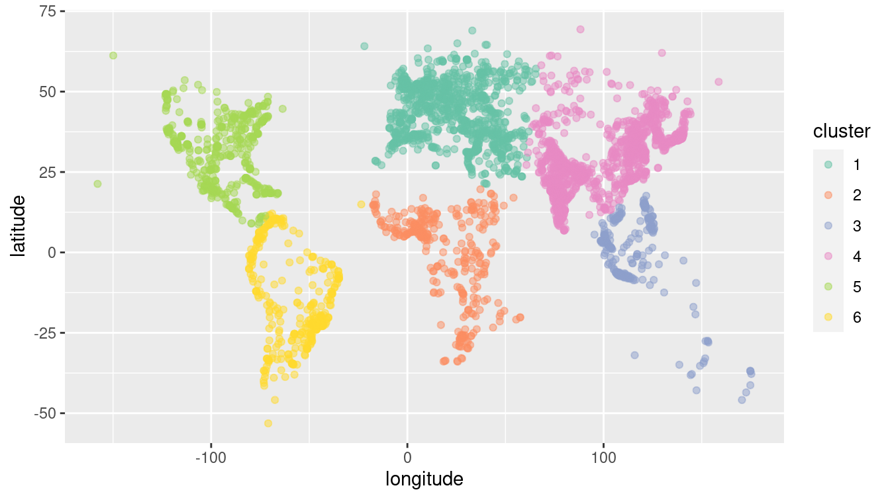

```{r setup, include=FALSE}
knitr::opts_chunk$set(collapse=TRUE, prompt=TRUE, eval=TRUE, message=F, include=T,comment=NULL, warning=FALSE, error=FALSE, fig.width = 9)
```

```{r packageCheck, include=FALSE}
mypacks <- c("ggplot2","dplyr","readr","tidyr")  # what packages are needed?
packs <- installed.packages()   # find installed package list
install.me <- mypacks[!(mypacks %in% packs[,"Package"])]  #what needs to be installed?
if (length(install.me) >= 1) install.packages(install.me, repos = "http://cran.us.r-project.org")   # install (if needed)
lapply(mypacks, library, character.only=TRUE)  # load all packages
```

## Supervised Learning: {.build}

-  Classify a response `y` into 3 classes based on their `x1` and `x2` values:
```{r, echo=FALSE}
set.seed(77)
mn_x1 <- c(5,8,9)
mn_x2 <- c(2, 5, 0)
clus_data <- data_frame(x1=unlist(lapply(1:3, function(x) rnorm(50,mn_x1[x],1))), x2=unlist(lapply(1:3, function(x) rnorm(50,mn_x2[x],1))), y = unlist(lapply(1:3,function(x) rep(as.character(x),50))))

ggplot(clus_data, aes(x=x1,y=x2,color=y)) + 
  geom_point()+
  coord_fixed()
```

- What method would we use?

## A different type of classification problem: {.build}

- Suppose we **only** have data on `x1` and `x2` and want to classify the `n` data cases:

```{r, echo=FALSE}
clus_data <- clus_data %>% select(-y)
ggplot(clus_data, aes(x=x1,y=x2)) + 
  geom_point()+
  coord_fixed()
```

## Unsupervised Learning {.build}

- This is an example of an unsupervised learning problem
    + there is no classification response to judge how well we classify the data!
    + e.g. we don't have a training data set available to train a model how to classify
- What are some examples of clustering problems? 
    + Finding natural cutoff in letter grades based on scores
    + Grouping schools based on student characteristics
    + Grouping products/companies based on characterstics 
- We will focus on two methods
    + K-means clustering: group cases into $K$ (fixed) groups based on the similarity of their X-variable values. 
    + Hierarchical clustering: produce a tree that illustrates "closeness" of cases (in terms of X-variables), cut the tree to classify into groups 

## Unsupervised Learning example {.build}

- Imagine aliens know the long/lat of major cities but have no idea how to group them
- If we choose 6 clusters, we get pretty good continent groupings

<center>

</center>


## K-means clustering {.build}

- Goal: Produce $K$ different clusters that have "similar values" 
- We have a set of (predictor) variables for n cases
    + for case i: $X_{i1}, ..., X_{ip}$
- Definition: $C_k$ is a set of indices that tell us which cases are in cluster $k$
    + e.g. $C_1 = {3,6,10}$ tell us that cases 3, 6, and 10 are in cluster 1.
- Definition: $|C_k|$ is the size of cluster $C_k$ 
    + can range from $1$ to $n$

## K-means clustering {.build}

- How to measure "similar variable values"?
    + one (common) way: Euclidean distance between cases in the same cluster!
    + **within cluster variation** (distance): for cluster $C_k$
    $$
    W_k = \dfrac{\sum_{i,l \in C_k}  (x_{i1} - x_{l1})^2 + (x_{i2} - x_{l2})^2 + \cdots + (x_{ip} - x_{lp})^2}{|C_k|}
    $$
- The optimal cluster assignment $C_1,...,C_K$ will minimize the total within cluster variation:
$$
\min_{C_1,...,C_K} \sum_{k=1}^K W_k
$$

## K-means algorithm {.build}

- Counting fact: How many ways to partition (cluster) n cases into $K$ groups?
    + approximately $K^n$ (Growing exponentially)
    + calculating the minimum distances for all possible combinations will take too long
- With any real data problem, we need to use a computer algorithm to (hopefully) get us close to the optimal cluster assignment 

## K-means algorithm {.build}
`1.` Randomly assign $K$ classes to each case.

```{r, echo=FALSE, warning=FALSE}
set.seed(77)
#clus_data$cluster_assign <- sample(as.character(1:3), 150, replace=TRUE)
clus_data <- clus_data %>% mutate(cluster_assign =as.character(sample(as.character(1:3), 150, replace=TRUE)))
ggplot(clus_data, aes(x=x1,y=x2, color=cluster_assign)) + 
  geom_point()+coord_fixed() + 
  ggtitle("Random assignment")
```

## K-means algorithm {.build}
`2.` Compute the *centroid* of each cluster:

```{r, echo=FALSE}
centroids <- clus_data %>% 
  group_by(cluster_assign) %>%
  summarize_all(mean)
ggplot(clus_data, aes(x=x1,y=x2, color=cluster_assign)) + 
  geom_point()+
  coord_fixed() +
  geom_point(data=centroids, aes(x=x1,y=x2, color=cluster_assign),pch="X", size=5, show.legend=FALSE)+ 
  ggtitle("Random assignment + centroids")
```

## K-means algorithm {.build}
`3.` Reassign cases to the cluster whose centroid they are closest to.

```{r, echo=FALSE}
distance <- as.matrix(dist(rbind(select(centroids, -cluster_assign), select(clus_data, -cluster_assign))))
distance <- distance[4:153,1:3]
min_dist <- as.vector(apply(distance,1,min))
new_cluster <- sapply(1:150, function(x) which(distance[x,] == min_dist[x]))
clus_data <- clus_data %>% mutate( cluster_assign =as.character(new_cluster))
ggplot(clus_data, aes(x=x1,y=x2, color=cluster_assign)) + 
  geom_point()+
  coord_fixed() +
  geom_point(data=centroids, aes(x=x1,y=x2, color=cluster_assign),pch="X", size=5, show.legend=FALSE)+ 
  ggtitle("First reassignment")
```

## K-means algorithm {.build}
`4.` Repeat `2-3` until no more cases are reassigned to a new cluster.

```{r, echo=FALSE}
centroids <- clus_data %>% 
  group_by(cluster_assign) %>%
  summarize_all(mean)
distance <- as.matrix(dist(rbind(select(centroids, -cluster_assign), select(clus_data, -cluster_assign))))
distance <- distance[4:153,1:3]
min_dist <- as.vector(apply(distance,1,min))
new_cluster <- sapply(1:150, function(x) which(distance[x,] == min_dist[x]))
clus_data <- clus_data %>% mutate( cluster_assign =as.character(new_cluster))
ggplot(clus_data, aes(x=x1,y=x2, color=cluster_assign)) + 
  geom_point()+
  coord_fixed() +
  geom_point(data=centroids, aes(x=x1,y=x2, color=cluster_assign),pch="X", size=10, show.legend=FALSE)+ 
  ggtitle("Second reassignment")
```

## K-means algorithm {.build}

```{r, echo=FALSE}
centroids <- clus_data %>% 
  group_by(cluster_assign) %>%
  summarize_all(mean)
distance <- as.matrix(dist(rbind(select(centroids, -cluster_assign), select(clus_data, -cluster_assign))))
distance <- distance[4:153,1:3]
min_dist <- as.vector(apply(distance,1,min))
new_cluster <- sapply(1:150, function(x) which(distance[x,] == min_dist[x]))
clus_data <- clus_data %>% mutate( cluster_assign =as.character(new_cluster))
ggplot(clus_data, aes(x=x1,y=x2, color=cluster_assign)) + 
  geom_point()+
  coord_fixed() +
  geom_point(data=centroids, aes(x=x1,y=x2, color=cluster_assign),pch="X", size=10, show.legend=FALSE)+ 
  ggtitle("Third reassignment")
```

- some greens turn blue, reds turn green and blue

## K-means algorithm {.build}

```{r, echo=FALSE}
centroids <- clus_data %>% 
  group_by(cluster_assign) %>%
  summarize_all(mean)
distance <- as.matrix(dist(rbind(select(centroids, -cluster_assign), select(clus_data, -cluster_assign))))
distance <- distance[4:153,1:3]
min_dist <- as.vector(apply(distance,1,min))
new_cluster <- sapply(1:150, function(x) which(distance[x,] == min_dist[x]))
clus_data <- clus_data %>% mutate( cluster_assign =as.character(new_cluster))
ggplot(clus_data, aes(x=x1,y=x2, color=cluster_assign)) + 
  geom_point()+
  coord_fixed() +
  geom_point(data=centroids, aes(x=x1,y=x2, color=cluster_assign),pch="X", size=10, show.legend=FALSE)+ 
  ggtitle("Fourth reassignment")
```

- one red turns green, one red turns blue

## K-means algorithm {.build}

```{r, echo=FALSE}
centroids <- clus_data %>% 
  group_by(cluster_assign) %>%
  summarize_all(mean)
distance <- as.matrix(dist(rbind(select(centroids, -cluster_assign), select(clus_data, -cluster_assign))))
distance <- distance[4:153,1:3]
min_dist <- as.vector(apply(distance,1,min))
new_cluster <- sapply(1:150, function(x) which(distance[x,] == min_dist[x]))
clus_data <- clus_data %>% mutate( cluster_assign =as.character(new_cluster))
ggplot(clus_data, aes(x=x1,y=x2, color=cluster_assign)) + 
  geom_point()+
  coord_fixed() +
  geom_point(data=centroids, aes(x=x1,y=x2, color=cluster_assign),pch="X", size=10, show.legend=FALSE)+ 
  ggtitle("Fifth reassignment")
```

- a red case turns green

## K-means algorithm {.build}

```{r, echo=FALSE}
centroids <- clus_data %>% 
  group_by(cluster_assign) %>%
  summarize_all(mean)
distance <- as.matrix(dist(rbind(select(centroids, -cluster_assign), select(clus_data, -cluster_assign))))
distance <- distance[4:153,1:3]
min_dist <- as.vector(apply(distance,1,min))
new_cluster <- sapply(1:150, function(x) which(distance[x,] == min_dist[x]))
clus_data <- clus_data %>% mutate( cluster_assign =as.character(new_cluster))
ggplot(clus_data, aes(x=x1,y=x2, color=cluster_assign)) + 
  geom_point()+
  coord_fixed() +
  geom_point(data=centroids, aes(x=x1,y=x2, color=cluster_assign),pch="X", size=10, show.legend=FALSE)+ 
  ggtitle("Sixth reassignment: same as the 5th!!")
```

- Took 5 iterations to converge (no new reassignments!)

## K-means algorithm {.build}

- This algorithm is *locally optimal*
    + reduces the *total within cluster variation* at each step (why?)
- But it is not necessarily *globally optimal*
    + solution depends on the random starting point (step I)
- In practice: 
    + repeat the algorithm 20-50 times 
    + use the **best** clustering assignment (e.g. smallest total within cluster variation)
    + also use `set.seed` to make results reproducible!
    
## K-means in R {.build}

- `kmeans(x, centers, iter.max, nstart)` function in base-R:
    + `x` is a matrix or data frame of variables (must be numeric!)
    + `centers` value of $K$
    + `iter.max` number of iterations (default is 10)
    + `nstart` number of random starting assignments (step I), default is 1 so always change this to a higher number
- output: `km_out <- kmeans(...)`
    + `km_out$cluster` is an integer vector of cluster assignments
    + `km_out$tot.withinss` is total within cluster variation (sum of squares)
    + `km_out$centers` a $k \times p$ matrix of cluster centers 
    
## K-means in R {.build}

- Let's use `kmeans` on the simulated data with $K=3$
```{r}
head(clus_data[,1:2])
set.seed(18)
km_out <- kmeans(clus_data[,1:2], centers=3, nstart=20)
```

## K-means in R {.build}

Let's add cluster assignment to the data frame:
```{r}
clus_data <- clus_data %>% mutate(cluster_assign = as.character(km_out$cluster))
head(clus_data)
```

## K-means in R {.build}
- Now we can see the assignment:
```{r, echo=FALSE}
ggplot(clus_data, aes(x=x1,y=x2)) + 
  geom_point(aes(color=cluster_assign))+coord_fixed() +
  geom_point(data=as.data.frame(km_out$centers),aes(x=x1,y=x2),pch="X", size=7)+
  ggtitle("clustering using kmeans function")
```


## K-means in R {.build}
- The centroids for this fit are:
```{r}
km_out$centers
```

## What if we use 6 clusters? {.build}

- Let's see what happens if we use 6 clusters:
```{r}
set.seed(18)
km_out6 <- kmeans(clus_data[,1:2], centers=6, nstart=20)
clus_data <- clus_data %>% mutate(cluster_assign6 = as.character(km_out6$cluster))
head(clus_data)
```

## What if we use 6 clusters? {.build}

```{r, echo=FALSE}
ggplot(clus_data, aes(x=x1,y=x2)) + geom_point(aes(color=cluster_assign6))+coord_fixed() +
  geom_point(data=as.data.frame(km_out6$centers),aes(x=x1,y=x2),pch="X", size=7)+ ggtitle("clustering using 6 clusters")
```

## What if we use 6 clusters? {.build}

- Which solution will have *smaller* total within cluster variation?
```{r}
km_out$tot.withinss
km_out6$tot.withinss
```
- Increasing the number of clusters will always decrease the within cluster variation
    + if $K=n$ then within cluster variation is 0!
- If we are uncertain how many "groups" are in our data/population, we can pick $K$ that shows the biggest reduction in total variation

## Within cluster SS vs. $K$ {.build}

- We look for an "elbow" in the plot: $K=3$ is when total $W_k$ starts leveling off
    + more than 3 clusters complicates analysis with little reduction in SS
```{r, echo=FALSE, fig.height=4,fig.width=7}
k<- 1:10
set.seed(11)
total.Wss <- sapply(k, function(x) kmeans(clus_data[,1:2], centers=x, nstart=20)$tot.withinss)
ggplot(data_frame(total.Wss, k), aes(x=k,y=total.Wss)) + geom_point() + geom_line() + scale_x_continuous(breaks=1:10)
```

## Example 2 {.build}

- Same data: just multiplied `x2` by 1000! 
```{r, echo=FALSE}
clus_data2 <- clus_data %>% mutate(x2=1000*x2)
ggplot(clus_data2, aes(x=x1,y=x2)) + geom_point() + ggtitle("data set 2") + coord_fixed(ratio=1/1000)
```

## Example 2 {.build}

- Fit kmeans with $K=3$. Why the difference in cluster assignments?!
```{r, echo=FALSE}
set.seed(11)
km_out <- kmeans(clus_data2[,1:2], centers=3, nstart=20)
clus_data2 <- clus_data2 %>% mutate(cluster_assign = as.character(km_out$cluster))
ggplot(clus_data2, aes(x=x1,y=x2)) + geom_point(aes(color=cluster_assign))+
  geom_point(data=as.data.frame(km_out$centers),aes(x=x1,y=x2),pch="X", size=4)+ ggtitle("data set 2 clustering")+ coord_fixed(ratio=1/1000)
```

## Standardizing {.build}

- k-means uses Euclidean distance to determine closeness (SS/variation) of points.
    + just like k-nn
- if you want to treat variables "equally" in the algorithm, you need to standardize if they differ greatly in scale/variation

## Example 2 - standarized {.build}

- Now assignments match much better with the original data (and our intuition on "where" the clusters lie)
```{r, echo=FALSE}
set.seed(11)
km_out <- kmeans(scale(clus_data2[,1:2]), centers=3, nstart=20)
clus_data2 <- clus_data2 %>% mutate(cluster_assign = as.character(km_out$cluster))
ggplot(clus_data2, aes(x=scale(x1),y=scale(x2))) + geom_point(aes(color=cluster_assign))+
  geom_point(data=as.data.frame(km_out$centers),aes(x=x1,y=x2),pch="X", size=4)+ ggtitle("data set 2 clustering")+ coord_fixed(ratio=1)
```

## After clustering {.build}

- Clustering is often used as an exploratory tool
    - always standardize variables!
- Use EDA tools to compare different characteristics of clusters
- Example: peer school groups 
    + use cluster analysis to find high schools with similar demographics 
    + identify the cluster that contains Claremont schools ("peer" schools)
    + Claremont teachers: can use the other schools in this cluster as "comparison" schools (e.g. for test scores, etc)
- One downside is that you need to specify the number of clusters beforehand

