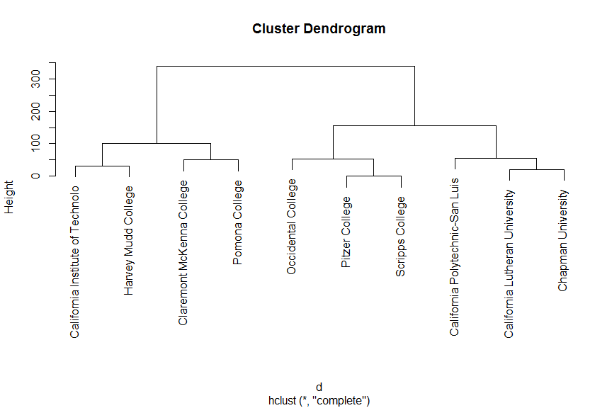

```{r setup, include=FALSE}
knitr::opts_chunk$set(collapse=TRUE, prompt=TRUE, eval=TRUE, message=F, include=T,comment=NULL, warning=FALSE, error=FALSE, fig.width = 9)
```

```{r packageCheck, include=FALSE}
mypacks <- c("ggplot2","dplyr","readr","tidyr")  # what packages are needed?
packs <- installed.packages()   # find installed package list
install.me <- mypacks[!(mypacks %in% packs[,"Package"])]  #what needs to be installed?
if (length(install.me) >= 1) install.packages(install.me, repos = "http://cran.us.r-project.org")   # install (if needed)
lapply(mypacks, library, character.only=TRUE)  # load all packages
```


## Hierarchical Clustering {.build}

- One disadvantage of `k-means` is that you have to specify $K$ ahead of time
    - Hierarchical clustering allows us to remain agnostic until we get a sense of the data
- We have a set of (numeric) X-variables but no response
    + goal: find cases that are similar wrt the X-variables
- Basic idea: produce a tree to illustrate how close (similar) cases are to one another
- We can "cut" the tree to classify cases into clusters with similar variable values

## Example 

<center>



</center>

## Dendrogram {.build}

- Tree diagram that shows how close (or not) cases are to one another
- leaf: single case
- fusing leaves: as we go up a tree we fuse cases connected by a common branch
    - fusing leaves creates a cluster of the cases involved in the fuse
- y-axis height: How *dissimilar* cases are
    + low height: similar
    + high height: dissimilar
    
## Simple example: {.build}
- here are $9$ data points with `two` variables
- How do we create a `dendogram` from these points?
```{r, echo=FALSE}
df <- data_frame(id=1:9,x1=c(2.5,4,1,1.4,6,2,6.3,5,3.5),x2=c(2,2.2,3,1,3,1.5,3.2,3.1,5))
ggplot(df,aes(x1,x2)) + geom_point() + geom_text(aes(label=id),nudge_y = -0.15) + coord_fixed()
```

## Algorithm {.build}

- pick a dissimilarity measure 
    + here: Euclidean distance (standardize if needed!)
1. start at the bottom: n cases are the n clusters. 
    - measure all dissimilarities (distance) between clusters (cases)
2. Fuse the two clusters that are least dissimilar (closest)
    - tree height of fuse = dissimilarity measure (distance apart)
3. For the new set of clusters, measure dissimilarity. 
4. Repeat 2-3 until only one cluster exists (top of the tree)

## Algorithm {.build}

- Slight problem: After first fuse, we have a cluster with 2 cases in it.
    + how to we measure dissimilarity (distance) between this cluster and all others?
- **Linkage**: options for computing dissimilarity between clusters of cases
    + complete: maximum dissimilarity (distance) between any pair of cases in cluster A and cluster B
    + average: compute average of all dissimilarities (distances) between all pairs of cases in cluster A and B
    + others: median, centroid
    
## Simple example: starting point {.build}

- Start with all points as distinct `leaves`
- Which two `leaves` are the first to be `fused`?
```{r, echo=FALSE}
df <- data_frame(id=1:9,x1=c(2.5,4,1,1.4,6,2,6.3,5,3.5),x2=c(2,2.2,3,1,3,1.5,3.2,3.1,5))
ggplot(df,aes(x1,x2)) + geom_point() + geom_text(aes(label=id),nudge_y = -0.15) + coord_fixed()
```

## Simple example: first round {.build}

```{r, echo=FALSE}
df <- data_frame(id=1:9,x1=c(2.5,4,1,1.4,6,2,6.3,5,3.5),x2=c(2,2.2,3,1,3,1.5,3.2,3.1,5))
ggplot(df,aes(x1,x2)) + geom_point() + geom_text(aes(label=id),nudge_y = -0.15) + coord_fixed() +
  geom_rect(xmin=5.8,xmax=6.5,ymin=2.6,ymax=3.5,alpha=0.01,color="red")
```

- $5$ and $7$ are the closest 
- What is the next step?

## Simple example: second round {.build}

```{r, echo=FALSE}
df <- data_frame(id=1:9,x1=c(2.5,4,1,1.4,6,2,6.3,5,3.5),x2=c(2,2.2,3,1,3,1.5,3.2,3.1,5))
ggplot(df,aes(x1,x2)) + geom_point() + geom_text(aes(label=id),nudge_y = -0.15) + coord_fixed() +
  geom_rect(xmin=5.8,xmax=6.5,ymin=2.6,ymax=3.5,alpha=0.01,color="red") + 
  geom_rect(xmin=1.7,xmax=2.7,ymin=1.2,ymax=2.4,alpha=0.01,color="blue")
```

- $6$ and $1$ are the next closest 
- What is the next step?


## Simple example: third round {.build}

```{r, echo=FALSE}
df <- data_frame(id=1:9,x1=c(2.5,4,1,1.4,6,2,6.3,5,3.5),x2=c(2,2.2,3,1,3,1.5,3.2,3.1,5))
ggplot(df,aes(x1,x2)) + geom_point() + geom_text(aes(label=id),nudge_y = -0.15) + coord_fixed() +
  geom_rect(xmin=5.8,xmax=6.5,ymin=2.6,ymax=3.5,alpha=0.01,color="red") + 
  geom_rect(xmin=1.7,xmax=2.7,ymin=1.2,ymax=2.4,alpha=0.01,color="blue") + 
    geom_rect(xmin=4.5,xmax=6.55,ymin=2.5,ymax=3.6,alpha=0.01,color="green") 
```

- $8$ and $5/7$ are the next closest 
- The distance is the $MAX$ so $8$ vs $7$

## Simple example: Comparing with the tree {.build}
- Go back and compare
```{r, echo=FALSE}
ex_hc <- hclust(dist(df[,2:3]))
plot(ex_hc, labels=df$id)
```

## Simple example: {.build}
- cut at 0.5 fuses 5 and 7, they are most similar (or least dissimilar!)
```{r, echo=FALSE}
ex_hc <- hclust(dist(df[,2:3]))
plot(ex_hc, labels=df$id)
abline(h=.5, lty=2)
```

## Simple example: {.build}
- cut at 1.5 fuses 5, 7 and 8 and 1,4 and 6. 
```{r, echo=FALSE}
ex_hc <- hclust(dist(df[,2:3]))
plot(ex_hc, labels=df$id)
abline(h=1.5, lty=2)
```

## Simple example: {.build}
- Based on dendrogram: Is 9 more similar to 2 or to 5?
```{r, echo=FALSE}
ex_hc <- hclust(dist(df[,2:3]))
plot(ex_hc, labels=df$id)
```

## Simple example: {.build}
- Can't tell: 9 is fused with both 2 and 5 at the *same* height (dissimilarity)
- Can tell: 9 is more similar to 2,5 than it is to 1 (fuse with 1 is higher than fuse with 2,5)
```{r, echo=FALSE}
ex_hc <- hclust(dist(df[,2:3]))
plot(ex_hc, labels=df$id)
abline(h=3.5, lty=2)
```


## Hierarchical clustering in R {.build}

- use base-R function `hclust`
    + default: Euclidean distance + complete linkage (`method`)
- First compute the distance matrix between variables:
```
d <- dist(Xvars)
```
- then run `hclust` and plot (`Xvars$id` is an identifier of cases)
```
hc_obj <- hclust(d)
plot(hc_obj, labels=Xvars$id)
```

- cut the tree to classify into `k` clusters 
```
cutree(hc_obj, k=)
```

## College grouping example {.build}

- Let's cluster together some colleges/universities in CA 
- Here is a subset of 10 schools
- Focus on average SATM and SATV scores for freshman class
```{r, echo=FALSE}
colleges <- read_csv("https://raw.githubusercontent.com/mgelman/data/master/Colleges.csv")
colleges.CA <- colleges %>% 
  filter(State %in% c("CA")) %>% slice(1:10) %>% 
  select(College,SATM,SATV) %>%  print()
```

## College grouping example {.build}

- Which schools are most similar?
- How would you group them? 
```{r, echo=FALSE}
set.seed(7)
ggplot(colleges.CA, aes(SATM,SATV)) + 
  geom_point() + 
  geom_text(aes(label=College),position=position_jitter(width=0,height=15)) + 
  coord_fixed(xlim = c(430, 800),ylim=c(435,665)) 
```


## College grouping example {.build}

- Compute the distance between SAT scores for all `r choose(10,2)` pairs of schools
```{r}
choose(10,2)
d <- dist(colleges.CA[,c("SATM","SATV")])
```
- Note that we did not `scale` the variables because they are similar in size/range!
- Then use these distances to get hierarchical clustering:
```{r}
CA_hc <- hclust(d)
```

## College grouping example {.build}

```{r, fig.height=6}
plot(CA_hc, labels=colleges.CA$College)
```

## College grouping example {.build}

- We can cut the tree to get 3 clusters. Here we ask specifically for 3 clusters:
```{r}
cutree(CA_hc, k=3)
```
- Add these classifications to the data frame.
```{r}
colleges.CA <- colleges.CA %>% 
  mutate(clusters3 = as.character(cutree(CA_hc, k=3)))
```
- Now plot:
```{r, eval=FALSE}
set.seed(7)
ggplot(colleges.CA, aes(SATM,SATV,color=clusters3)) + 
  geom_point() + 
  geom_text(aes(label=College), position=position_jitter(width=0,height=15)) +
  coord_fixed(xlim = c(430, 800),ylim=c(440,665)) 
```

## College grouping example {.build}

```{r, echo=FALSE}
set.seed(7)
ggplot(colleges.CA, aes(SATM,SATV,color=clusters3)) + 
  geom_point() + 
  geom_text(aes(label=College), position=position_jitter(width=0,height=15), show.legend=FALSE) +
  coord_fixed(xlim = c(430, 800),ylim=c(435,665)) 
```


## College grouping example {.build .smaller}

- What if we cut the tree at a height of 60. How many clusters?
```{r, fig.height=5.5}
plot(CA_hc, labels=colleges.CA$College); abline(h=60, lty=2)
```

## College grouping example {.build}

- We can cut the tree at a specific height:
```{r}
cutree(CA_hc, h=60)
```
- Now we have 4 clusters. Add these classifications to the data frame
```{r}
colleges.CA <- colleges.CA %>% 
  mutate(clusters4 = as.character(cutree(CA_hc, h=70)))
```
- Now plot:
```{r, eval=FALSE}
ggplot(colleges.CA, aes(SATM,SATV,color=clusters4)) + 
  geom_point() + 
  geom_text(aes(label=College), nudge_y = 10)
```

## College grouping example {.build}

```{r, echo=FALSE}
set.seed(7)
ggplot(colleges.CA, aes(SATM,SATV,color=clusters4)) + 
  geom_point() + 
  geom_text(aes(label=College), position=position_jitter(width=0,height=15), show.legend=FALSE) +
  coord_fixed(xlim = c(430, 800),ylim=c(435,665)) 
```

## Differences with k-means

- Advantages of `heiarchical` vs `kmeans`
    - Provides a nice visualization of the data
    - No requirement to choose `k` ahead of time
    - Can customize the algorithm by choosing different ways to calculate distance between leafs

- Advantages of `kmeans` vs `heiarchical`
    - If you have a large dataset, `kmeans` is faster 
    - `kmeans` allows you to easily quantify (using `withinss`) the tradeoff of adding more clusters
    
