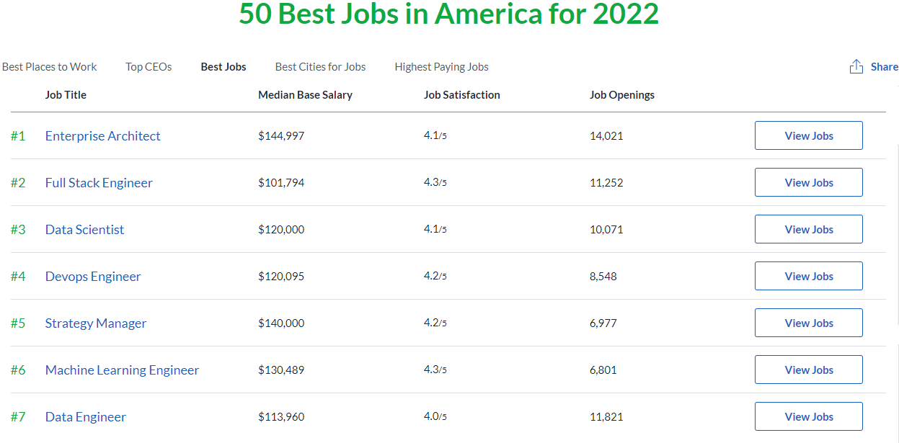

```{r setup, include=FALSE}
knitr::opts_chunk$set(collapse=FALSE, prompt=FALSE,eval=TRUE,eval=TRUE,  message=F, include=T)
library(knitr)
```

## Course overview

- See the [Syllabus](https://github.com/econ122-f23/home/blob/main/ECON123_F2022_DataScience_StatisticalLearning.pdf) for complete breakdown

- Typical class:
    + Short lecture on the concept we will focus on
    + In class exercise to apply the concepts we just covered

- Evaluation:
    + Class attendance/Participation [5%]
    + Problem sets (0/1/2 scale) [15%]
    + Team projects              [15%]
    + 2 midterm exams            [40%]
    + Final project              [25%]

- Note that 40% of your grade is from exams where you have to answer questions and write code in real time


## How to succeed

- Stay up to date with the course outline (I will update regularly)
- Come to class prepared and on time
- Ask questions if you start getting lost
    + In class
    + Tutor OH
    + My OH

## What the heck is "Data Science"?

Data Science:  [Google Trends](https://trends.google.com/trends/explore?date=all&geo=US&q=data%20science).

<script type="text/javascript" src="https://ssl.gstatic.com/trends_nrtr/2674_RC03/embed_loader.js"></script> <script type="text/javascript"> trends.embed.renderExploreWidget("TIMESERIES", {"comparisonItem":[{"keyword":"data science","geo":"US","time":"2000-01-01 2023-08-01"}],"category":0,"property":""}, {"exploreQuery":"date=all&geo=US&q=data%20science","guestPath":"https://trends.google.com:443/trends/embed/"}); </script>

## How popular are "Data Science" jobs?

- According to [glassdoor](https://www.glassdoor.com/List/Best-Jobs-in-America-LST_KQ0,20.htm), "Data Scientist" is the #3 job based on a weighting of salary, satisfaction, and openings 

- 


## [Data Science via the American Statistical Assocation](https://www.amstat.org/asa/files/pdfs/POL-DataScienceStatement.pdf)

- Previously, many of the roles were split out
   + Gathering and manging raw data
   + Economic and statistical analysis
   + Communication of substantive results
- With a new emphasis on speed, combining these roles has a distinct advantage
   

## Data Science in Economics

- Currently not heavily used but adoption is increasing: [Stanford Data Science Initiative in Economics](https://datascience.stanford.edu/research/research-areas/data-science-economics)
- Questions in economics typically focus on answering **causal** questions
    + What is the impact of education on labor outcomes?
    + What is the impact of fiscal policy on GDP? 
- When can we use Data Science tools to help inform economics?
    + When working with big data 
        - Ex: Using **text analysis** algorithms to better understand Yelp or Twitter data
    + When working with predictive problems 
        - Ex: Using a **random forest model** to predict outcomes
    + When helping us acquire data to formulate our question 
        - Ex: Using **scraping** and **wrangling** tools to acquire data on the web


## Data Science in Economics

- For those interested in academia:
    + Data science tools help us create datasets and analyze them in order to conduct economic research

- For those interested in private sector jobs
    + New graduates are expected in most companies to have some ability to extract, transport, load, clean, analyze, model, and 'tell the story' of their results
    
## Data Science in Economics

Some warnings to heed

- These days it's almost **TOO EASY** to implement complicated statistical algorithms with one line of code
    + This makes it easy to create fancy graphs and results without really understanding what you are doing
- One advantage of learning data science in an educational institution is so you can better understand what is going on under the hood
    + Once we get to the statistical analysis portion, try to make sure you also understand the statistics well


## This class

Focus on the "soup to nuts" approach to problem solving

- Data wrangling
    + Reshaping, cleaning, gathering
- Learning from data
    + Data visualization tools
    + Statistical learning methods
    + Network data, spatial data
- Communication
    + Reproducibility
    + Effective visualization
- Examples
    + [Stop and frisk](https://samuel-shlee.com/econ122_sqf/), [bikeshare](http://cs109hubway.github.io/classp/)
    
## Using R for data science

- Many data science teams use multiple languages, R and Python being common
- We will use R for this course -- R is more specialized for statistics and economics compared to python

## Using R Markdown for data science

- You will use [R Markdown](http://rmarkdown.rstudio.com/lesson-1.html) for all work in this class
- A Markdown (`.Rmd`) file contains
    + R code 
    + written answers, description of results, report, etc.
- The Markdown file is `knit` to generate an output document 
    + pdf, html, word
    + presentations (html, beamer pdf)
    + dashboards, interactive graphics (html)
- Markdown is designed for **reproducibility**!
- The slides I produce for this class are R Markdown's [`ioslides`](http://rmarkdown.rstudio.com/ioslides_presentation_format.html)

## Using GitHub and Rstudio for data science

- Class assignments and projects will be submitted using GitHub 
- Git is version control software that allows for easy collaboration on projects
- GitHub is an online "hub" where git controlled files are stored in repositories and (possibly) shared with others

  
## Using GitHub and Rstudio for data science

- Rstudio is an integrated development environment (IDE) for R
    - Provides a nice graphical interface with helpful tools
- Rstudio lets you create git controlled projects
    - create a GitHub repo
    - make a Rstudio project using your cloned repo
    - edit/create files (.rmd, .r, .csv, ...)
    - **commit** changes to your local computer using git
    - **push** changes to the GitHub repo (online)
    - **pull** changes made by others to your computer

- What you need to do
    - read the [GitHub reference page](https://github.com/econ122-f22/github-classroom-for-stduents)
    
## For rest of class

- Set up R, Rstudio

- Set up Git, GitHub

- Work on the `test-activity.Rmd` file in the `test-assignment` repo
    - Ask me questions
    - By class time Wednesday, push your completed `test-activity.Rmd` and `test-activity.md` files to GitHub 
    - This assignment will act as extra credit towards your problem set score
