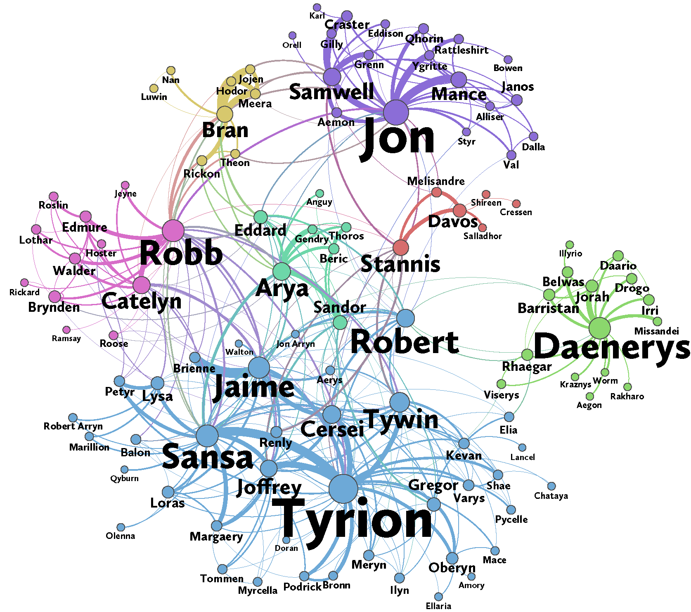

```{r setup, include=FALSE}
knitr::opts_chunk$set(collapse=TRUE, prompt=TRUE, eval=TRUE, message=F, include=T,comment=NULL, warning=FALSE, error=TRUE, fig.width = 9)
```


```{r packageCheck, include=FALSE}
# if you get an error with ggnetwork, try (re)installing with:
# install.packages("ggnetwork", type="source")
# also install igraph but don't load the library
mypacks <- c("ggplot2","dplyr","readr","tidyr", "statnet","ggnetwork", "intergraph", "gridExtra")  # what packages are needed?
packs <- installed.packages()   # find installed package list
install.me <- mypacks[!(mypacks %in% packs[,"Package"])]  #what needs to be installed?
if (length(install.me) >= 1) install.packages(install.me, repos = "http://cran.us.r-project.org")   # install (if needed)
lapply(mypacks, library, character.only=TRUE)  # load all packages
```


## GoT Network Activity {.build}

- Today we will work on replicating the results from [Game of Thrones handout](https://www.maa.org/sites/default/files/pdf/Mathhorizons/NetworkofThrones%20%281%29.pdf)

<center>



</center>


## Setup {.build}

- Characters are "connected" if their names appear within 15 words of another
    - These connections are scaled by the number of interactions
- We can perform two useful analyses using networks (**without ANY knowledge of the story**)
    + Community detection - Identify the major sub-networks within the story
    + Central character detection - Identify the major players in the book
  
- This method can also be applied to other books or texts
- The analysis uses some measures we haven't discussed yet
    - Eigenvector centrality
    - PageRank algorithm (centrality measure)
    - Modularity
    
## Eigenvector centrality {.build}

- Degree centrality tells us how many "friends" we have
    - Sometimes it's important to factor in how "important" these friends are
    - Being friends with a lot of social, political, financial influence can matter
- Weighted degree centrality with a feedback loop
- A vertex gets a boost for being connected to **important vertices**
$$
x_i=\sum_{j \in V} w_{ji}x_j
$$
- This leads to a linear system which can be solved by linear algebra to backout the $x_i$ values
$$
Ax_i=\lambda x_i
$$

## PageRank centrality {.build}

- Algorithm behind Google search engine
- Modified version of eigenvector centrality 
$$
y_i = \alpha \sum_{j \in V}\frac{w_{ji}}{k_j}y_j + \beta
$$
- Inherent importance $\beta$ and importance acquired from neighbors ($\alpha$ term)
- Importance of neighbor is spread equally among direct connections 
- Nodes get more credit if they are the ONLY ones connected to an important node
    - Daenerys has a much higher PageRank than eigenvector centrality because her connections are't as diluated as others
- Another example is ranking college basketball or football based on strength of schedule

## Modularity {.build}

- Modularity is a useful concept for detecting sub-networks or communities
- Does our "community" have more weighted edges relative to a randomly assigned network with similar properties?
- What properties should we control for?
- The **weighted degree** of a vertex is $k_i= \sum_{j \in V}w_{ij}$ where $w_{ij}$ is the weight of the edge between vertices $i$ and $j$
    -  important because the chance of an edge is higher if a vertex is more connected
- In a randomly rewired network,  the expected number of edges between $i$ and $j$ is $\frac{k_i k_j}{2m}$ where $m$ is the total number of edges in the network

## Modularity {.build}

- Summing over all vertices in a community $C$, we have
$$
\sum_{i,j \in C} \left(w_{ij}-\frac{k_ij_j}{2m}\right) \geq 0
$$
- If $C$ is not a community then this quantity may be negative

- The **modularity** $Q$ is then 

$$
Q = \frac{1}{2m} \sum_{k=1}^l \sum_{i,j \in C_k} \left(w_{ij}-\frac{k_ik_j}{2m}\right)
$$
- Notice $Q$ is normalized by $2m$ so that it is between **-1 and 1**

## Modularity {.build}

- Our goal is to partition the vertices into communites to maximize $Q$
- Since this is computationally intensive, we use a fast approx. algorithm called the `Louvain method`
    - Similar to heirarchical clustering methods
- What is a "high" modularity? It depends on the network structure so we always should compare to a random network (see activity)
- Other uses?
    - Detect strength of communities in different organizations
    - CMC vs other 5C?
    - LAC vs Universities? 
    - High school vs College vs Post-college
    - Tech firms vs Banking vs Consulting 

